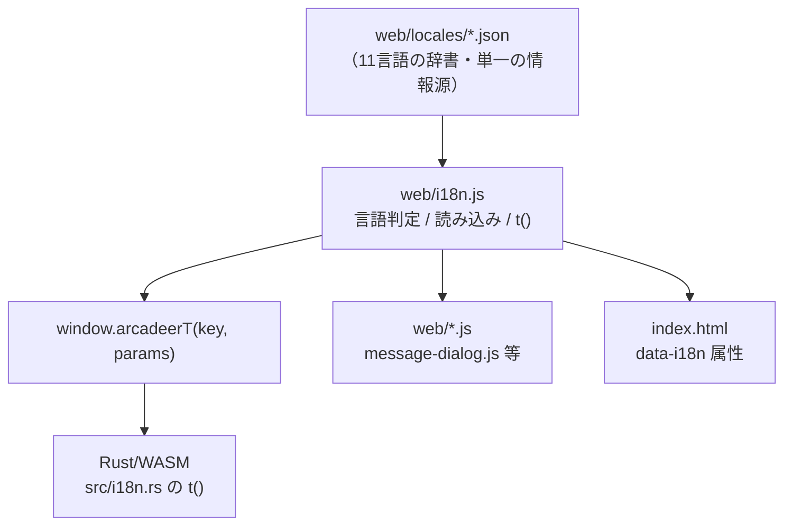
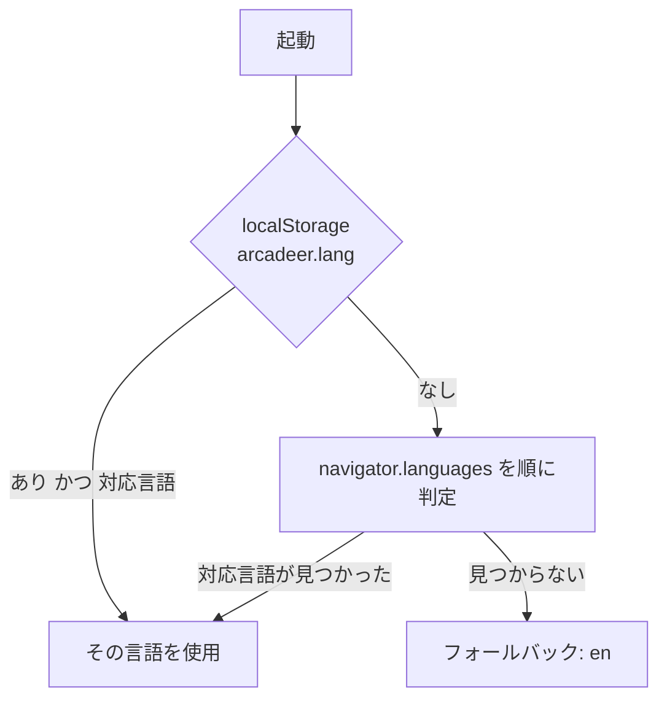

# 多言語対応（i18n）設計書

## 1. 目的

Arcadeer IDE の表示テキストを言語ごとに切り替え可能にする。
文言をソースコードから分離し、**単一の辞書（ロケールファイル）を Rust(WASM) と JavaScript の両方から参照**する。

## 2. 対応言語

| タグ | 言語 | 自称表記 |
| --- | --- | --- |
| `ja` | 日本語 | 日本語 |
| `en` | 英語 | English |
| `zh-Hans` | 中国語（簡体字） | 简体中文 |
| `zh-Hant` | 中国語（繁体字） | 繁體中文 |
| `ko` | 韓国語 | 한국어 |
| `es` | スペイン語 | Español |
| `fr` | フランス語 | Français |
| `de` | ドイツ語 | Deutsch |
| `it` | イタリア語 | Italiano |
| `nl` | オランダ語 | Nederlands |
| `pt` | ポルトガル語 | Português |

- **フォールバック言語は `en`**（未対応言語の環境でも意味が通るようにするため）

## 3. 構成



- **辞書の実体は `web/locales/<タグ>.json` のみ**。Rust側に文言は持たない
- Rust は翻訳キーだけを扱い、表示時に `window.arcadeerT` を通して変換する
- `src/listing.rs` は日本語文字列ではなく**翻訳キー**を返す（言語非依存・テスト可能）

## 4. 言語の決定順



- 作業者が明示的に選んだ言語は `localStorage` の `arcadeer.lang` に保存し、次回以降優先する

## 5. 言語タグの正規化

`navigator.language` の地域付きタグを対応タグへ寄せる。

| 入力例 | 正規化結果 |
| --- | --- |
| `ja` / `ja-JP` | `ja` |
| `en` / `en-US` / `en-GB` | `en` |
| `zh` / `zh-CN` / `zh-SG` / `zh-Hans` / `zh-Hans-CN` | `zh-Hans` |
| `zh-TW` / `zh-HK` / `zh-MO` / `zh-Hant` | `zh-Hant` |
| `ko` / `ko-KR` | `ko` |
| `pt` / `pt-BR` / `pt-PT` | `pt` |
| `ru` など未対応 | `null`（フォールバックへ） |

- 大文字小文字は区別しない（`ZH-hant` も `zh-Hant` として扱う）
- 中国語で文字体系が判別できない `zh` は **簡体字** を既定とする

## 6. キー命名と補間

- キーは `<領域>.<項目>` のドット区切り（例: `header.newProject`, `pane.tab.image`）
- 可変部分は `{名前}` のプレースホルダで表す

  ```json
  { "msg.projectOpened": "プロジェクト '{name}' を開きました" }
  ```

  ```js
  t("msg.projectOpened", { name: "my-game" })
  ```

- 未定義キーは**キー文字列をそのまま返す**（画面が壊れず、未翻訳箇所も発見しやすい）
- 選択中の言語に無いキーはフォールバック言語（`en`）で補う

## 7. 品質の担保（テスト）

`bun test` で以下を自動検証する。

| 検証 | 目的 |
| --- | --- |
| 全ロケールのキー集合が `ja` と完全一致 | 翻訳漏れ・不要キーの混入を防ぐ |
| 全ロケールの値が空でない | 空文字の埋め忘れを防ぐ |
| 各キーの補間プレースホルダが全言語で一致 | `{name}` の書き落としを防ぐ |
| 言語タグ正規化 | 地域付きタグの取りこぼしを防ぐ |
| 言語決定順 | 保存値 → navigator → フォールバック |

## 8. 適用範囲外

- **開発者向けの内部エラー文言**（`#ide-main がありません` 等、DOM構造の不整合を示すもの）は翻訳対象外とする
  - 作業者ではなく開発者が見るメッセージであり、原因調査には原文のほうが適するため
- ブランド名 `Arcadeer` は翻訳しない
