    # ゲームエンジン仕様

## 1. 概要

- ローカル環境で動作するWebゲーム作成IDE
- IDEとゲームエンジンはRustで記述され、WebAssemblyで動作する
- ゲームの動作はCoffeeScriptで記述する
- 画面描画はWebGLを使用する

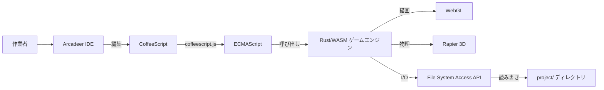

---
## 2. 動作環境

- Chrome系ブラウザ限定（File System Access API・PWAインストール機能を使用するため）
- **インターネット接続必須**（Tailwind CSS 等のCDNライブラリを利用するため）
- **PWA（Progressive Web App）として配布・インストールする**
  - 初回のみホストされた配布URL（例: GitHub Pages 等）にアクセスしてインストール
  - スタンドアロンウィンドウで起動（OSのアプリケーションとして登録される）
  - Service Workerは自前アセットのキャッシュ（起動高速化）に利用する
- File System Access API でローカルファイルシステム上の `project/` ディレクトリを直接読み書きする
- 追加のランタイム（Node.js, Python等）不要
- **CSSフレームワーク**: Tailwind CSS（Play CDN）。既存レイアウト(`style.css`)との競合を避けるため preflight は無効化する

### 2.1 PWAインストール〜利用フロー

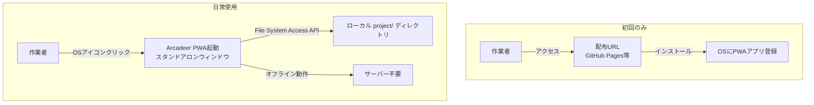

---

### 2.2 Service Worker と更新の届け方

Service Worker は、**自前のアセットをキャッシュして起動を速くし、オフラインでも動くようにする**ために使う。
一方で、**更新した内容が届かなくなる**という失敗も起こしやすい。ここでの決めごとは、
そのほとんどが「更新が届かない」を潰すためのものである。

#### ネットワーク優先

取得できたら**必ず新しいほうを返し**、キャッシュも更新する。オフラインの時だけキャッシュへ戻る。

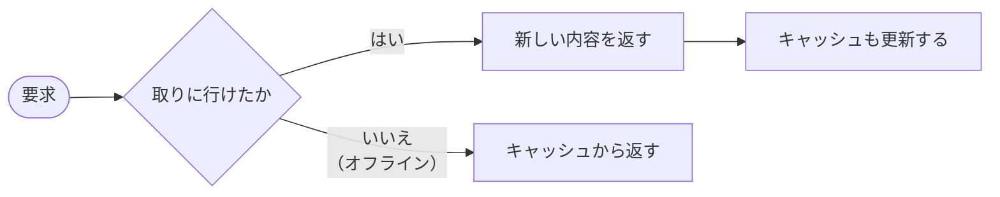

キャッシュ優先にすると、更新した JS / CSS / WASM が反映されず、
**古い挙動のまま動き続ける**ため採らない。

#### HTTPキャッシュを通さない

「ネットワーク優先」と書いても、`fetch` は既定で**HTTPキャッシュを経由する**。
配信元（GitHub Pages 等）が付ける `Cache-Control` のせいで古い内容が返り、
**名ばかりのネットワーク優先**になってしまう。

| 対象 | 指定 | 理由 |
| --- | --- | --- |
| Service Worker 本体 | `register(..., { updateViaCache: "none" })` | 古い本体が返ると、**更新したこと自体に気付けない** |
| 配信物の取得 | `fetch` を `cache: "no-cache"` で行う | 常にサーバーへ確認する。変更が無ければ `304` が返るので通信量はほとんど増えない |
| 最初のキャッシュ作り | `new Request(url, { cache: "reload" })` | ここで古い内容を保存すると、**オフラインの間ずっと古い版が出る** |

`fetch(req, {...})` は、**画面遷移の要求から作り直せずに落ちる**。
URL から組み直して確認付きの取得にする。

#### 登録は `load` を待たない

```js
await initI18n();
await init();                              // ← ここを待っている間に load が終わる
window.addEventListener("load", ...)       // 二度と呼ばれない
```

登録処理を `load` の聞き手の中に書いてはいけない。**モジュールの中で `await` している間に
`load` が発火し終えている**ことがあり、その後に足した聞き手は二度と呼ばれない。
登録されないまま動き、更新もキャッシュの入れ替えも起こらなくなる。

実際にこの書き方をしていたため、**古いキャッシュが37個（v104〜v141）残り**、
更新が届かない状態になっていた。

#### 新しい版になった時

`skipWaiting()` と `clients.claim()` で、新しい Service Worker はすぐに引き継ぐ。
ただし**既に読み込み終えた JS や WASM は古いまま**なので、切り替えには再読み込みが要る。

**勝手に再読み込みはしない。**このIDEは編集中のコードを抱えているため、
書きかけが飛ぶ恐れがある。**フッターに知らせるだけ**にして、再読み込みは操作する人に委ねる。

> 新しい版があります。再読み込みすると切り替わります。

知らせるのは `controllerchange` の時。ただし**初めての登録でも同じ出来事が起きる**ため、
登録より先に「以前から任せていたか」を控えておき、初回は知らせない。

#### 古いキャッシュの掃除

活性化の時に、**今の版以外のキャッシュをすべて消す**。
キャッシュ名は `arcadeer-v<番号>` とし、**配信物を変えるたびに番号を上げる**。

#### オフラインでの振る舞い

| 状態 | 動き |
| --- | --- |
| オンライン・更新あり | 新しい内容を返し、キャッシュも更新する |
| オンライン・更新なし | `304` が返る（中身は送られない）。キャッシュから返す |
| **オフライン** | **キャッシュから返す**。更新の確認は失敗するが、握り潰して動き続ける |

登録・更新の確認が失敗しても、**ツールもゲームもそのまま動く**。

---

## 3. ファイル構成

### 3.1 PWA配布構成（ホスト側）

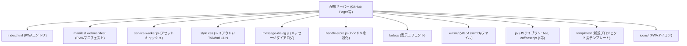

### 3.2 ローカル側（ユーザーの選択ディレクトリ）

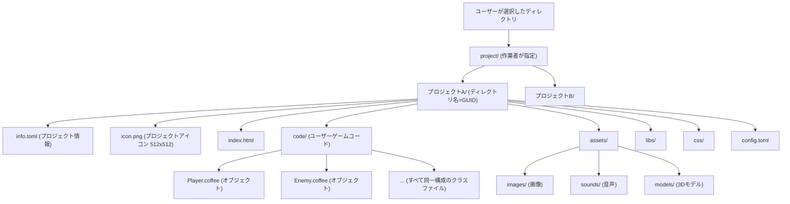

- **`code/`**: ユーザーが記述するCoffeeScriptを格納する。配布構成（7.2節）の `code/` と対応する
  - **オブジェクトはクラスファイルと1対1に対応する**。`code/` 直下の `*.coffee` 1ファイルが1オブジェクト（1クラス）となる
  - **`code/` に置かれるクラスファイルはすべて同じ構成**であり、**すべて同じスーパークラス（`arcadeermain`）を継承する**（6.3節）
  - 特別扱いされるエントリポイントファイルは存在しない。`code/` 配下の全クラスが対象となる
  - `code/` のクラスから生成されたオブジェクトが実行時の**オブジェクトリストに登録**され、**設定されたFPSの間隔で全オブジェクトの `behavior` メソッドが呼ばれる**（6.1〜6.2節）
- **`assets/`**: アセットを**種別ごとのサブディレクトリ**に分けて格納する。左ペインのタブ（4.3節）と1対1に対応する

  | ディレクトリ | 種別 |
  | --- | --- |
  | `assets/images/` | 画像 |
  | `assets/sounds/` | 音声 |
  | `assets/models/` | 3Dモデル |

  - ディレクトリ名は5.7節のアセットパック定義のキー（`images` / `sounds` / `models`）と一致させる

- GUIDプロジェクトディレクトリの親（図中の `project/`）を **Arcadeerホームディレクトリ** と呼ぶ
  - 新規プロジェクト作成・プロジェクトを開く操作では、まずこのホームディレクトリをピッカーで選択する

### 3.3 プロジェクトディレクトリ名と `info.toml`

- **ディレクトリ名にはユニークなGUIDを使用する**（`crypto.randomUUID()` で生成）
  - 入力したプロジェクト名はディレクトリ名には使わず、`info.toml` に保存する
  - これにより、プロジェクト名の重複・マルチバイト文字・OS依存の禁止文字を気にせず作成できる
- 新規プロジェクト作成時、プロジェクトディレクトリ直下に `info.toml` を生成する
- プロジェクトのメタ情報を記録する（ゲーム動作設定の `config.toml` とは役割が異なる）
- 現時点のフィールド:

  | キー | 説明 |
  | --- | --- |
  | `project_name` | 新規プロジェクト作成ダイアログで入力したプロジェクト名（表示名） |
  | `project_id` | ディレクトリ名として使用する生成済みGUID |
  | `icon` | プロジェクトアイコン画像（512x512 PNG）のファイル名。プロジェクトディレクトリ直下からの相対名 |

  ```toml
  project_name = "my-game"
  project_id = "1b9d6bcd-bbfd-4b2d-9b5d-ab8dfbbd4bed"
  icon = "icon.png"

  [order]
  objects = ["gameMain", "Player", "Enemy"]
  images = ["bg.png", "player.png"]
  ```

- **`[order]` セクション**: 左ペインのサムネイル並び順（4.3節）
  - タブごとに `objects` / `images` / `sounds` / `models` のキーで、表示順にファイル名（オブジェクトはクラス名）を並べる
  - **順序をプロジェクトの一部として保存**するため、別のPCやブラウザでも並びが保たれる
  - 中身が空のキーは書き出さない（既定の名前順に戻る）

- 今後、作成日時・エンジンバージョン・ゲーム名（マルチバイト表示名）等を追記予定

#### プロジェクトアイコン

- 各プロジェクトは 512x512 ピクセルの PNG アイコンを持つ
- 新規プロジェクト作成時、デフォルトアイコン（`web/templates/assets/default-icon.png`・デフォルト猫と同系配色の猫フェイス）が `icon.png` としてプロジェクトディレクトリへコピーされ、`info.toml` の `icon` に記録される
- デフォルトアイコンの生成: `tools/gen_default_icon.py`（Python標準ライブラリのみ）
- 作業者は `icon.png` を差し替える（または `info.toml` の `icon` を書き替える）ことでアイコンを変更できる

- 初回起動時にFile System Access APIでユーザーに `project` ディレクトリへのアクセス許可を求める
- 以降、ゲームプロジェクトの読み書きは選択された `project/` ディレクトリ配下に対して行う
- ファイル直接編集（外部エディタやGit連携）も可能

### 3.4 ホームディレクトリの永続化（IndexedDB）

- ピッカーで選択したホームディレクトリの `FileSystemDirectoryHandle` は **IndexedDB** に永続化する（`web/handle-store.js`）
  - ハンドルはJSON化できないため localStorage は使用できず、structured clone で保存できる IndexedDB を使用する
  - DB名 `arcadeer` / ストア `handles` / キー `home`
- 2回目以降の「新規プロジェクト作成」「プロジェクトを開く」では保存済みハンドルを優先し、**ディレクトリピッカーを省略**する
  - 権限が失効している場合は `requestPermission({mode:"readwrite"})` による小さな確認バブルのみ表示される（インストール済みPWAでは権限が永続化されるため、通常は無確認）
  - 未保存・許可拒否・ディレクトリ消失などで保存済みハンドルが使えない場合は、従来どおりピッカーへフォールバックし、選び直した結果で保存を上書きする
- ホームディレクトリは UI 上 **ワークスペース** と呼ぶ。プロジェクト管理ダイアログの `[ワークスペースを選択する]` ボタンで、保存済みハンドルを使わずに明示的に選び直せる（結果は保存を上書き）

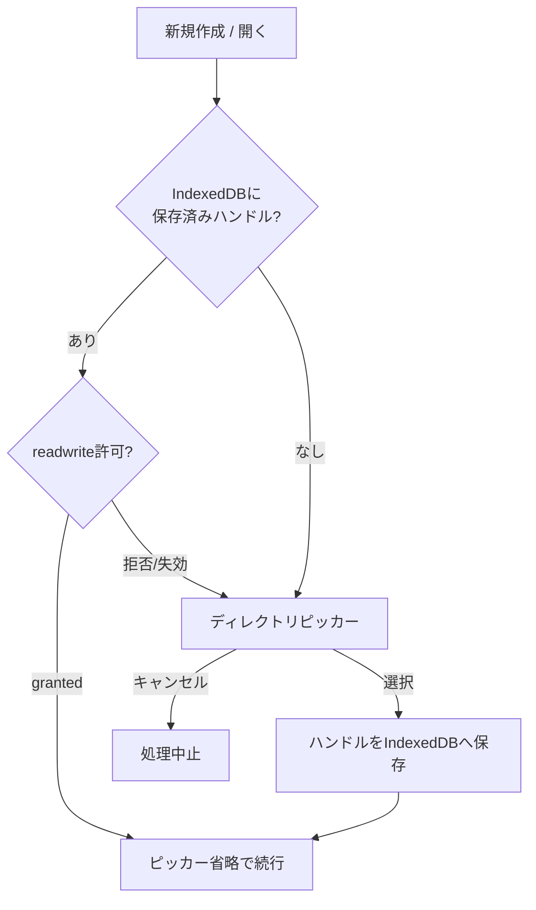

### 3.5 標準ディレクトリの自動作成

- プロジェクトの `code/` と `assets/` は、無ければ**自動的に作成**する
  - 作業者が手作業でディレクトリを用意する必要をなくすため
- 作成するタイミング
  - 対象は `code/` `assets/` と、`assets/images/` `assets/sounds/` `assets/models/`
- **新規プロジェクト作成時、デフォルトの3Dモデルを配置する**
  - 同梱の `web/templates/assets/default-cat.glb`（5.6節のデフォルメ猫）を `assets/models/default-cat.glb` へコピーする
  - 配置に失敗してもプロジェクト自体は使えるため、コンソールへ通知して処理は続行する
  - 既存プロジェクトには自動配置しない（作業者が意図して削除した場合に復活させないため）
  - **新規プロジェクト作成時**: `info.toml` / `icon.png` の生成に続けて作成する
  - **プロジェクトを開いた時**: 左ペインの一覧を読む前に、存在しなければ作成する
- 既存プロジェクト（`code/` `assets/` が無い状態で作られたもの）も、開いた時点で補完される
- 作成できなかった場合（書き込み許可が無い等）はコンソールへ通知し、該当タブには「利用できません」と表示する

### 3.6 直前に開いていたプロジェクトの復帰

- プロジェクトを開くと、そのディレクトリ名（GUID）を **localStorage**（`arcadeer.lastProject`）へ記録する
- **起動時（ブラウザのリロード時）に、記録されたプロジェクトを自動的に開き直す**
  - ホームディレクトリのハンドルは 3.4節のとおり IndexedDB から取得する
  - **既に readwrite が許可されている場合のみ**復帰する（`queryPermission` で確認）
    - 起動直後は利用者の操作が無いため `requestPermission` を出せない。確認が必要な状態なら何もせず通常の起動画面にする
  - 記録されたディレクトリが消えている・`info.toml` が読めない場合は、記録を破棄して通常の起動画面にする

---

## 4. IDE画面構成

### 4.1 全体レイアウト

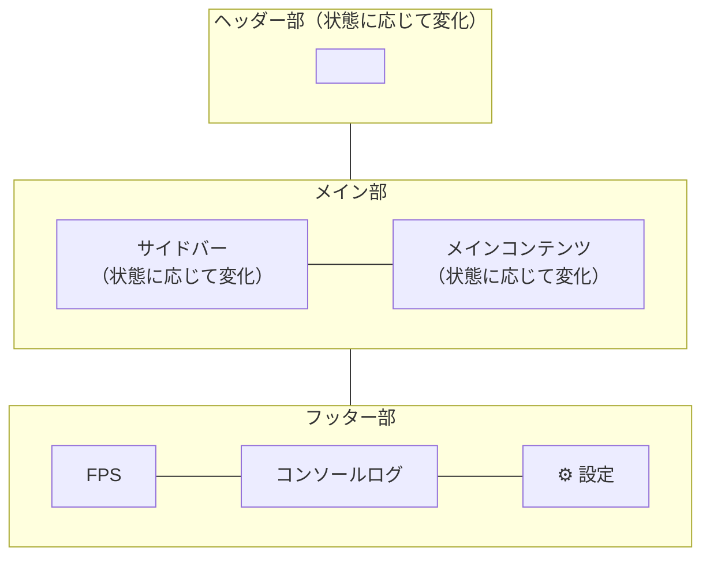

### 4.2 ヘッダー部

- 左端に **Arcadeer ロゴ** を常時表示する
  - ロゴマーク: ピクセルアート調の鹿（角付き）のSVG（`web/icons/logo.svg`、32×32px表示）
  - ワードマーク: 「Arca」は通常色、「deer」はアクセントカラーのグラデーション
  - ロゴをクリック（またはフォーカスして Enter / Space キー）するとページをリロードする
- ロゴの右側に、縦区切り線を挟んで操作ボタン群を配置する
- ボタンは**アイコンのみ**（34×34px）とし、文字は表示しない
  - ホバー／キーボードフォーカス時に、ボタン下へ**ツールチップ**を0.3秒フェードで表示する
  - ツールチップ文言は `data-tooltip` 属性に持ち、同じ文言を `aria-label` にも設定する
- **起動直後の表示**
  - フォルダーアイコン: `プロジェクト管理`（`#btn-open-project`）
    - ツールチップはダイアログの見出しと同じ文言にそろえる（押した先と呼び名を一致させるため）
  - **新規プロジェクト作成はここに置かない。**プロジェクト管理ダイアログの中へ移した（4.4節）
    - 「開く」と「作る」は同じ場所で選べたほうが分かりやすいため
- **右端**に歯車アイコンの `システム設定`（`#btn-settings`）を常時表示する
  - クリックでシステム設定ダイアログを開く（表示言語・キーバインド。4.6節）
  - 歯車は文字グリフのため、線画アイコンより大きめ（42×42pxの枠に30px）に描く
  - ツールチップは画面外へはみ出さないよう、ボタン右端に合わせて表示する（`.tooltip-right`）
    - **右端に並ぶボタンすべて**に付ける（辞書アイコンと歯車アイコン）
    - 余白を右へ寄せる指定（`.header-icon-btn-end`）とは**別のクラス**にしてある。
      右端のまとまりがボタン1つとは限らないため
    - **中央揃えの定義より後ろに書く**。詳細度が同じなので、先に書くと打ち消される
- ゲームの実行／停止トグルは、**ゲーム表示エリアまたは左ペイン**へ置く（4.4節・6.2.1節）

### 4.3 サイドバー（左ペイン）

- 状態に応じて表示内容が変化する
- **幅は 440px**（メイン部との比率を確保するため、初期実装の220pxから倍にした）
- **起動直後の表示**: 空（プロジェクト操作ボタンはヘッダー部にある）
- **プロジェクトを開いた後の表示**: 上から順に3段構成

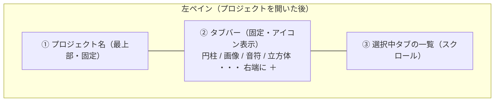

- プロジェクト名とタブバーは固定表示とし、**一覧部分のみがスクロール**する

#### ① プロジェクト名

- 左ペインの**最上部**に、開いているプロジェクト名（`info.toml` の `project_name`）を表示する
- 何を開いているかがすぐ分かるよう、**17px・太字・アクセントカラー**で大きめに表示し、フォルダーアイコン（📁）を添える
- 名前が長い場合は末尾を省略表示し、ツールチップで全体を示す
- 下に区切り線を引いてタブバーと分ける

#### ② タブバー

- タブは**アイコンのみ**（34×34px）で表示し、**タブ名（アセットの種類）はツールチップで示す**
  - ホバー／キーボードフォーカス時に、タブの下へ0.3秒フェードで表示する
  - 文言は翻訳キー（`pane.tab.*`）から取得し、同じ文言を `aria-label` にも設定する

  | タブ | アイコン |
  | --- | --- |
  | オブジェクト | 円柱 |
  | 画像 | 額縁と山（一般的な画像アイコン） |
  | 音声 | 連桁付きの音符 |
  | 3Dモデル | 立方体4つ（床にL字で3つ、その上に1つ積んだ形。輪郭は「Y」を逆さにした形になる） |

- タブは常に**4枚**を以下の順で表示する。中身が空でもタブ位置が動かないよう省略しない

  | タブ | 表示対象 |
  | --- | --- |
  | オブジェクト | `code/` 直下の `*.coffee` |
  | 画像 | `assets/images/` の `.png` `.jpg` `.jpeg` `.gif` `.webp` `.bmp` |
  | 音声 | `assets/sounds/` の `.ogg` `.wav` `.mp3` `.m4a` `.aac` `.flac` |
  | 3Dモデル | `assets/models/` の `.glb` `.gltf` |

- **種別ディレクトリ内でも、その種別の拡張子に当てはまらないファイルは一覧に表示しない**（`.gltf` が参照する `.bin` など、作業者が直接扱わないファイルを並べないため）

- 初期選択は「オブジェクト」タブ
- **一覧を再描画しても選択中のタブは保持する**（アセット追加・クラスファイル作成・表示言語の切り替えなど）
  - 別のプロジェクトを開いたときは「オブジェクト」タブへ戻す
- 拡張子の大文字小文字は区別しない
- タブ見出しは翻訳キー（`pane.tab.*`）で保持し、表示時に辞書から取得する（8節・`docs/i18n.md`）

#### ③ 一覧

- **オブジェクトはクラスファイルと1対1**。`code/` 直下の `.coffee` をすべて対象とし、拡張子を除いたファイル名をオブジェクト名として表示する
- 除外するもの: `.coffee` 以外の拡張子／ドットで始まる隠しファイル
- 並び順は**大文字・小文字を区別しない名前順**（`main` → `Player` の順）。綴りが同一で大小文字だけ異なる場合は元の文字列で比較して並びを安定させる
- 一覧が空のときは案内文を表示する（翻訳キー `pane.empty.*`）
- **`code/` `assets/` および種別ディレクトリが無い場合は自動的に作成する**（3.5節）。作成に失敗した場合のみ「利用できません」と表示する
- **オブジェクトタブは正方形アイコンのグリッド表示**とする
  - **横3列**で並べる（サムネイルを大きく見せるため）
  - 各カードは「サムネイル枠」＋「オブジェクト名」で構成し、**名前を含めたカード全体を正方形**に保つ
    - サムネイル枠はカード幅の88%（名前のぶんを見込んで少し小さくする）。ファイル名は6px
    - 行の高さに合わせてカードが縦へ引き伸ばされないよう、グリッドは `align-items: start` とする
  - サムネイル枠には、**そのオブジェクトが使うアセットのプレビュー**を表示する
    - 対応付けは、クラスファイル内の **`@MODEL` に書かれた文字列**から読み取る（下記）
    - 画像なら画像そのもの、3Dモデル（`.glb`）ならWebGLでレンダリングした絵を表示する
    - **組み込みプリミティブ（`box` `sphere` `plane` `cylinder` `cone`）なら、その形を描いて表示する**
      - 色は**白で固定**する。`@COLOR` は実行時に書き替わることがあり、一覧の絵と食い違うため
      - ファイルを読まないので、`buildPrimitive()` の頂点をその場でWebGLへ流すだけでよい
    - 3Dモデルとプリミティブは、アセットタブと同様に**ホバーでY軸回転**する
    - 読み取れない場合は共通のプレースホルダー（立方体アイコン）のままにする
      - `@MODEL` の既定値 `"primitive"` は形が決まらないため、**プレースホルダーのまま**にする
      - 「まだ何も決めていない」ことが見た目で分かるようにするため

##### アセットとの対応付け（`@MODEL`）

- IDEは `code/<オブジェクト名>.coffee` を読み、**`@MODEL` に代入された文字列リテラル**をアセット名として扱う

  ```coffee
  class Player extends arcadeermain
    constructor: (param) ->
      super(param)
      @KIND = "2D"
      @MODEL = "player.png"        # ← ここを読み取る

  class Enemy extends arcadeermain
    constructor: (param) ->
      super(param)
      @KIND = "3D"
      @MODEL = "default-cat.glb"
  ```

- 読み取りの規則
  - `@MODEL = "..."` / `@MODEL = '...'` の**文字列リテラル**のみを対象にする
  - `@MODEL = param.MODEL ?? "player.png"` のように既定値を書いた場合は、その文字列を採る
  - 複数回代入されている場合は**最後の指定**を採る
  - `#` で始まるコメント行は無視する
  - 変数や連結で組み立てている場合（`@MODEL = assetName`）は**実行しないと決まらない**ため読み取らない
- 拡張子で種別を判断し、`assets/images/` または `assets/models/` から読み込む
  - 拡張子が無い値（`"box"` などの**組み込みプリミティブ名**）はアセットとして扱わない（6.2.5節）
- **保存したら、そのオブジェクトのサムネイルを即座に作り直す**（`@MODEL` の書き替えが反映される）
  - ⌘S での保存だけでなく、**ゲーム実行前の自動保存（下書きの書き出し）でも作り直す**
    - 実行してみて初めて `@MODEL` の書き替えに気づく、という順序になりやすいため
    - 書き出せたぶんを**まとめて1回**で作り直す
  - **一部だけ作り直す時は、そのオブジェクトぶんの object URL だけを解放する**
    - 全部捨てると、画面に残っている他のカードのホバー回転が効かなくなる
    - URLは「持ち主（オブジェクト名）」と対で覚えておき、持ち主を指定して解放する（`src/asset_url.rs`）
    - モデルのキャッシュも、そのURLぶんだけ忘れる（`arcadeerForgetModel`）
  - **一覧そのものを作り直す時（タブの切り替えなど）は、これまでどおり全部解放する**
    - 前の一覧のカードはもう無いため
  - **絵を消すのは、指し示すものが無いと分かった時だけ**にする
    - `@MODEL` を消した／読めない名前になった／ファイルが見つからない場合は、既定のアイコンへ戻す
    - **描けなかっただけの場合は、いまの絵をそのまま残す**（WebGLの都合など、一時的な失敗のことがあるため）
    - 先に消してから作り直すと、しくじった時に空のまま残ってしまう
  - 差し替える時は、**前の絵とホバー指定を落としてから**新しい絵を入れる
    - 残っていると、`"sphere"` から `.glb` へ変えた時にホバーで前の形が回ってしまう
  - 名前が長い場合は末尾を省略表示し、ツールチップで全体を示す
- **ドラッグ＆ドロップで並べ替えられる**
  - カードの左半分に重ねるとその**前**へ、右半分に重ねるとその**後ろ**へ入る
  - **ドラッグ中は周りのカードが実際に動いて、ドロップ後の並びをその場で見せる**
  - 掴んでいるカードは薄い破線で表示する
  - **ドロップしても一覧の作り直し（フェードやサムネイルの再読み込み）は行わない**
    - 画面は既に並べ替え済みのため、表示順をそのまま保存するだけにする
  - 並び順は `info.toml` の `[order]` セクションへ保存する（3.3節）
  - **起点オブジェクト（`gameMain`）は掴んで動かせる**が、常に先頭に固定される
    - ドラッグ中は周りのカードが動いて反応するが、**ドロップすると元の位置へ戻る**
    - 他のカードを `gameMain` より前へ入れることはできない
  - 新規追加カードはドラッグ対象外で、常に先頭に置かれる
  - 保存後にファイルが増えた場合は**末尾へ名前順**で並び、外部で削除されたファイルは無視される
- 画像・音声・3Dモデルのタブも同様に並べ替えられる
- **オブジェクトはクリックできる**。クリック（またはフォーカスして Enter / Space）すると、メイン部（右ペイン）でそのクラスファイルを編集できる（4.4節）
  - 編集中のカードはアクセントカラーで強調表示する（タブ切り替えや一覧の作り直しをしても保たれる）
  - **編集中のファイルを再度クリックした場合は何もしない**（読み直すと未保存の編集内容が失われるため）
- **画像タブもオブジェクトタブと同じ正方形アイコンのグリッド表示**（横3列）とする
  - サムネイルには **`assets/images/` の画像を実際に読み込んで表示**する（object URL 経由）
  - 読み込みは非同期のため、まずプレースホルダー（画像アイコン）を表示し、読み込めたものから差し替える
  - 透過画像が背景と同化しないよう、サムネイル枠には市松模様を敷く
  - 発行した object URL は再描画時にすべて解放する
  - 現時点ではクリック操作は無い
- **音声タブもオブジェクトタブと同じ正方形アイコンのグリッド表示**（横3列）とする
  - 各カードの中央に**再生ボタン**（丸型）を置き、押すと `assets/sounds/` の音声をプレビュー再生する
  - 再生中はボタンが**停止ボタン**に変わり、アクセントカラーで塗られる。もう一度押すか、再生が終わると元に戻る
  - **同時に鳴らすのは1つだけ**。別のボタンを押すと直前の再生は止まる
  - **再生ボタン以外の場所をクリックすると再生を止める**（Escキーでも止まる）
  - タブの切り替え・一覧の再描画時にも再生を止める（object URL を解放するため）
  - object URL の発行が終わるまで再生ボタンは押せない
- **3Dモデルタブもオブジェクトタブと同じ正方形アイコンのグリッド表示**（横3列）とする
  - サムネイルは **`.glb` をIDE内部でWebGLレンダリングして生成**する（外部ライブラリ不要。`web/glb.js` + `web/model-preview.js`）
    - `web/glb.js`: GLBのチャンク分解・アクセサ読み出し・シーン走査・バウンディング計算（DOM非依存のため単体テスト可能）
    - `web/model-preview.js`: 256×256のオフスクリーンcanvasへ1枚描画し、PNGのdata URLとして取り出す
  - 描画内容（一覧アイコン用途のため最小限に留める）
    - ジオメトリと**頂点カラー（`COLOR_0`）**、平行光源＋環境光による簡易シェーディング
    - **アニメーション・スキニングは適用せずバインドポーズ**で描く
    - テクスチャ・PBRマテリアルは扱わない
    - 背景は透過。カメラはモデルのバウンディング球に合わせて自動配置し、斜め前方から見下ろす
    - 描画後は `WEBGL_lose_context` でGPUリソースを明示的に解放する
  - 生成できない場合（`.gltf` の外部リソース参照、WebGL非対応など）はプレースホルダー（立方体アイコン）のままにする
  - **マウスカーソルを重ねている間、モデルをY軸まわりに回転させる**（毎秒90度）
    - 静止画サムネイルの上に共有canvasを重ね、`requestAnimationFrame` で描き続ける
    - カーソルが外れたら停止し、静止画サムネイルへ戻す
    - **WebGLコンテキストとcanvasは1つを使い回す**（同時に見るのは1件のため。ブラウザのコンテキスト数上限を避ける）
    - 解析結果とGPUバッファはモデルごとにキャッシュし、2回目以降のホバーでは読み直さない
    - 一覧の再描画時（object URLの解放時）は回転を止めてキャッシュを捨てる
  - 現時点ではクリック操作は無い

#### 新規追加カード（サムネイル一覧の先頭）

- **サムネイル一覧の最左上（先頭）**に、**サムネイルと同じ大きさ**の「新規追加」カードを置く
  - 破線の枠に「＋」アイコンを置き、**その下に「新規追加」の文字**を出す（翻訳キー `pane.addNew`）
    - 文字はファイル名（6px）より少し大きい**8pxの太字**にして、押せることが分かるようにする
    - 名前欄の位置は他のカードと同じにするため、サムネイルの大きさは全カードでそろう
  - ツールチップは選択中タブに応じて切り替える（`新規オブジェクト作成` / `アセットを追加`）
  - 押した時の動作はタブバー右端の「＋」ボタンと同じ
  - キーボード操作にも対応する（フォーカスして Enter / Space）
- **一覧が空のときも表示する**（案内文の下にカードだけが並ぶ）
- グリッド表示のタブ（オブジェクト／画像／音声／3Dモデル）すべてに置く

#### 「＋」ボタン（タブバー右端）

- **「＋」アイコン**（ヘッダーのアイコンボタンと同じ34×34px）
  - タブの並びの直後ではなく、**タブエリアの右端**へ寄せて配置する（`margin-left: auto`）
    - タブをアイコン化して確実に1行へ収まるため、タブバーの折り返しは行わない
  - ツールチップは右端にあるため、ボタンの**下側・右揃え**に0.3秒フェードで表示する（ペイン外へはみ出さないように）
  - ツールチップの文言は選択中タブに応じて切り替える（オブジェクト:「新規オブジェクト作成」／それ以外:「アセットを追加」）
- **クリック時の動作は選択中のタブによって変わる**

  | 選択中のタブ | 動作 |
  | --- | --- |
  | オブジェクト | 新規クラスファイルを作成する（下記） |
  | 画像 / 音声 / 3Dモデル | ファイル選択画面を開き、選んだファイルを `assets/` へ保存する |

##### アセットの追加（画像 / 音声 / 3Dモデル）

- `showOpenFilePicker` でファイル選択画面を開く
- **選択中タブの種別でファイルタイプを絞り込む**（一覧の分類と同じ拡張子。「すべてのファイル」は選べない）

  | タブ | 選択できる形式 |
  | --- | --- |
  | 画像 | `.png` `.jpg` `.jpeg` `.gif` `.webp` `.bmp` |
  | 音声 | `.ogg` `.wav` `.mp3` `.m4a` `.aac` `.flac` |
  | 3Dモデル | `.glb` `.gltf` |

- **複数ファイルをまとめて選択できる**
- 保存先は**選択中タブに対応する種別ディレクトリ**（`assets/images/` 等。元のファイル名のまま。無ければ作成する）
- **保存前に拡張子を必ず再確認し、種別に合わないファイルは追加しない**（追加しなかった旨はコンソールへ記録する）
  - ファイル選択画面の絞り込みはOS側のファイルタイプ解釈により緩くなることがあるため（例: `audio/mp4` を指定すると `.mp4` 動画まで選べてしまう）
- **同名ファイルがある場合は上書きする**。上書きした旨はフッターのコンソールに残す
- 保存後は一覧を再描画して反映する
- 選択せずに閉じた場合は何もしない

##### 新規オブジェクトの作成（オブジェクトタブ）

- **クラス名入力ダイアログ**を表示する
  - 入力されたクラス名を検証し（下表）、通れば `code/<クラス名>.coffee` を作成して一覧へ反映する
    - **作成完了のメッセージダイアログは表示しない**（一覧に現れることで結果が明らかなため）。フッターのコンソール表示のみとする
  - 検証に失敗した場合はダイアログを閉じず、理由をメッセージダイアログで通知する

##### クラス名のバリデーション

CoffeeScript のクラス名（識別子）として使えることに加え、ファイル名にもなるため重複と長さも確認する。

| 検証 | 内容 | 翻訳キー |
| --- | --- | --- |
| 未入力 | 前後の空白を除いて空でないこと | `validate.class.empty` |
| 先頭文字 | 英字・`_`・`$`・非ASCII文字のいずれかで始まること（数字始まりは不可） | `validate.class.invalidStart` |
| 使用文字 | 2文字目以降は英数字・`_`・`$`・非ASCII文字のみ | `validate.class.invalidChar` |
| 予約語 | CoffeeScript / JavaScript の予約語でないこと | `validate.class.reserved` |
| 長さ | 64文字以内 | `validate.class.tooLong` |
| 重複 | 既存オブジェクトと同名でないこと（**大文字小文字を区別しない**） | `validate.class.duplicate` |

- 非ASCII文字を許可するのは、CoffeeScript の識別子規則が `\x7f`〜`\uffff` を認めているため（例: `敵キャラ` は有効）
- 重複判定で大文字小文字を区別しないのは、大文字小文字を区別しないファイルシステム上で衝突するため
- 生成するクラスファイルの内容は `docs/templete.md` の共通クラステンプレートに準拠する（**詳細は今後詰める**）

### 4.4 メイン部

- 起動直後: サイドバーの選択に応じた画面
  - `[新規プロジェクト作成]` クリック時:
    - プロジェクト名を入力するモーダルダイアログを表示する
    - `[OK]` 押下で `project/<プロジェクト名>/` ディレクトリを作成し、テンプレートファイルをコピーする
    - **アクセス許可の扱い**:
      - ディレクトリ選択は `showDirectoryPicker({ mode: "readwrite" })` で行い、選択時点で読み書き許可をまとめて要求する
      - ディレクトリ作成前に `requestPermission({ mode: "readwrite" })` の結果が `"granted"` であることを確認する
      - 許可がひとつでも却下・キャンセルされた場合（`AbortError` / `NotAllowedError` / 非granted）は、ディレクトリを作成せず処理を中止する
      - **作成に成功した場合は完了ダイアログを出さず、作成したプロジェクトをそのまま開く**（左ペインに一覧を表示し、フッターにプロジェクト名を表示する）
      - 中止・失敗の結果は、フッターのコンソールログに加えて**メッセージダイアログ**（4.5節）でも通知する
  - `[プロジェクトを開く]` クリック時（**プロジェクト管理ダイアログ**を表示する）:
    - IndexedDBに保存済みのホームディレクトリ（ワークスペース）があれば、ピッカーを省略して直接スキャンする（3.4節）
    - 保存済みハンドルが使えない場合は、ディレクトリピッカーで **Arcadeerホームディレクトリ**（GUIDプロジェクトディレクトリの親）を選択する（`readwrite`・許可却下時は中止。新規作成と同じ扱い）
    - ホームディレクトリ直下を走査し、`info.toml` を持つサブディレクトリをプロジェクトとして検出する（`info.toml` が無い・読めないディレクトリはスキップ）
    - **プロジェクト管理ダイアログのレイアウト**（横幅はブラウザの**80%**、高さは**90%**のモーダル）:
      - 画面**上端を基準**に配置し、開くときは**上からロールダウン**、閉じるときは**上へロールアップ**する（0.3秒。フェードと同時に `transform: translateY` で動かす）
      - 最上段の左端に見出し「プロジェクト管理」、その右側に `[新規プロジェクト作成]`、**右端に `[ワークスペースを選択する]` と `[キャンセル]`** を配置
        - 左寄せにするのは、このダイアログで真っ先にしたい「作る」操作
        - 右寄せにするのは、ここから離れる操作（別のワークスペースへ移る／閉じる）
      - **開くのをやめられる**よう、キャンセルボタン・Escキー・ダイアログ外クリックのいずれでも閉じられる（4.8節）
        - `[ワークスペースを選択する]` は、保存済みハンドルを使わずディレクトリピッカーで選び直す（結果は保存を上書きし、一覧を再表示）
        - `[新規プロジェクト作成]` は、いったんこのダイアログを閉じてから名前入力ダイアログを開く
      - その下に、**アイコン画像（`info.toml` の `icon`）＋ `project_name`** のカードグリッドを表示する（プロジェクト名順。**大文字・小文字を区別しない比較**でオブジェクト一覧・リソース一覧と統一。アイコンが読めない場合は絵文字プレースホルダー📦）
      - プロジェクトが1件も見つからない場合は、ヘッダー行の下に案内メッセージを表示する
      - **各カードの右上にゴミ箱アイコン**を置く（`.project-card-delete`）
        - ふだんは見えず、カードにカーソルを乗せた時とキーボードフォーカス時だけ現れる。**押し間違いを減らす**ため
        - 押すと確認ダイアログを出す。`[キャンセル]` なら閉じるだけ、`[OK]` なら**プロジェクトのディレクトリごと削除**する
        - 削除は `removeEntry(名前, { recursive: true })`。**元に戻せない**ため、確認を取れなかった場合（返事が読めない等）は削除しない
        - 消したあとは一覧を作り直し、消えたことが見て分かるようにする
        - **開いているプロジェクトを消した場合**は、起動直後と同じ「何も開いていない」状態へ戻す
          - ゲームが実行中なら**先に止める**。消えたファイルを触り続けないため
          - 左ペインとメイン部を空にし、`CURRENT_PROJECT` と直前プロジェクトの控え（`arcadeer.lastProject`）も消す
            - 控えを残すと、次回の起動で無いものを開こうとしてしまう
          - 開いているかどうかは**ディレクトリ名**で見分ける
        - 消すのは**ディレクトリ名**であって表示名ではない（`info.toml` の `project_name` とは異なることがあるため）
      - カードは `<div role="button" tabindex="0">` にする。**ボタンの中にボタンは置けない**ため
    - カードをクリックすると、そのプロジェクトを開く（フッター右端にプロジェクト名を表示。ディレクトリハンドルを保持し、以降の編集機能で使用する）
      - ゴミ箱を押した時は、カードの「開く」まで動かないように伝播を止める
      - **開いた旨のメッセージダイアログは表示しない**（画面が切り替わることで結果が明らかなため）。フッターのコンソール表示のみとする
- **クラスファイル編集時**: 左ペインでオブジェクトを選ぶと、メイン部に**コードエディタ**を表示する
  - コードエディタは **Ace Editor**（CDNから読み込み。バージョン固定）
    - モード: `ace/mode/coffee`（CoffeeScript）／テーマ: `tomorrow_night`／インデント: スペース2
    - 読み込みに失敗した場合（オフライン等）は、その旨をメイン部に表示する
  - 上部にヘッダー行を置く: 左からファイル名／未保存マーク／保存操作のヒント
  - **キーバインドを切り替えられる**（システム設定・4.6節）
    - `通常`（既定）: Ace 標準のキーバインド
    - `Vim`: Ace の vim キーボードハンドラ（`ace/keyboard/vim`）を使用。`:w` / `:write` でも保存できる
    - 設定は **localStorage**（`arcadeer.keybinding`）に保存し、次回起動時も引き継ぐ。切り替えは開いているエディタへ即時反映される
  - **保存は ⌘S（macOS）/ Ctrl+S（Windows）**。ブラウザ標準の保存ダイアログは抑止する（キーバインド設定に関わらず常に有効）
    - 保存先は `code/<クラス名>.coffee`（上書き）
    - 内容が保存済みと異なる間は**未保存マーク**を表示し、保存が完了すると消える
  - 保存の成否はフッターのコンソールに記録し、失敗時はメッセージダイアログでも通知する
#### 横長ウィンドウでの分割表示

- **ブラウザの表示領域が 横:縦 = 16:9 より横に広い場合**、メイン部を左右half&halfに分割する
  - 左: 従来の表示領域（エディタなど）
  - 右: **ゲーム実行画面**（`<canvas>`）
- 判定は CSS の `@media (min-aspect-ratio: 16 / 9)` で行うため、ウィンドウの拡大縮小に自動で追従する
  - 判定対象は**ビューポート**（ブラウザの表示領域）であり、画面サイズではない。ツールバーなどのぶん高さが縮むため、16:9のディスプレイでも全画面表示なら分割される
- **プロジェクトを開いている間だけ分割する**（起動画面に空の黒い領域を出さないため）

  | ビューポート | 比率 | 分割 |
  | --- | --- | --- |
  | 1280×800 | 1.60 | しない |
  | 1600×900 | 1.78 | する（ちょうど16:9） |
  | 1920×950 | 2.02 | する |
  | 2560×1000 | 2.56 | する |

- ゲーム表示エリアの構成
  - **最上部**: ボタンエリア（実行／停止トグル）。16:9より狭い場合は表示しない
  - **その下**: canvas を置く領域。長い方を領域に合わせ、短い方は中央に置く
    - 大きさの基準は**この領域**（`#ide-game-body`）にする。外側（`#ide-game`）は
      ボタン欄を含むため、そちらで計算するとボタン欄の高さぶん下へはみ出す
- **停止中はcanvasを隠し、表示領域をグレー地にする**（動いていないことが分かるように）
- スプリットモード・UNDO履歴同期などAce Editorの機能は今後活用する

### 4.5 メッセージダイアログ（共通モジュール）

- 作業者への通知（完了・中止・エラー・お知らせ）をモーダルで表示する共通モジュール（`web/message-dialog.js`）
- Tailwind CSS でスタイリングし、種別ごとに色・アイコン・見出しを切り替える
  - `info`（お知らせ・青） / `success`（完了・緑） / `warning`（中止・橙） / `error`（エラー・赤）
- WASM(Rust)からは `window.arcadeerShowMessage(message, kind, title)` 経由で呼び出す
- `[OK]` 押下で閉じる
- **閉じたら、開く直前にフォーカスがあった場所へ戻す**
  - 編集中にエラーが出た場合、閉じたあとそのまま書き続けられるようにするため
  - Escキーや画面外クリックで閉じた場合も同じ
  - 戻り先の要素が画面から消えている場合（一覧の作り直しなど）は、**エディタが出ていればそちらへ戻す**
  - ダイアログ自身の中や `body` は戻り先にしない

### 4.6 フッター部

- FPS表示（左端）。ゲーム実行中は**実測値**、停止中は `FPS: --`
- コンソールログ（エラー・デバッグ出力）
  - 閉じている間は**最新の1件のみ表示**する
- プロジェクト名は左ペイン最上部へ移動した（4.3節）
- 設定を開く歯車アイコンはヘッダー右端へ移動した（4.2節）

#### フッターの開閉

**フッターをクリックすると10行ぶんの高さへ広がり、過去ログを見られる**。もう一度クリックすると閉じる。

| 状態 | 高さ | 表示 |
| --- | --- | --- |
| 閉（既定） | 1行（32px） | 最新の1件のみ |
| 開 | 1行 ＋ 10行ぶん | 最新の1件 ＋ **過去ログの一覧**（古い順） |

- 右端の目印（`▲` / `▼`）で開閉の向きを示す
- **Alt/Option + Shift + N** でも開閉できる（6.2.1節）
- **開いている間だけ、目印の左にログを消すボタン（ゴミ箱）を出す**
  - 閉じている間は履歴を見ていないため、置いても邪魔になるだけ
  - バーの中にあるため、押しても**開閉はしない**（クリックをバーへ伝えない）
  - 消したあとも開いたまま。ゲームコードの `logClear()` と同じ動作
- キーボードでも開閉できる（フォーカスして Enter / Space）
- **履歴の保持は1,000行**。超えたぶんは古いほうから捨てる
  - 開いた時にこの数だけ要素を作るため、増やしすぎると重くなる
- 追加すると常に**最新行が見える位置**へ自動でスクロールする
- **一覧のDOMは開いている間だけ持つ**（開いたときにまとめて作り、閉じたら破棄する）
  - `echo()` を毎フレーム呼ぶと 60fps で毎秒60行増えるため、閉じている間もDOMへ積むと重くなる
  - 履歴そのものは開閉に関わらずメモリへ保持するので、開けば過去のぶんも見られる
- 履歴はゲームの実行・停止では消えない（実行前後の流れを追えるようにするため）
- WASM(Rust)側のログもゲームの `echo()` と**同じ経路**を通すため、記録の並びが実際の順序と一致する

#### `echo()` — デバッグログ

ゲームコードから、フッターのコンソールへ自由に書ける。`printf` に似た書式を使う。

```coffee
echo "座標は %@, %@", @X, @Y
```

| 記法 | 内容 |
| --- | --- |
| `%@` | 引数で順に置き換える |
| `%[フラグ][幅][.精度]@` | **桁をそろえる**（下記） |
| `%%` | `%` そのもの |

##### 桁の指定

**`printf` と同じ意味**にする。よそで覚えた書き方がそのまま通るようにするため。

| 書き方 | `3.14159` | `42` | 内容 |
| --- | --- | --- | --- |
| `%@` | `3.14159` | `42` | そのまま |
| `%.2@` | `3.14` | `42.00` | 小数2桁 |
| `%8.2@` | `␣␣␣␣3.14` | `␣␣␣42.00` | 全体8文字・右寄せ |
| `%08.2@` | `00003.14` | `00042.00` | 全体8文字・0埋め |
| `%04@` | `3.14159` | `0042` | 全体4文字・0埋め |
| `%-8.2@` | `3.14␣␣␣␣` | `42.00␣␣␣` | 左寄せ |
| `%+.2@` | `+3.14` | `+42.00` | 符号を必ず付ける |
| `% .2@` | `␣3.14` | `␣42.00` | 正の数の前に空白 |

- **幅は「全体の文字数」**であって、整数部の桁数ではない。
  「整数部4桁・小数部4桁」にしたい場合は、`4 + 1 + 4` で **`%09.4@`**（→ `0003.1416`）
- **精度を書かなければ、値はそのまま出す**（`%04@` に `3.14159` を渡しても切り捨てない）。
  幅だけを見て小数を落とすと、**黙って情報が消える**ため
- 符号と 0埋めが重なる場合、**0埋めは符号のあと**に入る（`-0003.14`）
- 左寄せ（`-`）と 0埋め（`0`）が重なる場合は**左寄せを採る**
- 数として扱えるものだけに符号と 0埋めが効く。文字列は空白で詰める
- **文字列に精度を書くと切り詰める**（`%.3@` に `"abcdef"` → `abc`）。
  ただし `NaN` や `Infinity` は数なので削らない
- 解釈できない並び（`%4.4x` など）は、**そのまま出力**する

- **引数が足りない場合は書式をそのまま残す**（書き間違いに気づけるよう、黙って空にはしない）
- 引数が余った場合は末尾へ**空白区切り**で並べる
- 置き換えた文字列の中に `%@` があっても、**再び置き換えの対象にはしない**
- 値の表し方

    | 型 | 表示 |
    | --- | --- |
    | 文字列 | そのまま |
    | 数値・真偽値 | `String()` による表現 |
    | `null` / `undefined` | `null` / `undefined`（区別が付くように） |
    | オブジェクト | JSON。循環参照などJSONにできないものは既定の文字列表現 |

- `setScreenSize` などと同じく、**コンパイル時のスコープへ渡す**（`window` を汚さない。6.2.3節）
- 戻り値は書式化した文字列

#### `random()` — 乱数

```coffee
@X = random 640             # 0〜639 のどれか
@fire() if random(10) is 0  # 10回に1回
```

- **`0` から `n - 1` までを返す。指定した値そのものは出ない**（`random(5)` は5通り）
- **渡した数が、そのまま通りの数**になる。
  配列の長さをそのまま渡せば、必ず添字の範囲に収まる
- 小数は切り捨てる（`random(2.7)` は 0〜1 の2通り）
- 負の数・`0`・`1`・数として読めない値は、必ず `0` を返す（選ぶものが無いため）
- 元になる乱数は差し替えられるようにしてあり、単体テストで偏りなく確かめられる

#### `logClear()` — ログの消去

```coffee
logClear()
```

- **履歴とフッターの1行表示の両方**を空にする
- 消したあとも、そのまま `echo()` で書き足せる
- ゲームの実行・停止では消えないため、区切りを付けたい場合に使う

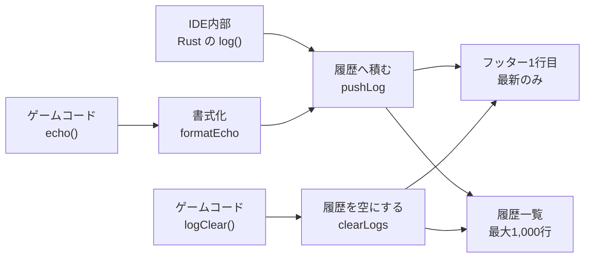

- **システム設定ダイアログ**は、ヘッダー右端の歯車アイコン（4.2節）から開く
  - **表示言語**の切り替え（8節）
  - **エディタのキーバインド**の切り替え（`通常` / `Vim`。4.4節）
  - いずれも選択した時点で即時反映し、内容は**localStorageに保存**して次回起動時も引き継ぐ

### 4.7 読み込み中の表示

プロジェクトを開く／復元する間、**3か所**で読み込み中であることを示す。

| 場所 | 表示 |
| --- | --- |
| 画面中央 | 半透明のオーバーレイに**回転インジケーター**と「読み込み中…」 |
| 左ペイン | 実際の構成に合わせた**スケルトン表示**（プロジェクト名・タブ4枚・カード6枚の枠がゆっくり明滅する） |
| フッター | コンソールへ「プロジェクト '{name}' を読み込んでいます…」を記録する |

- 起動時の自動復帰（3.6節）では、先に「前回のプロジェクトを復元しています…」を記録してからインジケーターを表示する
- 復帰できなかった場合（権限未付与・ディレクトリ消失など）も、必ずインジケーターを消して通常の起動画面に戻す
- **`prefers-reduced-motion` が有効な環境では明滅・回転を止める**（動きに敏感な利用者への配慮）

### 4.10 はじめての案内（プロジェクト未選択時）

**プロジェクトを開いていない間、メイン部へ操作の説明を表示する。**

このアプリは**ゲーム1本を1つのディレクトリ**として扱い、それらをまとめて置く場所を
最初に選んでもらう。ブラウザのファイル操作（3.1節）に慣れていないと、
**何を選ばされているのか分からない**ため、最初に説明を置く。

#### 内容

| 部分 | 内容 |
| --- | --- |
| 見出し | 「はじめに、ゲームを保存する場所を選びます」 |
| 導入 | **ゲーム1本が1つのフォルダーになる**こと、選んだ場所の中だけを読み書きすること |
| 手順1 | フォルダーアイコンを押して、置き場所を選ぶ |
| 手順2 | ブラウザの確認を許可する。**選んだ場所の外には触れない** |
| 手順3 | ファイルアイコンでゲームを1本作る |
| 補足 | 場所はブラウザが覚えるので、次回は前回のゲームが自動で開く（3.6節） |

- 手順にはヘッダーの**アイコンと同じ絵**を並べ、どれを押すのか見て分かるようにする
- 文言は**11言語**用意する（8節）

#### 表示の切り替え

**追加のコードは不要。**メイン部と重ねて置き、プロジェクトを開いた時に付く
`has-project`（4.4節）でCSSが隠す。

```css
.ide-welcome { position: absolute; inset: 0; }
.ide-main.has-project .ide-welcome { display: none; }
```

### 4.9 仕様・リファレンス

ゲーム作成に必要な内容を、**IDEの中から表示言語で読める**ようにする。

#### 開き方と置き場所

- **ヘッダー右端、歯車アイコンの左に辞書アイコン**を置く。押すと開閉する
- 開いている間はアイコンをアクセントカラーにして、状態が分かるようにする

| ウィンドウ | 置き場所 |
| --- | --- |
| 16:9より横長 | **ゲーム表示エリアと同じ右半分**。開いている間はゲーム側を隠す |
| 16:9より狭い | **右ペイン全体**を覆う |

横長のときに場所を分け合うのは、3分割にするとエディタが狭くなりすぎるため。
ゲームを見ながらリファレンスを読みたい場合は、ウィンドウを狭めれば重ねて表示できる。

#### 内容

**使えるものを漏れなく載せる。**メソッドはすべて、引数と取りうる値もすべて挙げ、
**項目ごとにサンプルを添える**。IDEの中だけで書き方が分かる状態にするため。

| 章 | 内容 |
| --- | --- |
| はじめ方 | 起点クラス・動くもの・床の置き方を、短い例で示す |
| 基本の考え方 | 座標系、オブジェクトとクラス、1フレームの流れ、種別、組み込みの形 |
| オブジェクトを作る | `@addObject` の引数をすべて（既定値つき）。クラスファイル無しで置く方法 |
| プロパティ | インスタンスのプロパティをすべて（既定値つき） |
| オブジェクトのメソッド | 一覧＋**メソッドごとに見出し・サンプル・引数の表** |
| 当たり判定 | `@BOUNDARY` のキーの表、尋ね方、`setDebug` |
| 全体で使えるメソッド | `setScreenSize` `isKeyDown` `echo` `logClear` `random` `setDebug` `GLOBAL` を**個別に** |
| カメラ | 5つのメソッドと全キー |
| ライトと影 | 5つのメソッドと全キー |
| ゲームコントローラー | `GAMEPAD`、`setGamepadOption` の全キー、キーコンフィグ |
| IDEの使い方 | プロジェクト、左ペイン、キー操作、フッター |

- **上部の目次はタブとして働く。**押した章だけを表示する
  - 内容が長いため、1本の長い頁にすると目当ての場所へ辿り着けない
  - 開いた直後は先頭の章（はじめ方）を出す
- **一覧の名前を押すと、その項目の説明まで動く**
  - 一覧で見つけてから、上下に探し直さずに済むようにするため
  - 飛び先が**別の章にある場合は、先にその章へ切り替える**（隠れたままだと位置が測れない）
  - 表のセルに飛び先（見出しの翻訳キー）を持たせ、見出しには**キーから決まる id** を振る
    - 章をまたいでも重ならないよう、キーをそのまま使う
  - 位置は `scrollIntoView` に任せず、**表示領域からの差を測ってずらす**
    - 入れ子の都合で途中までしか動かないことがあるため
    - 下にそれ以上の中身が無い場合は、そこで止まる（それ以上スクロールできないため）
- 表は幅が足りない場合、**表だけを横スクロール**させる（本文は折り返す）

#### 多言語対応の作り

**構成（コードと記号）と、翻訳が要る文を分けて持つ。**

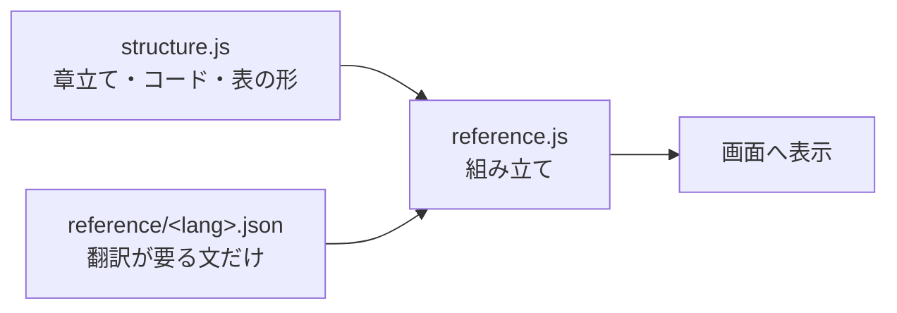

| 置き場所 | 内容 |
| --- | --- |
| `web/reference/structure.js` | 章立て、**コード例**、表の列構成。翻訳しないものはすべてここ |
| `web/reference/<lang>.json` | その言語の文だけ（**11言語ぶん**） |

- コード例やAPI名（`addObject` `@KIND` など）は**翻訳しない**ため、1か所にだけ置く
  - 11言語ぶん書き写す必要がなく、内容を直す時も1か所で済む
- 表のセルは2通り。`"文字列"` はそのまま、`{ k: "キー" }` はその言語の文へ置き換える
- 内容は**表示言語を切り替えると作り直す**
- 読み込みは開いた時に一度だけ行い、以後は覚えておく
- ある言語のファイルが読めない場合は**英語へ退避**する（8節の方針と同じ）

##### 内容がそろっていることの担保

テストで次を機械的に確認する。

- 対応言語ぶんのファイルがそろっている
- 構成が使うキーが**全言語にある**（不足が無い）
- **使っていないキーが無い**（余りが無い）
- 空の文が無い
- 日本語と英語が別物である（訳し漏れの検出）

### 4.8 表示エフェクト（共通）

- UI要素の**表示／非表示はすべて0.3秒のフェードイン／フェードアウト**で行う（共通モジュール `web/fade.js` + `style.css` の `.fade-dialog` / `.fade-element` クラス）
- **すべてのモーダルダイアログ**は、以下の操作でキャンセル（＝何もせず閉じる）できる
  - `[キャンセル]` / `[閉じる]` ボタン
  - **Escキー**
  - **ダイアログ外（バックドロップ）のクリック**
  - いずれも `web/fade.js` が共通で処理するため、ダイアログを追加しても自動的に有効になる
  - ダイアログ外クリックの判定は、要素の矩形と座標の比較で行う（`padding` 部分を誤って外側と判定しないため）
  - 入力欄でドラッグ選択してダイアログ外でボタンを離した場合は閉じない（押した位置と離した位置の**両方が外側**のときだけ閉じる）
- 対象: メッセージダイアログ、新規プロジェクト作成ダイアログ（Escキーによるキャンセルも含む）、メイン部の画面切り替え（プロジェクト選択画面の表示・差し替え・クリア）、フッターのプロジェクト名・コンソールメッセージ表示
- WASM(Rust)からは `window.arcadeerFadeInDialog` / `arcadeerFadeOutDialog` / `arcadeerFadeInElement` / `arcadeerFadeOutElement` / `arcadeerFadeOutAndClear` 経由で呼び出す（fade.js 未ロード時は即時表示にフォールバック）

### 4.9 画面遷移

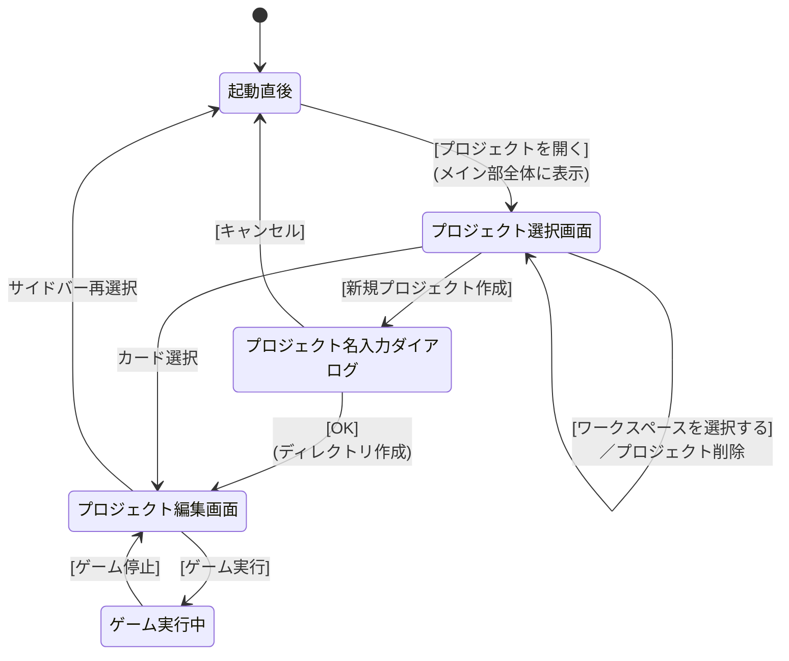

---

### 4.11 編集中の下書き（自動保存）

**編集の途中経過を失わない**ための仕組み。

以前は、保存せずに別のソースを開くと編集内容が消えていた。エディタの中にしか
無かったためである。**入力が止まるたびに控えを残す**ようにして、これを無くす。

#### 流れ

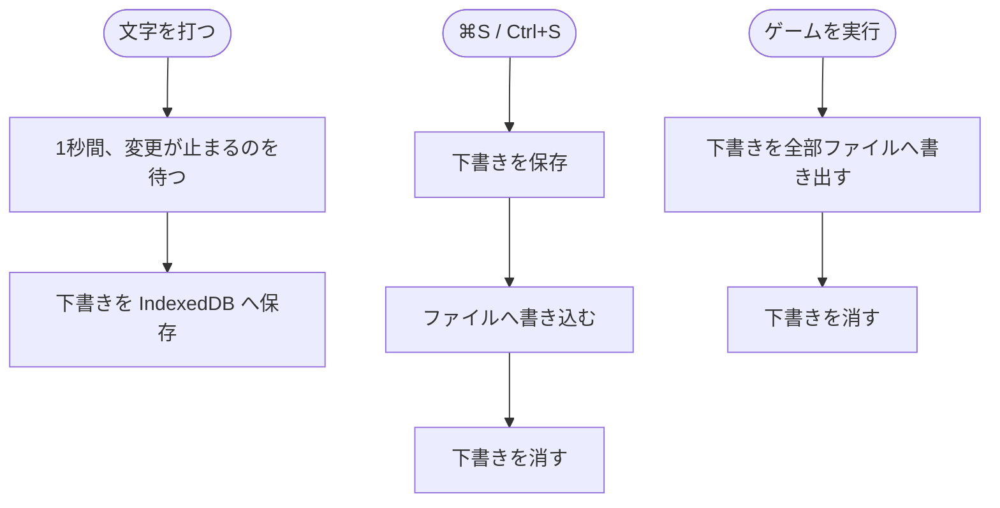

| 場面 | 動き |
| --- | --- |
| 入力が**1秒**止まる | 下書きを IndexedDB へ**非同期で**保存 |
| ファイルと同じ内容に戻った | 下書きを消す（用済みのため） |
| `⌘S` / `Ctrl+S` | **下書きを保存してから**ファイルへ書き込む |
| 別のソースを開く | 開く前に、編集中のぶんを下書きへ確定させる |
| **ゲームを実行** | 保存されていない下書きを**すべてファイルへ書き出す**（後述） |

- 保存先は IndexedDB。ハンドル（`handles`）と**同じデータベース**を使い、
  保管場所を `drafts` として分ける
  - 別々に開くと版が食い違い、片方が開けなくなるため、開く処理は1か所へまとめる
- 鍵は **`<プロジェクトID>/<ファイル名>`**。
  プロジェクトが違えば `gameMain.coffee` も別物として扱う
- 書けない環境（プライベートモード等）でも、**編集そのものは続けられる**

#### 開く時の判断

下書きが残っている場合、**ファイルの最終更新時刻**（`File.lastModified`）と
下書きの保存時刻を比べる。外のエディタで書き換えられている恐れがあるためである。

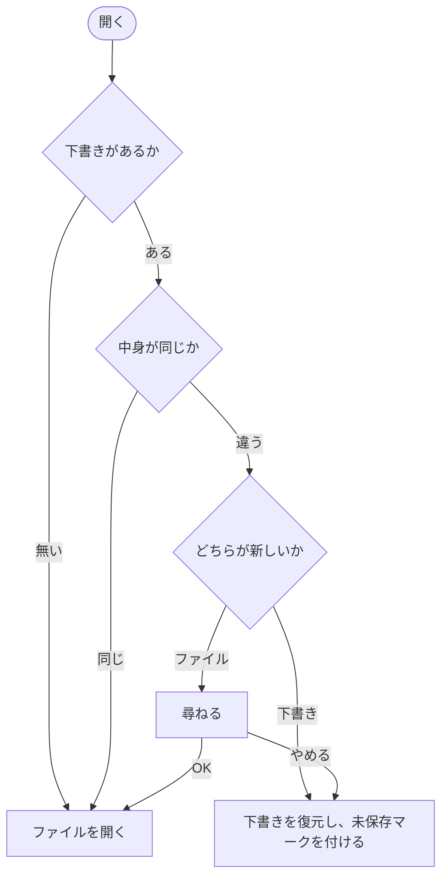

| 状況 | 動き |
| --- | --- |
| 下書きが無い／中身が同じ | ファイルを開く（下書きは消す） |
| **下書きのほうが新しい** | **黙って復元**し、未保存マークを付ける |
| **ファイルのほうが新しい** | **「ファイルが更新されています。読み込みますか？」**と尋ねる |

- 尋ねて **OK** なら、ファイルを読み込んで下書きを消す。
  **やめる** なら、編集の続きを守る（下書きを開く）
- 時刻が取れない場合は、**編集内容を失わないほう**（下書き）へ倒す
- ただし**下書きの時刻が分からない**場合は、勝手に上書きせず尋ねる
- 復元しても**ファイルは書き換わらない**。反映されるのは保存した時だけ

#### やり直し（UNDO）の履歴

**ファイルを切り替えても、やり直しの履歴を保つ。**

やり直しの履歴は、Ace の**編集セッション**が持つ。開き直すたびにセッションを
作り直すと履歴が消えるため、**ファイルごとに一度作ったセッションを覚えておいて使い回す**。

- セッションはエディタ本体から独立しているため、画面を組み直しても残る
- **ファイルを読み直した時だけ**、覚えていた内容を入れ替える
  （下書きを復元する場合は、セッションの内容がそのまま最新なので触らない）
- 変更の受け取りは**エディタ本体側**で行う。セッションを付け替えても効くようにするため

#### 実行時の書き出し

エンジンは**ファイルを読む**ため、下書きのままでは実行に反映されない。
そこで、**ゲームを実行する直前に、そのプロジェクトの下書きをすべて書き出す**。

- 見ているコードと、実際に動くコードが食い違わない
- 保存し忘れたまま実行しても、意図したとおりに動く
- 書き出したものは下書きから消し、開いているファイルなら未保存マークも消す
- **書き出す前に、1秒の待ちを打ち切って下書きを確定させる。**
  打った直後に実行すると下書きがまだ書かれておらず、取りこぼすため

### 4.12 エディタの文字サイズ

システム設定に**文字サイズ**を置き、コードを書く領域の大きさを変えられるようにする。

| | 内容 |
| --- | --- |
| 対象 | **エディタだけ**（一覧・フッター・リファレンスは変わらない） |
| 範囲 | **1〜255 px** |
| 既定 | **13 px**（これまで直書きしていた値） |
| 指定 | **横スライダー**。つまみの右へ今の大きさを出す |
| 保存先 | `localStorage`（`arcadeer.fontSize`） |

- **つまみを動かしている最中も反映する**（`input`）。大きさは見て決めるものなので、
  離すまで分からないのでは選びにくい
- 範囲の外の保存値は、**近いほうの端へ寄せる**。既定へ戻すより意図に近いことが多い
- 数として読めない保存値（空文字を含む）は既定へ戻す
- 大きさの表示（`13 px`）は**桁が変わっても幅が動かない**よう、場所を空けておく

IDE全体ではなくエディタだけを対象にしたのは、一覧やフッターまで変えると
レイアウトの崩れを確かめる範囲が広くなるため。必要になったら別項目として足す。

## 5. ゲームエンジン

### 5.1 CoffeeScriptトランスパイル

- ゲームの初回実行時にCoffeeScriptからECMAScriptにトランスパイルされる
- トランスパイルには公式の `coffeescript.js`（ブラウザ向けトランスパイラライブラリ）を使用する
- ブラウザ内で `CoffeeScript.compile()` を呼び出して変換する（**ソースマップ付き**。エラー表示の行番号逆変換に使用する — 5.8節）

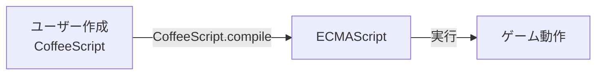

### 5.2 WebGL描画

- WebGLを使い画面描画を行うライブラリをECMAScriptで記述し、WebAssemblyから呼び出す
- **外部JSライブラリ（Three.js等）は使用せず、WebGLを直接制御する**
- Rustからは `web-sys` クレート経由でWebGL APIを呼び出す

#### 描画構成

- 2Dと3Dのプレーンの両方をWebGLで生成する
- 2Dは、WebGLの2Dプレーンを使用する
- 重ね合わせは2Dの方を上にする
- 2Dプレーンは複数作成可能
- 2Dオブジェクトは描画するプレーンを指定可能
- 2Dプレーンは作成された順に上に積み上がっていく（重ね合わせで上になる）
- 同じプレーンに描画される2Dスプライトは描画順に上に重なっていく

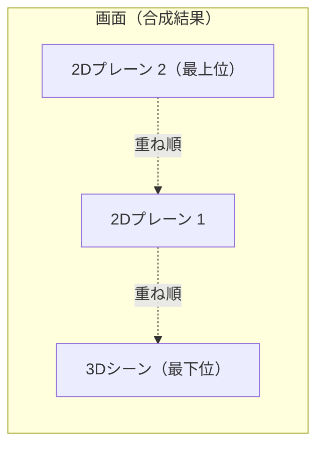

### 5.3 2Dカメラ（2Dプレーンの表示範囲制御）

- Three.jsの `OrthographicCamera` と同じ思想で2Dプレーンの表示範囲を制御する
- 各2Dプレーンはワールド座標系を持ち、カメラがその一部を切り取って表示する
- カメラオブジェクトは以下のパラメータを持つ
  - `x, y`: ワールド座標系におけるカメラ左上位置
  - `width, height`: カメラで映す範囲の幅・高さ
- 上記パラメータをもとに正射影行列（Orthographic Projection Matrix）を生成し、WebGLに渡して描画する
- 2Dスプライトは矩形メッシュ（2つの三角形）にテクスチャを貼って描画する

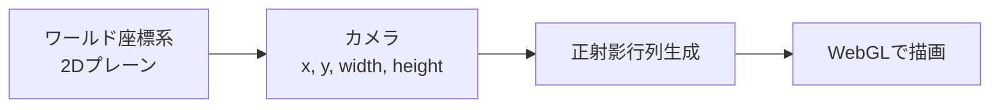

### 5.4 テキスト描画

- 2Dプレーンにテキストを表示する機能を実装する
- テキストデータを渡すと2Dプレーンに描画するライブラリを作成する

### 5.5 当たり判定

**「当たったか」は、聞かれた時にその場で答える。**毎フレーム全部の組み合わせを
調べておくのではなく、ゲームコードが**相手を指定して尋ねる**形にする。

```coffee
behavior: (e) ->
  super(e)
  if @collision(@ground)      # 動かした直後に聞く
    @Y = 0.5                  # その場で戻せる
    @YS = 0
```

> 当初は物理エンジン（Rapier）を組み込む案だったが、必要なのは
> 「当たったかどうか」だけであり、質量や反発を扱う物理演算は要らない。
>
> 次に「毎フレーム全組み合わせを調べ、`behavior(e)` の `e.hits` へ配る」形を
> 作ったが、**調べた時点と使う時点がずれる**（1フレーム古い位置になる）ため、
> 尋ねる形へ改めた。合わせて、使わない組み合わせを調べる無駄も無くなった。

#### 尋ねるメソッド

| メソッド | 見る範囲 | 用途 |
| --- | --- | --- |
| `@intersect(相手)` | **XY平面だけ**（奥行きを見ない） | 見下ろし型・横スクロール |
| `@collision(相手)` | XYZ すべて | 立体的な遊び |

- **どちらを使うかは書く人が選ぶ。**`@KIND` では決めない。
  3Dオブジェクトでも、奥行きを無視したければ `@intersect` を使える
- **呼んだ瞬間の位置**で判断する。動かした直後に聞いて、その場で戻せる
- 自分自身は当たらない
- **相手には配列も渡せる**

```coffee
enemy = @collision(@enemies)   # 当たった相手が返る
@damage() if enemy
```

##### 戻り値

**当たった相手そのもの**を返す。当たっていなければ `null`。

`true` を返すだけより使い道が広く、`if @collision(@ground)` の書き味も変わらない。
配列を渡した場合は、**最初に当たった相手**を返す。

#### `@BOUNDARY`

当たり判定に使う範囲。**書き方で3通り**に分かれる。

| `@BOUNDARY` の値 | 判定 | 拡大縮小 |
| --- | --- | --- |
| **書かない** | **見た目そのもの** | **効く** |
| `null` / `false` | 持たない | ― |
| オブジェクト | 書いた形 | **効かない** |

既定では**見えているものがそのまま当たる**ので、まずは何も書かずに作り始められる。
細かく詰めたい時だけ形を書く。管理用オブジェクトなど、判定を持たせたくないものは
`null` を入れて外す。

##### 見た目そのものを使う場合

見えているものが当たるのが自然なので、こちらは**拡大縮小が効く**。

| 種別 | 判定の大きさ |
| --- | --- |
| プリミティブ | `1 × 1 × 1` に `@SCALEX/Y/Z` を掛けたもの（どの形も正規化されている。6.2.5節） |
| 3Dモデル | モデルの**外接直方体**に `@SCALEX/Y/Z` を掛けたもの |
| 2D画像 | プリミティブと同じ扱い |
| 管理用（`@KIND = "NONE"` など） | **判定なし**（表示していない以上、当たるものが無い） |

- モデルの外接直方体は、**読み込んだ時に一度だけ求めて覚える**
  （頂点はGPUへ渡してしまうため、後からは数えられない）
- **まだ読み込めていないモデルは判定を持たない**。大きさが分からないため
- モデルの中心がずれている場合は、**そのずれも拡大縮小と一緒に伸びる**

##### 形を自分で書く場合

`@BOUNDARY` は**オブジェクト（値の入れ物）**なので、キーは**すべて大文字**にする。
インスタンスのプロパティと同じ書き方であり、メソッドの引数（小文字）とは見分けがつく。

```coffee
@BOUNDARY =
  MODEL: "box"      # "box"（直方体）/ "sphere"（球）/ "cylinder"（円柱）
  SCALEX: 1         # 大きさ（1×1×1 の何倍か）
  SCALEY: 1
  SCALEZ: 1
  RADIUS: 0.5       # MODEL: "sphere" / "cylinder" のとき
  X: 0              # オブジェクトの位置からの**ずれ**
  Y: 0
  Z: 0
```

| キー | 内容 | 既定値 |
| --- | --- | --- |
| `MODEL` | `"box"` / `"sphere"` / `"cylinder"` | `"box"` |
| `SCALEX` / `SCALEY` / `SCALEZ` | 直方体の全長（中心からではない） | 各 1 |
| `RADIUS` | 球・円柱の半径 | 0.5 |
| `SCALEY` | 円柱の高さ（直方体と共通） | 1 |
| `X` / `Y` / `Z` | オブジェクトの座標からの**ずれ** | 各 0 |

- `X` / `Y` / `Z` は、オブジェクトでは「位置」だが、**`@BOUNDARY` の中では「ずれ」**になる
  - `@BOUNDARY` の中身はオブジェクトからの相対と決まっているため

**円柱は Y軸に沿って立つ**形に固定する（見た目の `cylinder` と同じ向き）。
横倒しの円柱は扱わない。

- 知らない `MODEL` は直方体として扱う
- 大きさに 0 以下や数値でない値を書いた場合は既定へ戻す
- **もの凄く大きな見た目に、ごく小さな判定**を付けられる。難易度の調整はここで行う

#### 効かないもの

| | 形を書いた場合 | 見た目そのものの場合 | 理由 |
| --- | --- | --- | --- |
| `@SCALEX` などの拡大縮小 | **効かない** | **効く** | 書いた形は見た目から切り離すのが目的。見た目そのものなら、見えているとおりに当たるべき |
| `@ROTX` などの回転 | **効かない** | **効かない** | 軸に沿った形だけを扱うほうが速く、調整もしやすい |

#### 当たりの見方

| 組み合わせ | 見方 |
| --- | --- |
| 直方体 × 直方体 | 3軸それぞれの重なり |
| 球 × 球 | 中心どうしの距離 |
| 球 × 直方体 | 直方体の中で**いちばん近い点**までの距離 |
| **円柱 × 円柱** | **XZは円と円**、Yは範囲の重なり |
| **円柱 × 直方体** | **XZは円と矩形**、Yは範囲の重なり |
| **円柱 × 球** | 円柱の中で**いちばん近い点**までの距離（縁に触れた場合も拾える） |

直方体も円柱も「**XZ平面の形を、Y方向へ押し出したもの**」なので、
`XZの重なり × Yの重なり` に分けて考えられる。近似ではなく、**どれも正確**である。

`@intersect` の場合は、**Zを潰してから**同じ手順で見る（球は円、直方体は矩形になる）。

**接している（境目がちょうど一致する）場合も当たりとみなす。**
1ドットの判定を置いた時に、端で拾えなくなるのを避けるため。

#### 当たりを取るには双方に判定が要る

片方が `null` などで判定を持たない場合は、当たらない。

#### すり抜け

1フレームの移動量が判定の大きさを超えると、**重なった瞬間が存在せず**すり抜ける。
落下速度が上がる場合などは、判定を厚くして避ける。

#### デバッグ表示（`setDebug`）

```coffee
setDebug debug: true, opacity: 0.3
```

見た目と判定がずれていないかを、**目で確かめられる**ようにする。

| キー | 内容 | 既定値 |
| --- | --- | --- |
| `debug` | 当たり判定の枠を描くか | `false` |
| `opacity` | 枠の濃さ（0より大きく1以下） | `0.5` |

- **書いた項目だけ変わる**（`setGamepadOption` と同じ）
- `setDebug true` のように**真偽値だけを渡す短い書き方**もできる
- `opacity` に範囲外や数値でない値を書いた場合は既定へ戻す
  （0 だと見えず、1 を超えると意味を成さないため）

| 種別 | 描くもの |
| --- | --- |
| `@KIND = "2D"` | XY平面の**矩形**（`@intersect` が見る範囲） |
| それ以外 | **直方体**のワイヤーフレーム（`@collision` が見る範囲） |
| `MODEL: "sphere"` | **球**（3方向の輪。2Dなら正面の輪1つ） |
| `MODEL: "cylinder"` | **円柱**（上下の輪と縦4本。2Dなら矩形） |
| 判定を持たないもの | 描かない |

- 色は**赤**（`#ff3b30`。キーコンフィグの目印と同じ）。**濃さは 0.5**。
  枠はあくまで補助なので、半透明にして見た目の邪魔をしない
- **深度判定を効かせたまま描く。**モデルの後ろへ回った辺は隠れ、前後の関係が見た目どおりになる
  （線そのものは深度を書き換えないため、あとから描くものへは影響しない）
- 引数を省略すると入（`setDebug()`）
- **ゲームを実行し直すと既定へ戻る**（他の設定と同じ扱い）
- `GLOBAL` には入れない。**システムの状態を、ゲームが使う入れ物へ混ぜない**ため

#### 押し戻し

**エンジンは行わない。**当たったことを答えるだけで、位置を戻したり跳ね返したりはしない。
どう振る舞うかはゲームによって違い、engine が決めると思ったのと違う動きになりやすいため。

### 5.6 3Dモデルフォーマット

- **採用フォーマット: glTF 2.0（バイナリ版 `.glb` を標準とする）**
- 選定理由:
  - **アニメーション内包**: スケルタル（ボーン）アニメーションとモーフターゲット（ブレンドシェイプ）を、複数の名前付きクリップとして単一ファイルに格納できる
  - **標準性**: Khronos Group（OpenGL / Vulkan / WebGL と同じ団体）が策定し、**ISO/IEC 12113:2022** として国際標準化されている
  - **Web/WebGL適性**: Web上のリアルタイム3Dの標準交換フォーマットであり、WebGLで直接扱える。本IDEは外部JSライブラリを使わず `web-sys` 経由でWebGLを直接制御する方針（5.2節）と整合する
  - **配布効率**: `.glb` はジオメトリ・マテリアル・テクスチャ・アニメーションを1つのバイナリファイルに圧縮梱包でき、ファイルサイズが小さく読み込みが速い
  - **PBR対応**: 物理ベースレンダリング（PBR）マテリアルを標準サポートする
- 比較検討した他フォーマット:

  | フォーマット | 判断 |
  | --- | --- |
  | **FBX**（Autodesk） | アニメ内包可・流通も広いが、プロプライエタリ仕様で制作パイプライン（Unity/Unreal）向け。Web/WebGLでの直接利用には不向き（実質glTF等への変換が前提）。不採用 |
  | **USD / USDZ**（Pixar） | 大規模シーン記述やApple系AR向けに強いが、WebGLランタイムでの直接読み込みは一般的でなくブラウザゲーム用途には過剰。不採用 |
  | **OBJ / STL** | アニメーション非対応のため要件外。不採用 |

- 取り扱い方針:
  - 配布・保存は単一ファイルの **`.glb`（バイナリ）** を基本とする
  - `.gltf`（JSON + 外部リソース）は開発・デバッグ時の確認用途として許容する
  - 圧縮が必要な場合は **Draco**（ジオメトリ圧縮）／ **KTX2 / Basis**（テクスチャ圧縮）拡張の採用を将来検討する
- 3Dモデルファイルはゲームプロジェクトの `assets/` 配下に配置する
- モデルの読み込み・解放は **アセットパック**（5.7節）を通じて行う

#### デフォルトキャラクター（同梱モデル）

- 新規プロジェクト用のデフォルト3Dキャラクターとして、**二足歩行風**のデフォルメ猫モデルを同梱する
  - 四つ足ではなく立ち姿にするのは、ゲームの主人公として扱いやすいため
- 配置: `web/templates/assets/default-cat.glb`（オレンジ）
  - **毛色違い**として `web/templates/assets/default-cat-white.glb`（白）も同梱する
  - 形と骨は同じで、頂点カラーだけが違う。敵味方の描き分けなどに使える
- 生成: `tools/gen_cat_glb.py`（Python標準ライブラリのみで `.glb` を直接生成。Blender等の外部ツール不要）
  - 再生成する場合は `python3 tools/gen_cat_glb.py` を実行する。**2色ぶんが一度に出力される**
  - 毛色は `PALETTES` に「出力ファイル名 → 部位ごとの色」で持つ。増やすならここへ足す
- 構成:
  - 12ボーン（hips / spine / head / ear_L,R / **arm_L,R** / **leg_L,R** / tail1-3）のスケルトン＋リジッドスキニング
    - 前脚を**腕**にし、後脚を**脚**にした二足の骨組み
  - 複数パーツの頂点カラー(`COLOR_0`)による色分け（体・耳・口まわり・鼻・目・手足・お腹・しっぽ先）
  - 単一マテリアル（PBR・`baseColorFactor` 白／`COLOR_0` で着色）
- 内包アニメーションクリップ:

  | クリップ名 | 長さ | ループ | 内容 |
  | --- | --- | --- | --- |
  | `Walk` | 1.0秒 | する | 腕と脚を交互に振る歩行。腕は脚と逆位相。胴の上下とひねり |
  | `Run` | 0.55秒 | する | 大振幅・高速。前傾姿勢で、しっぽを後方へ |
  | `Jump` | 1.3秒 | しない | しゃがみ→腕を振り上げて跳躍→着地→静止 |
  | `Down` | 1.4秒 | しない | **やられた演出。**のけぞる→尻もち→仰向けに倒れて手足をジタバタ |

- `Down` は**腰ごと後ろへ倒す**（`hips` のX回転）。背骨だけ曲げても、よろけて見えるだけで倒れたようにならない
  - 倒れた姿勢では体が沈むため、床に置いたまま再生すると**足元がわずかに床へ潜る**
  - 気になる場合は `@Y` を少し上げるか、`@removeAfterAnimation` で消し切る

### 5.7 アセット管理（アセットパック）

ゲームに使うアセット（画像・音声・3Dモデル）を**アセットパック**という単位でまとめて定義し、シーン単位でプリロード／解放する仕組みを提供する。

#### 定義（連想配列）

- アセットパックはCoffeeScriptの連想配列で定義する
- パック名をキーに、種別（`images` / `sounds` / `models`）ごとに「アセット名 → ファイルパス」を列挙する

```coffee
AssetPacks.define "stage1",
  images:
    player: "assets/player.png"
    tiles:  "assets/tiles.png"
  sounds:
    bgm:    "assets/stage1_bgm.ogg"
    jump:   "assets/jump.wav"
  models:
    cat:    "assets/default-cat.glb"
```

#### プリロード

- シーン開始前に `AssetPacks.load(パック名, 進捗コールバック)` で一括読み込みする
- 読み込みは fetch にとどまらず**デコードとGPU転送まで**行い、使用時の遅延を無くす

```coffee
await AssetPacks.load "stage1", (loaded, total) ->
  drawLoadingBar loaded / total
```

| 種別 | プリロード時の処理 | メモリの実体 |
| --- | --- | --- |
| 画像 | fetch → デコード → WebGLテクスチャ化 | GPU（VRAM） |
| 音声 | fetch → AudioBufferにデコード（Web Audio API） | RAM |
| 3Dモデル(.glb) | fetch → パース → 頂点/インデックスバッファをGPU転送。スケルトン・アニメーションクリップはRAM保持 | GPU + RAM |

#### 使用

- `AssetPacks.get(パック名, アセット名)` でキー指定により即時取得する（デコード済みのため遅延なし）
- 解放済み・未ロードのパックに `get` した場合は明確なエラーをコンソールへ出力する

#### 解放

- 不要になった時点で `AssetPacks.release(パック名)` を呼び、メモリから解放する
  - WebGLリソース（テクスチャ・バッファ）は `deleteTexture` / `deleteBuffer` で**明示的にGPUメモリから解放**する
  - AudioBufferやパース済みデータは参照を切ってJSのGCに回収させる

#### 管理方式

- **参照カウント**: 同じファイルが複数パックに含まれる場合、アセット実体は参照カウントで共有管理する
  - `release` しても他のパックが使用中なら実体は保持する
  - 同一ファイルの二重ロードを防止する
- **ロード状態**: パックは `unloaded` / `loading` / `ready` の状態を持つ
  - `load` の二重呼び出しは同一のPromiseを返す（多重読み込みしない）

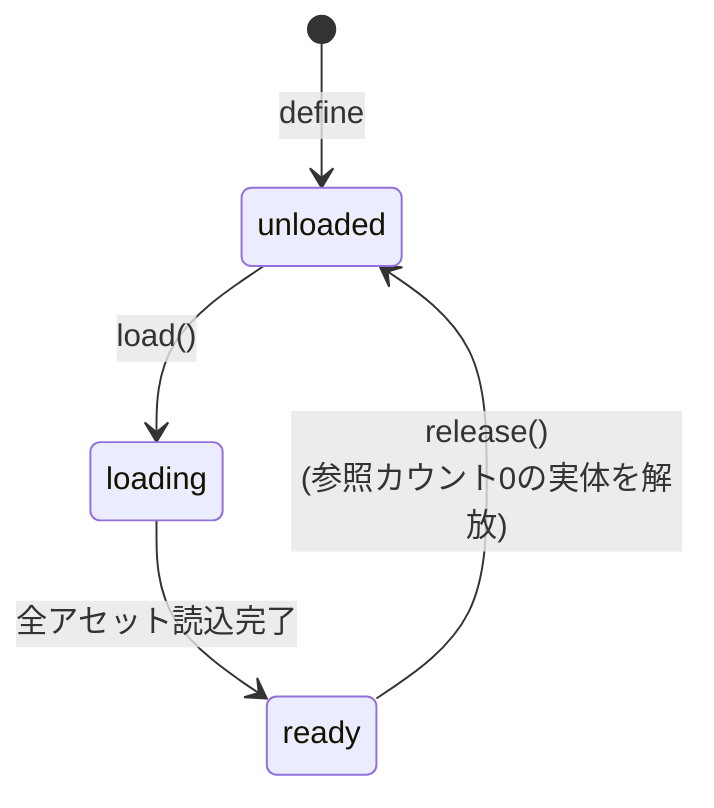

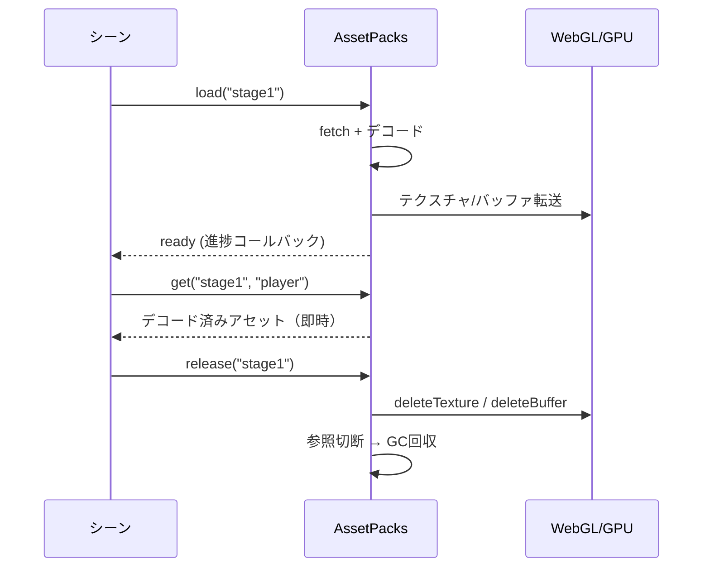

#### 3Dモデルの詳細表示

左ペインの**3Dモデルタブでモデルを選ぶ**と、メイン部に次を縦に並べて表示する（`web/model-view.js`）。

- **正面から見た大きめのプレビュー**（静止姿勢）
  - ゲームの決まりでは **-Z が前方**なので、カメラは手前側（-Z）へ置く
  - 見上げ・見下ろしをせず、モデルの中心と同じ高さから見る
- **内包するアニメーションの一覧**（名前・長さ・動きのプレビュー）
  - 並べ替えない。**作った側が意図した順**で見せる
  - プレビューはループ再生する

##### 名前のコピー

- 名前はボタンにし、押すと**クリップボードへコピー**する
  - `@setAnimation name: "..."` へそのまま貼れるようにするため
- `navigator.clipboard` を先に試し、断られたら**隠した入力欄**で写す
  - 安全な文脈と利用者の操作が要るため、断られることがある
- どちらも駄目な場合は、その旨を知らせる（黙って諦めない）

##### 描画のしかた

- **WebGLのコンテキストは1つだけ**使い回し、各行の2Dキャンバスへ写す
  - 行ごとに作ると、アニメーションの多いモデルでコンテキストの上限に達する
- スキニング（骨の変形）に対応した専用のシェーダーを使う
  - サムネイル生成（`model-preview.js`）は静止姿勢しか描かないため、別に持つ
- 左ペインのタブを選び直したら、**再生を止めてから**画面を消す
  - 止めないと、見えないところで描き続ける
- 開く時はアセット管理画面と同じく、エディタの状態を手放す（`CURRENT_FILE` を空にする）

#### アセットの対応表（`assets.toml`）と管理画面

**実装済みの部分。**上のプリロード／解放より先に、**キー名とファイル名の対応**だけを扱えるようにしてある。

- ゲームコードでは**キー名**でアセットを指す。ファイル名を直接書かないため、差し替えは1行直すだけで済む

  ```coffee
  @MODEL = "cat"        # ファイル名ではなくキー名
  ```

- 対応表はプロジェクト直下の **`assets.toml`**（`info.toml` の隣）に置く

  ```toml
  [images]
  title = "title.png"

  [sounds]
  jump = "jump.wav"

  [models]
  cat = "default-cat.glb"
  ```

- **キー名は種別をまたいで一意**にする。ゲームコードは種別を書かずに引くため
- キー名は英数字とアンダースコアで、数字以外から始める（そのままゲームコードへ書くため）
- 実際に置かれているファイルと突き合わせ、**増えたファイルには仮のキー名**を付け、**消えたファイルの行は落とす**
  - 仮の名前は拡張子を落として作る（`default-cat.glb` → `default_cat`）
  - **既にあるキー名は変えない**（作業者が付けた名前を勝手に書き換えない）

##### 管理画面

- 左ペインのタブ列、**3Dモデルの右**に開くボタンを置く（タブではないため選択状態は持たない）
  - **もう一度押すと開く前の状態へ戻る**（トグル）
    - 直前までオブジェクトを編集していた場合は、そのエディタを開き直す
    - 何も開いていなかった場合は、メイン部を空にするだけ
  - タブの選択状態を切り替える処理は、**このボタンを触らない**（`role="tab"` のものだけを対象にする）
    - 選択状態の付け外しでクラス名を書き換えるため、巻き込むと見た目の指定ごと消える
- メイン部に種別ごとの一覧を出し、キー名をその場で書き換えられる
  - 使えない名前・重複はその場で知らせ、**保存しない**（直前の名前へ戻す）
- **開く時にエディタの状態を手放す**（`CURRENT_FILE` を空にし、カードの強調も外す）
  - 残したままだと「同じファイルは開き直さない」判定に引っかかり、**直前まで編集していたオブジェクトを選び直しても何も起きなくなる**
  - 画面から外す前に、書きかけの下書きを確定させる（1秒の待ちの途中だと最後の入力が落ちるため）
- **左ペインのタブを選び直したら、この画面は閉じる**（メイン部を空にする）
  - タブはこの一覧から選ぶものなので、別画面が残っていると噛み合わない
  - **エディタを開いている時は消さない**（タブを見ながら書き続けられるように）
  - 出ているかどうかは画面の有無（`.assetmap-pane`）で見る。別に状態を持つと実際の表示とずれる

### 5.8 エラー捕捉と通知

ゲームコード（CoffeeScript → トランスパイル後のJavaScript）のエラーは、ブラウザの開発者ツールを開かなくても**IDE内で捕捉・表示**し、コーダーに通知する。捕捉は以下の4層で行う。

#### ① コンパイルエラー（実行前）

- `CoffeeScript.compile(source, { sourceMap: true })` は構文エラー時に**行・列番号付きの例外**を投げる（`e.location.first_line` / `first_column`）
- 実行前にIDEで捕捉し、`.coffee` 上のエラー位置とメッセージを表示する
- 表示形式は **`ファイル名:行:桁 メッセージ`**（例: `gameMain.coffee:6:1 unexpected indentation`）
  - CoffeeScriptの位置情報は0起点のため、表示は1起点に直す

#### ② 実行時エラー（フレームループ内・最重要）

- エンジンがユーザーコードの `behavior()` を呼び出す箇所を **try/catch で包む**
- 「**どのオブジェクト（クラス）のどのメソッドで発生したか**」という文脈付きで通知する

```js
try {
  obj.behavior();
} catch (e) {
  reportError(e, obj);  // 発生元オブジェクトの情報を添えて通知
}
```

#### ③ グローバル捕捉（取りこぼし防止の保険）

- `window.addEventListener("error", ...)`: 同期エラー全般
- `window.addEventListener("unhandledrejection", ...)`: async/Promise系エラー

#### ④ ソースマップによる行番号逆変換

- コンパイル時に生成したソースマップで、エラースタックの**JS行番号を `.coffee` の行番号に変換**して表示する
- コーダーは自分が書いたCoffeeScriptの行として直接エラー位置を把握できる

#### IDEでの通知方法

| 表示先 | 内容 |
| --- | --- |
| Aceエディタの行アノテーション | エラー行に赤マーカー＋ホバーでメッセージ（コンパイル/実行時とも） |
| フッターコンソール | 最新エラーの1行表示（4.6節） |
| エラーパネル／メッセージダイアログ | エラー種別・発生元オブジェクト名・`.coffee` 行番号・スタック |

#### エラー発生時の挙動

- **実行時エラー発生時はゲームループを一時停止する**
  - 毎フレーム同じエラーが連続発生してログが流れるのを防ぐ
  - 修正 → 再実行のフローへ自然につなげる
- ユーザーコードの `console.log` もIDE内（フッターコンソール／エラーパネル）へ表示し、printデバッグを開発者ツールなしで完結させる

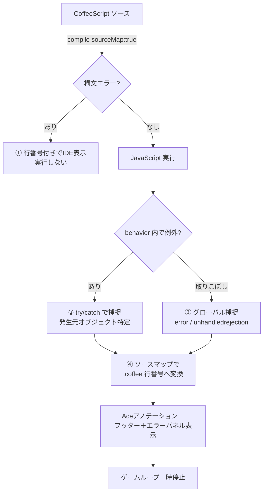

---

## 6. ゲーム作成仕様

### 6.1 画面描画タイミング

- デフォルトは **60fps**
- 設定ファイル（**TOML形式**）で変更可能
  - **ゲーム作成者が指定した値をそのまま使う**（10fps単位などへ丸めない）
  - 扱えない値（0など）を避けるため、`1`〜`240` の範囲にのみ収める

#### 1フレームの流れ

**ダブルバッファリング**を前提とし、1フレームは次の順で進む。

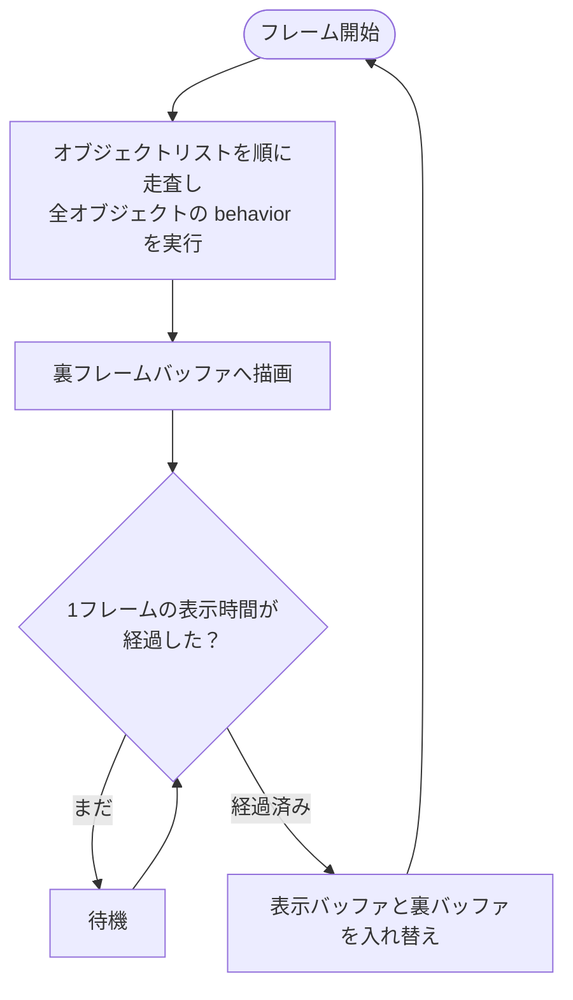

- 表示時間内に処理が終わった場合は、**残り時間を待ってから**入れ替える
- **表示時間内に全オブジェクトの `behavior()` が終わらなかった場合は、表示時間を過ぎても入れ替えない**
  - 全オブジェクトの実行が終わった**次のタイミングで**入れ替える
  - つまり、そのフレームの表示時間は目標より長くなる
- **追いつくための多重更新・巻き戻しは行わない**（1フレームにつき `behavior()` は1巡だけ）
  - 処理が重い場合は、フレームを飛ばすのではなく**ゲーム全体が素直に遅くなる**
  - タブ非表示などで長く止まっていた場合も、取り戻そうとしない

#### 実装上の扱い

- ループは **`setTimeout`** で駆動する
  - **`requestAnimationFrame` は使わない。**表示のリフレッシュ間隔（60Hzなら16.7ms）の
    **整数倍でしか入れ替えられない**ため、60や30のように割り切れる値でないと
    16.7ms と 33.3ms が交互に来てしまい、「FPSは丸めない」という方針を満たせない
  - ブラウザは自動でバッファを入れ替えるため、**裏バッファはオフスクリーンのフレームバッファ（FBO）として自前で用意**し、入れ替えの判断が下りた時点で表示側へ転送する
  - 目標FPSがディスプレイのリフレッシュレートを超える場合、**実際の表示更新はリフレッシュレートが上限**となる

##### 締切の進め方

**次フレームの起点は「理想の時刻」で積み上げる**（実際に入れ替えた時刻を起点にしない）。

```
次の起点 ← 今の起点 ＋ 1フレームの表示時間
待ち時間 ← 次の起点 − 現在時刻          （0未満なら 0。小数は切り上げ）
```

- 実際の入れ替え時刻を起点にすると、発火の遅れが毎回わずかに積み上がり、
  **締切が少しずつ後ろへずれて周期的にフレームが伸びる**（実測40〜50fps程度まで落ちる）
- **1フレーム以上遅れている場合だけ、起点を現在時刻に置き直す**
  - 遅れを持ち越さないため。**取り戻すために更新を多重に回すことはしない**

##### 1回の呼び出しで行うこと

表示時間が来ていれば**先に入れ替え**、続けて次に表示するフレームを更新する。
この順にすることで、1フレームあたりの `setTimeout` は**1回**で済む。

```mermaid
flowchart TB
    T([setTimeout で起床]) --> P{表示時間が<br/>経過したか}
    P -- はい --> Swap[バッファを入れ替え<br/>起点を1フレーム進める]
    P -- いいえ --> U
    Swap --> U{裏バッファの<br/>描画が未了か}
    U -- はい --> Behavior[全オブジェクトの behavior<br/>→ 裏バッファへ描画]
    U -- いいえ --> D
    Behavior --> D[締切までの残り時間を求める]
    D --> T
```

- **実測FPS**は「入れ替えから入れ替えまで」の直近30回の平均から求め、フッターに表示する（4.6節）
  - 理想の起点と比べると発火の遅れが毎回の測定に乗るため、**実際の入れ替え時刻どうし**で測る

##### ウィンドウが隠れている間の扱い

**ウィンドウが隠れたら一時停止し、表示へ戻ったら再開する。**

ブラウザは**隠れているタブの `setTimeout` を1秒間隔まで制限する**ため、そのまま回すと
**1fps** まで落ちる。中途半端な速度で動き続けるより、止めたほうが分かりやすい。

| 出来事 | 動作 |
| --- | --- |
| 実行中に隠れた | **一時停止**（`Paused`）。押しっぱなしのキーを解除し、FPS表示を `--` に戻す |
| 隠れて止めた状態から表示へ戻った | **再開**（`Running`）。フレームの区切りを取り直してループを再開する |
| 停止中に隠れた／戻った | 何もしない |
| **別の理由で一時停止している**（エラー捕捉など） | **再開しない**（勝手に動き出さないようにする） |

- 再開時は**フレームの区切りだけを取り直す**。止まっていた間の空白を1フレームの長さとして
  数えないようにするためで、**実測FPSの記録は残す**
- 一時停止中でも**停止**はできる（Escキー・トグルボタン）

```mermaid
stateDiagram-v2
    [*] --> 停止中
    停止中 --> 実行中: 実行
    実行中 --> 停止中: 停止 / Esc
    実行中 --> 一時停止: ウィンドウが隠れた
    一時停止 --> 実行中: 表示へ戻った
    一時停止 --> 停止中: 停止 / Esc
```

### 6.2 オブジェクト管理

- ゲーム実行中のオブジェクトは**一次元配列**で管理する
- 全オブジェクトを単一のフラットなリストに格納する
- 毎フレーム、配列を順に走査して各オブジェクトの `behavior()` を呼び出す
- `addObject()` / `removeObject()` で動的に追加・削除する

#### 走査中の追加・削除の扱い

`behavior()` の中から追加・削除された場合に、呼び出し順が崩れないようにする。

| 操作 | 扱い |
| --- | --- |
| **追加** | 走査対象は**フレーム開始時に固定**する。そのフレームでは呼ばれず、**次フレームから対象**になる |
| **削除** | その場では**予約のみ**。**フレーム末にまとめて反映**する（走査中に配列が縮まないようにするため） |

- 識別子（`ObjectId`）は**再利用しない通し番号**とする。削除済みの識別子が別の実体を指すことはない
- 同じ識別子を二重に削除しても1件として扱い、存在しない識別子の削除は無視する
- ゲーム停止時は一覧と削除予約をすべて破棄する

#### 公開API

CoffeeScript側から次のグローバル関数として利用する。

| 関数 | 内容 |
| --- | --- |
| `arcadeerAddObject(object)` | 一次元配列の末尾へ追加し、識別子を返す |
| `arcadeerRemoveObject(id)` | 削除を予約する（反映はフレーム末） |
| `arcadeerObjectCount()` | 現在の保持数（削除予約は反映前） |

### 6.2.1 ゲームの実行と停止

- **実行／停止トグル**で操作する
  - **1つのボタンで兼ねる**。停止中は再生アイコン、実行中は停止アイコン（赤）を表示する
  - プロジェクトを開いていない間は押せない
  - ツールチップも状態に応じて「ゲーム実行」「ゲーム停止」に切り替わる（表示言語の変更にも追従する）
  - **置き場所はウィンドウの縦横比で変わる**（同じ働きのボタンを両方に用意し、表示の切り替えはCSSが行う）

    | ウィンドウ | 置き場所 |
    | --- | --- |
    | 16:9より横長 | **ゲーム表示エリアの最上部**のボタンエリア |
    | 16:9より狭い | **左ペインのプロジェクト名の右端** |
- 実行状態は `停止中` / `実行中` / `一時停止` の3つ
  - `一時停止` は**ウィンドウが隠れた時**（6.1節）と、実行時エラーを捕捉した際（5.8節・**今後実装**）に使う
- 実行中は**実測FPSをフッターへ表示**する（4.6節）。表示の書き換えは0.25秒間隔に間引く
- **実行中も編集できる**（デバッグしやすくするため、画面を覆ったり操作を止めたりしない）
- **入力の宛先は、クリックした場所で決まる**
  - **ゲーム表示エリアをクリック**すると、以降のキー操作は**ゲームへ**送られる
    - 押されているキーは `isKeyDown(コード)` でゲームコードから参照できる（6.2.3節）
    - ブラウザ既定の動作（スクロール等）は抑止する
    - 入力先が分かるよう、フォーカス中は canvas の枠をアクセントカラーにする
  - **それ以外をクリック**すると、通常どおりIDEの操作になる（エディタでの編集・保存など）
  - フォーカスが外れた場合とゲーム停止時は、押下状態をすべて解除する
- 停止すると、オブジェクトリストを破棄しFPS表示を `--` に戻す

##### キーボードショートカット

**Esc は「停止」だけを行う**。今どちらの状態か分からなくても、確実に止められるようにするため。

**Alt を足すと「止めずにエディタへ戻る」**。動かしたまま数値を書き直して、
すぐ効きを確かめたい場面のため。止まっている時に押しても何もしない
（うっかり実行してしまわないように）。

実行・停止のトグルには **⌘（Mac）/ Ctrl（Windows）** を使う。

**Windowsキー（GUIキー）は使わない。**OS が先に横取りするため、ブラウザまで届かない
（`Win+Enter` はナレーターの起動に割り当てられている）。

| キー | 操作 | 条件 |
| --- | --- | --- |
| **Esc** | **リファレンスを閉じる**、または必ず**停止** | 下記の順に判断する。**エディタにフォーカスがある間は無効** |
| **⌘/Ctrl + Enter** | **実行**と**停止**のトグル | プロジェクトを開いている。エディタの編集中でも効く |
| **Alt/Option + ⌘/Ctrl + Enter** | **止めずに**エディタへ戻る | **実行中**かつプロジェクトを開いている |
| **Alt/Option + Shift + N** | フッターのログの**開閉**（4.6節） | いつでも。エディタの編集中でも効く |

Esc は上から順に判断する。

| 順 | 条件 | 動作 |
| --- | --- | --- |
| 1 | エディタにフォーカスがある | **何もしない**（vimが入力モードを抜けるのに使うため） |
| 2 | **リファレンスが開いている**（4.9節） | **リファレンスを閉じる**。ゲームは止めない |
| 3 | 実行中 | ゲームを停止する |
| 4 | 上記以外 | 何もしない |

読んでいるものを閉じるほうを先にするのは、リファレンスがゲーム表示エリアと同じ場所を
使うため、開いている間はゲームが見えていないから。

**操作のあとはフォーカスを自動で移す**。キーボードだけで「直す → 動かす → 止める → 直す」と往復できるようにするため。

| 操作 | 移す先 |
| --- | --- |
| Esc で停止 | **エディタ**（続けてコードを直せる） |
| Esc でリファレンスを閉じる | **移さない**（読むのをやめただけのため） |
| ⌘/Ctrl + Enter で実行 | **ゲーム表示エリア**（そのままキー操作をゲームへ送れる） |
| ⌘/Ctrl + Enter で停止 | **エディタ**（すぐ続きを書ける。Esc で止めた時と同じ） |
| Alt + ⌘/Ctrl + Enter | **エディタ**（**ゲームは動いたまま**） |

##### 捕捉フェーズで受ける

ショートカットの判定は、`window` の **捕捉（キャプチャ）フェーズ**で受け取る。

- エディタ（Ace）は**自分が扱ったキーの伝播を止める**
- 浮上（バブル）フェーズで待っていると、**編集中の `⌘/Ctrl+Enter` が届かない**
- 捕捉フェーズなら、止められる前に受け取れる

```
window（捕捉）← ここで受ける
  └ エディタ … 自分で扱って stopPropagation する
window（浮上）← ここでは届かないことがある
```

- **引き受けたキーは、そこで止める**（`preventDefault` ＋ `stopPropagation`）
  - 止めないと、実行と同時にエディタへ改行が入ってしまう
- 引き受けなかったキーは何もせず、そのまま通す

##### `key` と `code` の使い分け

修飾キーを伴う判定には **`KeyboardEvent.code` を使う**。

macOSでは **Alt（Option）を押すと `key` が別の文字になる**ため（`Alt+N` → `˜` など）、
`key` で見分けると動かない。`code`（`"KeyN"`）はキーボード配列や修飾キーに影響されない。

- `Escape` `Enter` のように修飾キーで変わらないものは `key` のままでよい
- ⌘/Ctrl との組み合わせは**横取りしない**（別の操作に使われうるため）

- フォーカスの移動で**画面をスクロールさせない**（`preventScroll`）
  - 既定の `focus()` は要素が見える位置まで親をスクロールさせるため、
    ゲーム表示エリア上部のボタン欄が隠れてしまう

- エディタでファイルを開いていない場合は移さない
- **トグルボタンで操作した場合は移さない**（マウス操作の流れを妨げないため）

- Esc をエディタで無効にするのは、**vimキーバインドが入力モードを抜けるのに Esc を使う**ため
  - 有効にすると、モードを切り替えるたびにゲームが止まってしまう
  - エディタで編集しながら止めたい場合は、トグルボタンを押すか、エディタの外をクリックしてから Esc を押す
- フォーカスの判定は、フォーカス中の要素がエディタ本体（`#editor-body`）の内側にあるかで行う
  - Ace は本体の中に入力用の要素を持つため、要素そのものの一致では判定できない

```mermaid
flowchart TB
    Key([キー入力]) --> Which{どのキー}
    Which -- "Esc" --> Running{実行中}
    Running -- いいえ --> Pass[なにもしない]
    Running -- はい --> Focus{エディタに<br/>フォーカス}
    Focus -- はい --> Pass2[なにもしない<br/>エディタへ渡す]
    Focus -- いいえ --> Stop[ゲームを停止]
    Stop --> FocusE[エディタへ<br/>フォーカス]
    Which -- "⌘/Ctrl+Enter" --> Opened{プロジェクトあり}
    Opened -- いいえ --> Pass3[なにもしない]
    Opened -- はい --> Alt{Altも押している}
    Alt -- はい --> Running2{実行中}
    Running2 -- はい --> Keep[止めずに<br/>エディタへフォーカス]
    Running2 -- いいえ --> Pass5[なにもしない]
    Alt -- いいえ --> Playing{実行中}
    Playing -- いいえ --> Run[ゲームを実行]
    Run --> FocusG[ゲーム表示エリアへ<br/>フォーカス]
    Playing -- はい --> Stop2[ゲームを停止]
    Stop2 --> FocusE2[エディタへ<br/>フォーカス]
    Which -- その他 --> Pass4[なにもしない]
```

```mermaid
flowchart TB
    Start([フレーム開始]) --> Traverse[オブジェクト配列を順に走査]
    Traverse --> SuperBehavior[スーパークラスの behavior<br/>加速度・座標を更新]
    SuperBehavior --> UserBehavior[ユーザー定義の behavior 呼び出し]
    UserBehavior --> Next{次のオブジェクトあり？}
    Next -->|Yes| Traverse
    Next -->|No| Collision[当たり判定]
    Collision --> Render[描画]
    Render --> End([フレーム終了])
```

### 6.2.3 ゲームコードから使うAPI

#### `addObject` — オブジェクトの生成と追加

- **引数はすべてキー指定**で、`name` にクラス名を書く
- 生成したインスタンスの**参照を返す**ため、そのまま保持して操作できる

```coffee
class gameMain extends arcadeermain
  constructor: (param) ->
    super(param)

    @myship = @addObject
      name: "myship"
      x: 0
      y: 0
      z: 0

  behavior: (e) ->
    super(e)
    @myship.X += 1        # 参照経由で操作できる
```

- `name` が無い場合や未登録のクラス名の場合は例外にする（綴り間違いに早く気づけるように）
- 生成されたオブジェクトも `addObject` を使えるため、階層的に増やせる
- 追加されたオブジェクトは**次フレームから** `behavior` の対象になる（6.2節）

#### `removeObject` — オブジェクトの削除

```coffee
@removeObject bullet       # 別のオブジェクトを消す
@removeObject @            # 自分自身を消す
```

- **`@addObject` と同じくインスタンスメソッド**にする。
  片方だけ関数だと、書く場所によって呼び方が変わって覚えにくい
- **消えるのは渡した相手**で、呼び出し元ではない。自分を消したい場合は自分を渡す
- 消す相手は**参照**で渡す。`addObject` が返したものをそのまま使える
- 登録されていないものを渡した場合は**何もしない**（消し損ねても止まらないように）

##### 消える順番

```mermaid
flowchart TB
    A([removeObject を呼ぶ]) --> B["削除を予約する"]
    B --> C["このフレームの走査を続ける"]
    C --> D["走査が終わる"]
    D --> E["destructor(e) を呼ぶ"]
    E --> F["一覧から取り除く"]
    F --> G["描画対象から外れる"]
```

- **その場では消えない。**走査の途中で配列を変えると呼び出し順が崩れるため、
  予約だけして**フレーム末にまとめて**取り除く
- 取り除く**直前に `destructor(e)` を呼ぶ**。`e` は `behavior` と同じフレーム情報
- `destructor` を持たないオブジェクトは、そのまま取り除く
- 取り除いたあとは**描画されない**（描画は走査より後に行うため、同じフレームから消える）
- 同じものを二度渡しても、**1件として扱う**
- 一覧から外れたあとは、参照が切れ次第 JavaScript の後始末に回る

```coffee
class enemy extends arcadeermain
  destructor: (e) ->
    echo "%@ フレーム目に消えました", e.frame
    GLOBAL.SCORE += 100
```

- 識別子は**再利用しない**通し番号にする。古い参照が別の実体を指さないようにするため

#### `setScreenSize` — ゲーム内の画面解像度

- `setScreenSize(横, 縦)` で、**ゲームで使う座標系の解像度**を指定する
- canvas の**内部解像度（描画バッファ）**になる。画面上の表示サイズはブラウザの大きさから決まるため、指定した座標系のまま拡大縮小される
  - 例: `setScreenSize(640, 480)` としたとき、画面上が1080px幅で表示されても、ゲーム内の座標系は640×480

```coffee
class gameMain extends arcadeermain
  constructor: (param) ->
    super(param)
    setScreenSize(640, 480)
```

- 既定は **640×480**。指定が無ければこの値を使う
- 上限は **4096**。これを超える指定は上限に収める
- 0以下・数値でない・引数不足などの不正な指定は**無視**し、直前の指定を保つ
- ゲームを実行するたびに既定へ戻してから、クラスの指定を反映する

##### エンジンの関数の渡し方

- `setScreenSize` などのエンジン側の関数は、**クラスをコンパイルする際のスコープへ渡す**
  - `window`（グローバル）を汚さずに、ゲームコードから直接呼べるようにするため
  - CoffeeScriptは代入していない識別子に `var` を作らないため、外側のスコープの関数が参照される

#### `setAnimation` — アニメーションの指定

```coffee
@setAnimation
  name: "Run"
  loop: true
  speed: 1.5
```

| 項目 | 仕様 |
| --- | --- |
| `name` | 再生するクリップ名（`.glb` に内包されたもの）。**必須** |
| `loop` | 既定 **`false`**。`true` を明示した場合のみ繰り返す |
| `speed` | 既定 **1**。`0` は一時停止として扱う。負数や数値以外は1に戻す |
| `rootMotion` | 既定 **`true`**。`false` を明示するとクリップが持つ移動を無効化する |

- **同じクリップを指定した場合は何もしない**（再生位置を戻さない）
- 別のクリップを指定すると**即座に切り替わる**（再生位置は0へ）
- ループしないクリップが末尾に達すると **`@animationFinished`** が `true` になる
- 再生位置は毎フレーム、**目標FPSの1フレーム時間**ぶん進む

#### `removeAfterAnimation` — 再生し終えたら消す

```coffee
@removeAfterAnimation
  name: "Die"
  times: 1        # 省略すると1回
```

弾の着弾や敵の撃破のように、**演出を見せてから消したい**場面のためのもの。
「アニメーションを指定して再生し、終わったら自分を消す」という手順を
毎回書かずに済ませる。

| 項目 | 仕様 |
| --- | --- |
| `name` | 再生するクリップ名。**必須** |
| `times` | 再生する回数。既定 **1**。1以上の整数でなければ1に戻す |
| その他 | `speed` / `rootMotion` は `setAnimation` と同じ |

- `times` が2以上のときは**内部でループさせる**。ループしないと2周目が再生されないため
- 数え方は「クリップの末尾に届いた回数」。**長さの無いクリップは1回**として扱い、
  消えないまま残らないようにする
- 再生し終えると `removeObject` と同じ流れに入る。
  **`destructor(e)` が呼ばれてから**一覧を外れる

##### 消えるまでの間

回数を数えるのは**姿勢を進める時**で、これは走査より後に行う。
そのため、削除が反映されるのは**次のフレーム末**になる。

```mermaid
flowchart TB
    A["フレームN: 走査"] --> B["フレームN: 姿勢を進める"]
    B --> C{"回数に届いたか"}
    C -- はい --> D["削除を予約"]
    D --> E["フレームN: 描画（まだ映る）"]
    E --> F["フレームN+1: 走査"]
    F --> G["destructor(e) → 一覧から外す"]
```

1フレームぶん長く映ることになるが、目には分からない。
走査の途中で消さないという決まり（6.2節）を崩さないほうを採る。

##### ルートモーション（`rootMotion`）

アニメーションクリップには、姿勢の変化だけでなく**キャラクター自身の移動**が
含まれていることがある。これを一般に**ルートモーション**と呼ぶ。

同じクリップでも、使う場面によって移動が要るかどうかが変わる。

| 使い方 | 必要なもの | 位置を決めるのは |
| --- | --- | --- |
| 「ジャンプする」という一連の動きを見せる | 移動を含む全体 | **アニメーション** |
| ゲームのジャンプ動作中の見た目に使う | **姿勢だけ** | **ゲーム**（`@YS` と `@GRAVITY`） |

後者でクリップの移動をそのまま使うと、**アニメーションの移動とゲームの計算が
二重に効いて**しまい、意図した軌道にならない。そのため呼び出しごとに選べるようにする。

```coffee
# 既定 : クリップをそのまま再生する（上下動もそのまま出る）
@setAnimation
  name: "Jump"

# ゲームのジャンプに流用する : アニメーションの移動だけ止める
@YS = -12                    # 位置はゲームが制御する
@setAnimation
  name: "Jump"
  rootMotion: false          # 姿勢だけを使う
```

| 項目 | 仕様 |
| --- | --- |
| 無効化の対象 | **スケルトンの根ボーンの移動のみ** |
| 残るもの | 回転・拡大縮小（跳躍中の姿勢変化は失われない）。根以外のボーンの移動 |
| 無効化中の根の位置 | **バインドポーズ**の位置に固定される |
| `@X/@Y/@Z` | 書き換えない（数値による位置制御を保つため） |
| 切り替え | **同じクリップの再生中でも反映される**（再生位置は戻らない） |

根ボーンは `skin.skeleton` を使う。指定が無いモデルでは、**他のボーンの子に
なっていないボーン**を根とみなす。

```mermaid
flowchart LR
  A["クリップ<br/>Jump"] --> B["サンプリング<br/>sampleClip"]
  B --> C{"rootMotion"}
  C -- "true（既定）" --> D["そのまま<br/>ボーン行列へ"]
  C -- "false" --> E["根ボーンの移動を除く<br/>stripRootMotion"]
  E --> D
```

##### 回転について

3Dオブジェクトの回転は、扱いやすさを優先して**オイラー角（度）**で指定する。
エンジン内部ではボーンの回転に四元数を使い、補間には球面補間を用いる。

```coffee
behavior: (e) ->
  super(e)
  @ROTY += 2        # Y軸まわりに回す
```

###### 角度の正規化

**`ROTX` / `ROTY` / `ROTZ` は 0以上360未満へ自動でそろえる。**剰余で求めるため、
何周していても収まる。

```
そろえた値 = ((角度 mod 360) + 360) mod 360
```

| 元の値 | そろえた値 |
| --- | --- |
| -3 | **357** |
| -90 | 270 |
| 360 | 0 |
| 370 | 10 |
| 725 | 5 |
| -725 | 355 |

- そろえる場所は**2か所**
  - オブジェクトを**生成した時**（`addObject` の引数を含む）
  - 毎フレームの**共通処理**（`super(e)` の中）
- 数値として扱えない値は `0` にする
- 小数はそのまま保つ（`-0.5` → `359.5`）

見た目は正規化してもしなくても変わらないが、**回し続けても値が際限なく膨らまない**ため、
角度を比べる処理が書きやすくなる。

#### `echo` — デバッグログ

フッターのコンソールへ書き出す。書式の詳細は4.6節を参照。

```coffee
behavior: (e) ->
  super(e)
  echo "座標は %@, %@", @X, @Y
```

- `%@` を引数で順に置き換える（`%%` は `%` そのもの）
- **`%08.2@` のように桁をそろえられる**（`printf` と同じ意味。4.6節）
- **フッターをクリックすると過去ログを10行ぶん見られる**（4.6節）

#### `logClear` — ログの消去

フッターのログを、履歴ごと空にする。

```coffee
logClear()
```

#### `isKeyDown` — キー入力の参照

- `isKeyDown(コード)` で、そのキーが押されているかを調べる
- コードは `KeyboardEvent.code`（`"ArrowLeft"` `"Space"` `"KeyZ"` など）

```coffee
behavior: (e) ->
  super(e)
  @X -= 4 if isKeyDown("ArrowLeft")
  @X += 4 if isKeyDown("ArrowRight")
```

- 受け取れるのは**ゲーム表示エリアをクリックしてフォーカスがある間**のみ
  - それ以外の場所をクリックすると、キー操作はIDE側（エディタなど）へ戻る

##### ふだんは `GAMEPAD` を使う

- **サンプルや案内では `GAMEPAD` のほうを先に見せる**（6.2.9節）
  - キーボードもゲームパッドも**同じ形で読める**（キーボードは `GAMEPAD[0]` へ混ざる）
  - 遊ぶ人が**自分の割り当てに変えられる**（キーコンフィグ・6.2.10節）

```coffee
behavior: (e) ->
  super(e)
  pad = GAMEPAD[0]
  @X -= 4 if pad.cursor[3].pressed
  @X += 4 if pad.cursor[1].pressed
```

- `isKeyDown` は、**ゲームパッドに無いキー**を見たい時に使う（デバッグ用の切り替えなど）

#### `waitjob` — 待機

- `@waitjob(ミリ秒)` で待機し、**時間が過ぎるとステータス番号（`@proc`）が次へ進む**
- **待機中は、そのオブジェクト自身の `behavior()` が呼ばれない**
  - 呼ばれるのは**スーパークラスの共通処理だけ**（待機の解除・重力の加算・座標の更新・回転角の正規化）
  - 待機中も落下や移動は続く。止まるのは作業者が書いた処理だけ
- 待機が明けたフレームでは、`@proc` を進めてから**そのフレームのうちに**自前の `behavior()` を呼ぶ
  - 1フレームも空けずに次の分岐へ移れる

```coffee
behavior: (e) ->
  super(e)
  switch @proc
    when 0
      @waitjob(1000)      # ここは1回だけ実行される
    when 1
      echo "1秒たった"     # 1秒後のフレームから、ここが動く
```

- 上のように `switch @proc` の中へ書ける
  - 待機中は自前の `behavior()` が呼ばれないため、`@waitjob` が呼び直されて解除時刻が延び続けることはない
- 待ち時間は**実時間**（`performance.now()`）で数える。処理落ちしても待ち時間は変わらない
- `@isWaiting()` で待機中かどうかを調べられる

##### 呼び分けの実装

- エンジンは毎フレーム、オブジェクトの `behavior()` を**直接は呼ばない**
  - 実行基盤が公開する `arcadeerRunBehavior(オブジェクト, e)` を通す（`web/runtime.js`）
  - ここで「待機中なら共通処理だけ」「そうでなければ自前の `behavior()`」を選ぶ
- **共通処理を二重に実行してはならない**
  - 自前の `behavior()` を呼ぶ場合、その中の `super(e)` が共通処理を担う
  - 両方呼ぶと重力が2回かかる

### 6.2.2 ゲームの起点オブジェクト（`gameMain`）

- **プロジェクト作成時に `code/gameMain.coffee` を配置する**
  - **通常のクラスとは別の雛形**を使う（`build_entry_template`）。実行すればいきなり絵が動くところから始められるようにするため
  - 同梱の猫（`default-cat.glb`）を出し、`@ROTY = 180` でこちらを向かせ、`Walk` を再生しながら毎フレーム回す
  - 新しくオブジェクトを作った時の雛形（`build_class_template`・`docs/templete.md` に準拠）は、これまでどおり `@waitjob` だけの最小構成
  - **作業者はこのクラスの編集からゲーム作成を始める**

  ```coffee
  class gameMain extends arcadeermain
    constructor: (param) ->
      super(param)

      @MODEL = "default-cat.glb"
      @X = 0.0
      @Y = 0.0
      @Z = 0.0
      @scaleX = 1.0
      @scaleY = 1.0
      @scaleZ = 1.0

      @ROTY = 180.0

      @setAnimation({name:"Walk", loop:true})

    behavior: (e) ->
      super(e)

      switch @proc
        when 0
          @ROTY += 1
  ```
- **ゲームを実行すると、まずこのクラスのインスタンスを生成してオブジェクトリストへ追加する**
  - 最初に追加されるため、毎フレームの走査でも**先頭で `behavior()` が呼ばれる**
  - 以降のオブジェクトは `gameMain` から `addObject()` で追加していく
- **種別は `@KIND = "NONE"`**（画面に出ない管理用。6.2.5節）
  - `@MODEL` を持たなければ、指定しなくても管理用になる
- **削除不可**とする
  - 新規オブジェクト作成で `gameMain` という名前は使えない（大文字小文字を区別せず拒否。翻訳キー `validate.class.entryReserved`）
  - 左ペインでは**常に一覧の先頭**に表示し、**名前をアクセントカラーの太字**にして他と区別する
    - 枠は「編集中」「ホバー」に使うため色を変えない（常時付いていると選択中に見えてしまうため）
  - ツールチップに「ゲームの起点（削除できません）」と補足する
- **生成に失敗した場合は、その理由をコンソールへ添える**
  - 例: `ゲームの起点 'gameMain' を生成できませんでした: gameMain.coffee: something went wrong`
  - 理由が無いと、名前の書き間違いなのかコンストラクタの不具合なのか切り分けられないため
  - トランスパイル層が直近の失敗理由を覚えておき（`lastInstantiateError()`）、通知側がそれを添える
- インスタンス生成は CoffeeScript のトランスパイル（5.1節）に依存する
  - トランスパイル層が公開する `arcadeerCreateObject(クラス名)` を通じて生成する
  - **トランスパイル層が未実装の間は生成を保留**し、その旨をコンソールへ記録する

### 6.2.5 組み込みプリミティブ

3Dモデルを用意しなくても、**床・壁・弾・当たり判定の箱**などを手早く置けるようにする。

#### 使い方

`@KIND` を `0` にし、`@MODEL` に形状名を書く。

```coffee
class floor extends arcadeermain
  constructor: (param) ->
    super(param)
    @MODEL = "box"            # @KIND は省略できる（"box" からプリミティブと分かる）
    @COLOR = "#886644"
```

```coffee
# gameMain から置く
@floor = @addObject
  name: "floor"
  y: -2
  scaleX: 20
  scaleY: 0.5
  scaleZ: 20
```

##### クラスファイル無しで置く

**形状名をそのまま `addObject` の `name` に書ける。**床や弾のように独自の処理を持たない
ものへ、いちいちクラスファイルを用意しなくて済むようにする。

```coffee
@floor = @addObject
  name: "box"               # ← クラスファイルは不要
  y: -2
  scaleX: 20
  scaleY: 0.5
  scaleZ: 20
  color: "#886644"
```

| 項目 | 扱い |
| --- | --- |
| 生成されるクラス | **`arcadeermain`**（共通スーパークラス） |
| `@MODEL` | 書いた形状名がそのまま入る。`model` を書けばそちらを使う |
| `@KIND` | 自動判定でプリミティブになる |
| インスタンスのメソッド | `waitjob` `setAnimation` `addObject` などは**そのまま呼べる** |
| **同じ名前のクラスファイルがある場合** | **クラスファイルを優先する** |
| 形状名でもクラス名でもない場合 | 例外にする（綴り間違いに早く気づけるように） |

戻り値は生成したインスタンスなので、そのまま保持して動かせる。

```coffee
@ball = @addObject
  name: "sphere"
  Y: 5
  GRAVITY: 0.5              # 落ちてくる

behavior: (e) ->
  super(e)
  @ball.COLOR = "#ff0000" if @ball.Y < 0
```

#### オブジェクトの種別（`@KIND`）

**名前で指定する**（数値でも書けるが、名前を標準とする）。

| 名前 | 数値 | 種別 |
| --- | --- | --- |
| **`"NONE"`** | 0 | **画面に出ない管理用**（見た目を持たず処理だけを担う） |
| `"PRIM"` | 1 | 組み込みプリミティブ |
| `"2D"` | 2 | 2D |
| `"3D"` | 3 | 3D（`.glb` / `.gltf`） |

- 大文字小文字は区別しない（`"none"` `"3d"` も可）
- 数値も引き続き受け付ける。ただし**番号を変えると意味が変わってしまう**ため、名前を推奨する

##### 管理用オブジェクト（`"NONE"`）

**`gameMain` がこれに当たる。**ゲーム全体の進行を受け持ち、画面には何も描かない。

```coffee
class gameMain extends arcadeermain
  constructor: (param) ->
    super(param)
    @KIND = "NONE"            # 画面には出さない

    @myship = @addObject
      name: "myship"
```

- `@MODEL` を持たないオブジェクトは、**指定しなくても管理用になる**（下記の自動判定）
- 描画の対象外になるだけで、`behavior()` は他と同じように毎フレーム呼ばれる

##### 省略時の自動判定

**`@KIND` は省略できる。**省略した場合は `@MODEL` の内容から決める。

| `@MODEL` | 判定 |
| --- | --- |
| `"box"` `"sphere"` `"plane"` `"cylinder"` `"cone"` | プリミティブ |
| `.glb` / `.gltf` | 3D |
| `.png` `.jpg` `.jpeg` `.gif` `.webp` `.bmp` | 2D |
| 上記以外・未設定 | **管理用**（`"NONE"`）として扱う |

- **明示した `@KIND` は `@MODEL` より優先する**（食い違っていても指定に従う）
- 知らない値（`"2.5D"` など）を指定した場合は、**その値につき一度だけ**コンソールへ知らせてから自動判定に移る
  - 毎フレーム同じ警告を出さないため。記録はゲームを実行するたびに消す

##### 解決のタイミング

`@KIND` と `@MODEL` は `super(param)` の**後**にコンストラクタ本体で代入されることが多い。
そのため生成時ではなく、**描画のたびに解決する**。

```coffee
class enemy extends arcadeermain
  constructor: (param) ->
    super(param)          # ← この時点では @MODEL がまだ無い
    @MODEL = "cat.glb"    # ← ここで決まる
```

#### 用意する形状

どの形も**原点を中心とした 1×1×1 に収める**。大きさは `SCALEX` / `SCALEY` / `SCALEZ` で決める。
そろえておくことで、指定した拡大率がそのまま「何単位ぶんか」になる。

| 名前 | 形 | 大きさ |
| --- | --- | --- |
| `box` | 直方体 | 1×1×1 |
| `sphere` | 球 | 直径1 |
| `plane` | 平面（XY平面に立ち、手前を向く） | 1×1（厚みなし） |
| `cylinder` | 円柱 | 直径1・高さ1 |
| `cone` | 円錐（頂点は真上） | 底面の直径1・高さ1 |

- 形状名は**大文字小文字を区別しない**
- 知らない名前は描かない（実行は止めない）
- 頂点は初回に一度だけ作ってGPUへ載せ、以降は使い回す（ファイルの読み込みは発生しない）

##### 丸い形の太さ（`@RADIUS`）

球に3軸ぶんの拡大率を書かせるのは回りくどい。**丸い形は `@RADIUS` だけで指定できる**ようにする。

```coffee
@MODEL = "sphere"
@RADIUS = 0.25      # 3軸を書かなくてよい

@MODEL = "cylinder"
@RADIUS = 1         # 太さ
@SCALEY = 3         # 高さは @SCALEY のまま
```

| `@MODEL` | `@RADIUS` が効く軸 | 高さ |
| --- | --- | --- |
| `sphere` | X・Y・Z すべて | — |
| `cylinder` / `cone` | X・Z（太さ） | `@SCALEY` |
| `box` / `plane` / 3Dモデル | 効かない | — |

- 元の形は半径 `0.5` なので、**内部では `@SCALE = @RADIUS × 2` に読み替える**
- **書けば `@SCALE` より優先する**（掛け合わせない）
  - 掛けると、`@RADIUS = 1` と書いたのに `@SCALEX = 2` が残っていて半径2になる、という分かりにくさが出る
- 既定は未指定（`null`）。書かなければ、これまでどおり `@SCALE` がそのまま効く
- 正の有限数でなければ**書かなかったものとして扱う**（書き間違いで描画が消えないように）
- 読み替えは `effectiveScale()` の1か所にまとめ、**描画（`scene.js`）と当たり判定（`collision.js`）の両方がそこを通る**
  - 別々に書くと、見た目と判定が必ずずれるため
- `@BOUNDARY` を自分で書いた場合は、これまでどおり見た目と切り離される（`@RADIUS` の影響を受けない。5.5節）
- 3Dモデルの読み込み一覧（`modelsUsedBy`）には**含めない**

#### 色の指定（`@COLOR`）

```coffee
@COLOR = "#ff8800"
```

| 記法 | 例 |
| --- | --- |
| 6桁 | `#ff8800` |
| 3桁（短縮） | `#f80` |
| 8桁（不透明度つき） | `#ff880080` |

- 先頭の `#` は省略できる。大文字小文字・前後の空白は問わない
- **読めない値は白**にする（色の書き間違いで描画が止まらないように）
- 既定は指定なし（素材そのままの色）
- **3Dモデルにも同じように効く**。素材の色へ掛け合わせる形で反映する
- 途中で書き換えられる

```coffee
behavior: (e) ->
  super(e)
  @COLOR = "#ff0000" if @damaged
```

```mermaid
flowchart TB
  O["オブジェクト"] --> S{"@KIND の指定"}
  S -- "あり" --> K
  S -- "なし" --> I["@MODEL から自動判定"]
  S -- "読めない値" --> W["一度だけ警告"] --> I
  I --> K{"種別"}
  K -- "NONE" --> N["描画しない<br/>behavior だけ動く"]
  K -- "PRIM" --> P["組み込みプリミティブ<br/>@MODEL の形状名から生成"]
  K -- "3D" --> M["3Dモデル<br/>@MODEL のファイルを読み込み"]
  P --> C["@COLOR を掛ける"]
  M --> C
  C --> D["裏フレームバッファへ描画"]
```

#### 透明度の指定（`@ALPHA`）

```coffee
@ALPHA = 0.3     # 3割の濃さで透ける
```

- **1で不透明、0で見えなくなる**。既定は `1`
- 範囲の外は端へ寄せる（`-1` は `0`、`2` は `1`）。数値でないものは `1` として扱う
  - 書き間違いで描画が壊れないようにするため
- `@COLOR` を8桁で書いた場合は、**その透明度と掛け合わせる**
  - `@COLOR = "#ff880080"` かつ `@ALPHA = 0.5` なら、実際の透明度は約 `0.25`
- 途中で書き換えられる。フェードはこの値を少しずつ動かす

```coffee
behavior: (e) ->
  super(e)
  @ALPHA -= 0.02
  @removeObject @ if @ALPHA <= 0
```

##### 描く順

半透明は「先に描いたものの上へ重ねる」形で色を混ぜるため、**描く順が結果を変える**。
不透明なものは深度テストに任せられるので、並べ替える必要はない。

```mermaid
flowchart TB
  A["描くもの一覧"] --> B{"半透明か"}
  B -- "いいえ" --> C["不透明の組<br/>もとの順のまま"]
  B -- "はい" --> D["半透明の組<br/>カメラから遠い順へ並べ替え"]
  C --> E["先に描く"]
  E --> F["ブレンドを有効にする<br/>深度は読むが書かない"]
  F --> G["半透明を奥から手前へ重ねる"]
```

- 半透明を描くあいだは **`depthMask(false)`** にする
  - 深度を書いてしまうと、手前の半透明が奥の半透明を深度テストで消してしまう
- 距離はX・Y・Zの3軸で測る。**同じ距離のものは、もとの順を保つ**
  - 毎フレーム入れ替わると、ちらついて見えるため
- 並べ替えは `web/draw-order.js` が受け持つ（WebGLに依存しないため単体テストできる）
- **半透明は、カメラにいちばん近い面だけを塗る**
  - そうしないと球や箱の**暗い内側の面**が手前の面へ塗り重なり、半透明にした途端に暗く沈む
  - 面の巻き方（表裏）には頼らない。プリミティブと3Dモデルで揃っている保証が無いため
  - **深度で選ぶ**。1つのオブジェクトにつき2回描く

| 回 | `colorMask` | `depthMask` | `depthFunc` | 役割 |
| --- | --- | --- | --- | --- |
| ① | 書かない | 書く | `LESS` | いちばん近い面の深度だけを入れる |
| ② | 書く | 書かない | `LEQUAL` | その深度と一致する面だけを塗る |

  - 奥から手前へ描くので、①で深度を書いても、あとから描く手前のものは通る
  - 内側は見えなくなるが、**フェードアウトの見え方としてはこちらが自然**
- **半透明そのものは、半透明ごしの影を受けない**（`uReceiveTransmit`）
  - 自分が透過率マップへ書いた値で、**自分自身を暗くしてしまう**ため
  - 光が入ってくる面を暗くする理由が無い、という点でも筋が通る
  - 半透明どうしが影を落とし合うことはなくなるが、実害は小さい

##### 影も同じだけ薄くなる

- **落ちる影も `@ALPHA` と同じだけ薄くなる**（6.2.6節「半透明が落とす影」）
- `@SHADOW = false` を書けば、これまでどおり影そのものを消せる

### 6.2.6 ライトと影

#### ライトの置き方

カメラ（6.2.4節）と同じく、**名前を付けて辞書のように扱う**。

```coffee
addLight
  name: "sun"
  type: "directional"       # 平行光（太陽）
  X: 4
  Y: 10
  Z: 6
  targetX: 0
  targetY: 0
  targetZ: 0
  COLOR: "#fff4e0"
  intensity: 0.8
  shadow: true              # このライトが影を作る

addLight
  name: "torch"
  type: "point"             # 点光源
  X: 0
  Y: 2
  Z: 3
  COLOR: "#ff8800"
  range: 10
```

| メソッド | 用途 |
| --- | --- |
| `addLight` | ライトを追加する（同じ名前なら置き換える） |
| `setLight` | 設定を変える（書いた項目だけ。`name` 省略で既定のライト） |
| `getLight` | 設定を取り出す（無ければ `null`） |
| `removeLight` | 削除する |
| `setAmbient` | 環境光の色を設定する |

#### 指定できる項目

| キー | 内容 | 既定値 |
| --- | --- | --- |
| `type` | `"directional"` / `"point"` / `"ambient"` | `"directional"` |
| `X` `Y` `Z` | 位置 | 4 / 10 / 6 |
| `targetX` `targetY` `targetZ` | 注視点（平行光の向きを決める） | 0 / 0 / 0 |
| `COLOR` | 光の色 | `"#ffffff"` |
| `intensity` | 明るさの倍率 | **0.8** |
| `range` | 点光源が届く距離 | 20 |
| `shadow` | このライトが影を作るか | `false`（既定のライトのみ `true`） |
| `shadowRadius` | 影を落とす範囲の半径 | 20 |

- **同時に扱えるライトは4つまで**（WebGL1 の uniform 数に収めるため）。超えると例外
- 何も置かなくても **`"sun"` という平行光が1つ**用意され、これが影を作る
- 知らない種類は平行光として扱う
- 環境光の既定は `#333333`。**「環境光 ＋ ライトの明るさ」が 1.0 を超えると白く飛ぶ**ため、
  既定値は合計がちょうど 1.0 になるようにしてある
- 環境光に読めない値を渡した場合は**無視する**（白にすると陰まで最大の明るさになり絵が破綻するため）
- ライトはゲームを実行するたびに既定へ戻す

#### 陰影の計算

明るさは**画素ごと**に求める（フォンシェーディング相当）。頂点で明るさを求めて
補間するグローシェーディングより滑らかで、実装も変わらない。

```
明るさ = 環境光 + Σ（ライトの色 × 明るさ × 面の向き × 影の係数）
```

- 位置と向きは**視点から見た座標系へそろえてから**シェーダーへ渡す（画素ごとに変換し直すより安い）
- 点光源は距離に応じて弱める（`range` を超えると届かない）

#### 影（シャドウマップ）

**ライトから見た深度を一度描き、本描画で「その点は光から見えるか」を判定する。**

```mermaid
flowchart TB
    A([フレーム開始]) --> B[ライトから見た深度を描く<br/>1024×1024]
    B --> C[本描画]
    C --> D{光から見た深度より<br/>奥にあるか}
    D -- はい --> E[影にする]
    D -- いいえ --> F[そのまま照らす]
    E --> G([裏バッファへ])
    F --> G
```

| 項目 | 内容 |
| --- | --- |
| 解像度 | 1024×1024 |
| 対応する種類 | **平行光のみ**（点光源は全方向を写す必要があり、作りが大きく変わるため未対応） |
| 深度の持ち方 | **RGBAへ詰める**（深度テクスチャの拡張が無い環境でも動くようにするため） |
| 写す範囲 | **カメラの注視点を中心**とした `shadowRadius` の正方形 |
| 輪郭 | 近くの9点を調べて平均する（ギザギザをやわらげる） |
| 影の濃さ | 直接光を 25% まで落とす（環境光は残るので、影の中でも形が分かる） |

- 範囲を**置かれているオブジェクト全体**に合わせると、遠くへ飛んだ1体のせいで
  範囲が広がり、肝心の手元の影が粗くなる。そのため**カメラ基準**にしている
- 面が自分自身を影と誤判定しないよう、判定をわずかに手前へずらす

#### 半透明が落とす影

深度マップに書けるのは深度だけで、「**どれだけ光を通したか**」を持たない。
そのままでは半透明のものも真っ黒な影を落としてしまう。
そこで**透過率マップ**をもう1枚用意する。

```mermaid
flowchart TB
  A["影を落とすもの"] --> B{"半透明か"}
  B -- "いいえ" --> C["深度マップへ描く<br/>これまでどおり"]
  B -- "はい" --> D["透過率マップへ<br/>1 - ALPHA の色で描く"]
  C --> E["本描画"]
  D --> E
  E --> F["さえぎられた割合<br/>= 1 - (1 - 影の割合) × 透過率"]
```

- 深度マップには**不透明なものだけ**を描く
  - 半透明のものが深度に入ると、その後ろにある不透明なものの影が欠けてしまうため
- 透過率マップは白（＝全部通す）で塗ってから、半透明なものを `1 - @ALPHA` の色で塗り重ねる
  - **掛け算のブレンド**（`ZERO, SRC_COLOR`）にする。2枚重なれば `0.5 × 0.5 = 0.25` と自然に濃くなる
  - 掛け算は順序を選ばないため、**並べ替えが要らない**（6.2.5節の描画側とはここが違う）
- 深度は影のものと共有する。**不透明の陰に隠れた半透明は数えない**
  - 書き込みはしない。半透明どうしが打ち消し合わないようにするため
- 影の輪郭と同じ9点で平均する。片方だけくっきりしていると境目が浮くため
- 半透明が1つも無ければ透過率は1のままで、**これまでと同じ結果になる**
- 分け方と値の決め方は `web/shadow-cast.js` が受け持つ（WebGLに依存しないため単体テストできる）

##### 数えるのは光を向いている面だけ

- 透過率マップへ描く時は、**光を向いている面だけ**を数える（`cullFace(BACK)`）
- 両面を数えると `1 - @ALPHA` が2回かかり、**見た目の薄さと影の濃さが釣り合わなくなる**
  - `@ALPHA = 0.9` の箱なら `0.1 × 0.1 = 0.01` となり、9割見えているのに影はほぼ真っ黒になる
- 片面だけを数えれば、影の濃さは `@ALPHA` にそのまま比例する

| `@ALPHA` | 影の明るさ（日向216・真っ黒92） |
| --- | --- |
| 1 | 92 |
| 0.9 | 105 |
| 0.75 | 124 |
| 0.5 | 155 |
| 0.1 | 204 |

##### 残る制約

- 透過率マップは**受け手の深度を見ない**
  - 半透明のものより**光源側**にある面も、わずかに暗くなる
  - 消すには透過率マップへ深度も持たせる必要があり、そのぶん複雑になる
- **平らな1枚板は、向きによっては影を落とさない**
  - 光を向いている面だけを数えるため、裏を向いていると数に入らない
  - 箱・球・円柱や、閉じた3Dモデルでは起きない

#### オブジェクトごとの指定（`@SHADOW`）

```coffee
@SHADOW = false     # このオブジェクトは影を落とさない
```

既定は `true`。影を受けるかどうかは指定できない（常に受ける）。

#### 今後の候補

| 手法 | 位置づけ |
| --- | --- |
| **ラジオシティの焼き込み** | 動かない地形の間接光を**事前に計算**してライトマップに保存する。実行時の負荷はほぼゼロ。アセットパックのビルド工程（5.7節）と相性が良い |
| **SSAO** | 接地部や隙間を暗くして立体感を出す |
| **半球ライティング** | 空の色と地面の色で上下から照らす。間接光の雰囲気が安価に出る |
| レイトレーシング | 任意のモデルを実時間で扱うのは WebGL1 では現実的でない |

### 6.2.7 ゲーム全体で共有する値（`GLOBAL`）

クラスファイルは**1つずつ別のスコープでコンパイルされる**ため、そのままでは
変数を共有できない。得点や残機のように全体で使う値は `GLOBAL` へ入れる。

```coffee
# gameMain で初期化する
GLOBAL.SCORE = 0
GLOBAL.LIVES = 3

# 別のクラスから読み書きできる
behavior: (e) ->
  super(e)
  GLOBAL.SCORE += 100
  echo "得点は %@", GLOBAL.SCORE
```

| 項目 | 仕様 |
| --- | --- |
| 名前 | **`GLOBAL` ひとつだけ** |
| 使い方 | 連想配列。`GLOBAL.SCORE` でも `GLOBAL["SCORE"]` でも読み書きできる |
| 入れられる値 | 数値・文字列・配列・オブジェクトなど何でも |
| 入れていないキー | `undefined` |
| 削除 | `delete GLOBAL.TEMP` |
| 初期化 | **ゲームを実行するたびに空になる** |
| 渡し方 | `setScreenSize` などと同じく、コンパイル時のスコープへ渡す（`window` を汚さない） |

#### なぜ入れ物を1つに限るか

`SCORE = 0` のように**名前を自由に生やせる**形も技術的には可能だが、採らない。
すべての名前が「存在する」扱いになり、**書き間違いがエラーにならなくなる**ため。

```coffee
@X += SPEED        # 正しくは SPPED と書いていた場合
                   # 名前を自由に生やす方式: undefined として計算され @X が NaN になる
                   # GLOBAL 方式:            今までどおり ReferenceError で分かる
```

NaN は「画面から物が消える」という形でしか現れず、原因にたどり着くのに時間がかかる。
入れ物を1つに限れば、共有したい値は明示的に `GLOBAL.` と書くことになり、
それ以外の綴り間違いは従来どおり検出できる。

#### 実装上の注意

- 空にする際は**新しい入れ物へ差し替えない**。差し替えると、既に受け取っている
  クラスが古いものを見続けてしまうため、キーを削って回る
- 開発者コンソールからは `window.arcadeerGlobal` で中身を覗ける

### 6.2.8 フレーム情報（`behavior` の引数）

`behavior` には、そのフレームの情報が渡される。

```coffee
behavior: (e) ->
  super(e)

  echo "%@ フレーム目", e.frame if e.frame % 60 is 0
  @ROTY = e.time * 90                 # 1秒で90度まわす
```

| キー | 内容 |
| --- | --- |
| `e.frame` | 実行開始からのフレーム数（**最初のフレームは 0**） |
| `e.time` | 実行開始からの経過秒数 |

- **1フレームにつき1つ作り、そのフレームの全オブジェクトへ同じものを渡す**
- `arcadeermain` 側でも受け取るため、`super(e)` と書ける
- 引数を使わない書き方（`behavior: ->`）も従来どおり動く

#### `e.time` の求め方

**実時間ではなく、フレーム数から求める。**

```
e.time = フレーム数 × 1フレームの表示時間
```

実時間で測ると、ウィンドウが隠れている間の一時停止（6.1節）や処理落ちのぶんだけ
先へ飛んでしまい、ゲーム内の時間としては扱いにくい。アニメーションを進める量
（6.1節）と同じ考え方でそろえてある。

### 6.2.9 ゲームコントローラー

**XInput 準拠のゲームパッドとキーボードの状態を混ぜて**、ゲームコードへ渡す。

#### 取得の仕組み

- **`navigator.getGamepads()`（Gamepad API）**で読む
  - 呼んだ時点の**写し**が返るため、覚えておかず**毎フレーム読み直す**
  - フレームループの `behavior` を回す直前に更新する（6.1節）
- キーボードの押下状態（6.2.3節）と混ぜる

```mermaid
flowchart LR
  A["Gamepad API<br/>navigator.getGamepads()"] --> C["混ぜる"]
  B["キーボードの押下状態"] --> C
  C --> D["GAMEPAD[]"]
  D --> E["behavior から参照"]
```

#### `GAMEPAD[]`

```coffee
behavior: (e) ->
  super(e)
  pad = GAMEPAD[0]

  @X -= 4 if pad.cursor[3].pressed        # 左
  @X += 4 if pad.cursor[1].pressed        # 右
  @XS = pad.axes[0][0] * 4                # 左スティックの左右
  @jump() if pad.button[0].pressed
```

- 配列なのは、**ゲームパッドを複数つなげられる**ため
- パッドが1つも繋がっていなくても、**キーボード用に `GAMEPAD[0]` は必ずある**
- **キーボードは `GAMEPAD[0]` にだけ混ざる**
- `setScreenSize` などと同じく、コンパイル時のスコープへ渡す（`window` を汚さない）
- ゲームを実行するたびに、すべて離した状態へ戻す

##### `GAMEPAD[].cursor[0〜3]`

4方向キー。**時計回り**に並べる。

| 番号 | 向き | パッド | キーボード |
| --- | --- | --- | --- |
| 0 | 上 | 4方向キー上 | `↑` / `W` |
| 1 | 右 | 4方向キー右 | `→` / `D` |
| 2 | 下 | 4方向キー下 | `↓` / `S` |
| 3 | 左 | 4方向キー左 | `←` / `A` |

##### `GAMEPAD[].button[0〜11]`

ボタン12個。キーボードは **`yuiohjklnm,.`**（3段×4列に並ぶ配置）。

| 番号 | パッド（XInput 準拠の並びの先頭12個） | キーボード |
| --- | --- | --- |
| 0〜3 | A / B / X / Y | `y` `u` `i` `o` |
| 4〜7 | LB / RB / **LT** / **RT** | `h` `j` `k` `l` |
| 8〜11 | Back / Start / 左スティック押込 / 右スティック押込 | `n` `m` `,` `.` |

- `.pressed` … 押されているか
- `.value` … 0.0〜1.0。**アナログボタン（LT / RT）**はその踏み込み具合が入る
- 機種によってはボタンがこれより多いが、**扱うのは先頭12個まで**
- **アナログ値が届くかどうかは機種とモードによる**
  - 実機での確認例: ELECOM JC-U3613M は DirectInput モードだと、トリガーが
    `0` と `1` の2値でしか届かない（軸としても届かない）。**機器側の制約であり、
    実装では補えない**
  - パッドがアナログ値を返す場合は、そのまま `.value` に入る
- キーボードで押した場合は `.value` が `1` になる

##### `GAMEPAD[].axes[0〜1][0〜1]`

アナログスティック2本。

| | 意味 |
| --- | --- |
| 1番目の添字 | 0 = 左スティック、1 = 右スティック |
| 2番目の添字 | 0 = X方向、1 = Y方向 |

- 値は **-1.0 〜 1.0**（中心が 0）
  - 仕様の当初案は 0.0〜1.0 だったが、それでは**左右の区別がつかない**ため改めた
  - Gamepad API の生の値もこの範囲で、`@XS` などへそのまま使える
- 範囲の外の値は -1.0 〜 1.0 に収める
- キーボードはスティックには混ざらない

##### 左スティックを4方向キーとして扱う（`stickAsCursor`）

```coffee
setGamepadOption
  stickAsCursor: true       # 左スティックでも4方向キーと同じ操作ができる
  deadzone: 0.5
```

4方向キーの代わりにアナログスティックでも操作できるようにするための設定。
**入にすると、4方向キーとアナログスティックが同じ用途になる。**

| キー | 内容 | 既定値 |
| --- | --- | --- |
| `stickAsCursor` | 左スティックの上下左右を `cursor` へ混ぜるか | **`false`** |
| `deadzone` | どこまで倒したら「押した」とみなすか | **0.5** |

- 傾きを各方向について **-1 / 0 / 1** に切り分けてから混ぜる
- **斜めに倒すと2方向が同時に立つ**（ハットスイッチと同じ扱い）
- **`axes` の値はそのまま残る**。4方向として使いながら、アナログ値も読める
- 混ざるのは**左スティックだけ**。右スティックは対象外
- `deadzone` は 0 より大きく 1 以下。範囲の外や数値でない値は既定へ戻す
  - 0 だと少しの傾きで反応してしまい、1 を超えると決して反応しなくなるため
- 設定はゲームを実行するたびに既定へ戻す
- 書いた項目だけが変わる

##### 混ざり方

| 項目 | 決まり |
| --- | --- |
| `.pressed` | パッド・キーボード・（設定が入なら）左スティックの**どれかが押されていれば** `true` |
| `.value` | **大きいほう**を採る |

#### 機種ごとの配置の違い

ボタンや軸の並びは**機種とOSによって変わる**。とくに macOS では XInput が使えず、
**DirectInput モードでしか機器として現れない**パッドがある（実機で確認済み）。

そのため、配置を**4段構え**で決める。

```mermaid
flowchart TB
    A([パッドを読む]) --> Z{"遊ぶ人の設定が<br/>あるか"}
    Z -- はい --> Y["キーコンフィグの配置<br/>（6.2.10節）"]
    Z -- いいえ --> B{"mapping が<br/>standard か"}
    B -- はい --> C["標準（XInput 準拠）の配置"]
    B -- いいえ --> D{"プリセットに<br/>あるか"}
    D -- はい --> E["その機種の配置"]
    D -- いいえ --> F["その場で見当をつける"]
```

| 順 | 判定 | 対象 |
| --- | --- | --- |
| 1 | **遊ぶ人の設定**（6.2.10節） | 自分で割り当てを決めた場合。**何より優先する** |
| 2 | `mapping` が `"standard"` | ブラウザが標準配置へ整えてくれる機種（Xbox / PS など） |
| 3 | **プリセット**（`製造元:製品` で照合） | **実機で確かめた機種** |
| 4 | その場で見当をつける | 知らない機種 |

自動判定は**万能ではない**。どれだけ手を尽くしても読み替えられない機種があるため、
最後の手段として遊ぶ人が自分で決められるようにしてある（6.2.10節）。

##### 製造元の読み取り

`id` から製造元と製品の番号を取り出す。書き方はブラウザで異なるため両方に対応する。

| ブラウザ | 書き方 |
| --- | --- |
| Chrome | `名前 (Vendor: 056e Product: 2003)` |
| Firefox | `056e-2003-名前` |

##### プリセット

**実機で確かめたものだけを載せる。**手元で確認できない機種を推測で入れると、
かえって誤動作の原因になるため。

| 機種 | 内容 |
| --- | --- |
| `056e:2003` ELECOM JC-U3613M（DirectInput） | 4方向キーは**軸9番のハットスイッチ**、右スティックは軸2と5 |

##### ハットスイッチ

DirectInput のパッドでは、**4方向キーが1本の軸**として届くことがある。
8方向が -1〜1 に等間隔で並び、**中立だけが範囲の外**（約 1.286）に出る。

| 値 | 向き |
| --- | --- |
| -1.000 | 上 |
| -0.714 | 上＋右 |
| -0.429 | 右 |
| -0.143 | 右＋下 |
| 0.143 | 下 |
| 0.429 | 下＋左 |
| 0.714 | 左 |
| 1.000 | 左＋上 |
| 1.286 | 中立（どこも押していない） |

- 斜めのときは**2方向が同時に立つ**
- 知らない機種でも、**中立の値が出ている軸をハットとみなして**自動で読み替える

##### 軸の静止位置

**手を離しても 0 に戻らない軸を持つ機種がある。**0 を静止位置と決めうちにすると、
何も触っていないのに「倒しっぱなし」と読んでしまう。

そこで、**枠ごとに初めて見た時の値を静止位置とみなし**、そこからのぶれで判断する。
軸の数が変わった場合は、別の機種に差し替わったとみなして取り直す。

##### 端に張り付く軸

さらに厄介な機種として、**一度も触られていない間だけ端（±1）を返し続ける軸**がある。

初めて見た時に `|値| >= 0.99` の軸は、スティックの静止位置としてありえないため、
**まだ値が届いていない**とみなして `0` を返す。一度でも範囲の内側の値が来たら、
そこから普通の軸として扱う。

- これをしないと、ゲームを実行した瞬間から自機が動き続ける
- 実行の瞬間にスティックを倒しっぱなしだと、一度動かすまで反応しない。
  暴走するよりは安全と判断した

#### 実装上の注意

配列と各要素は**作り直さず、中身だけ書き換える**。作り直すと、既に受け取っている
ゲームコードが古いものを見続けてしまうため（`GLOBAL` と同じ考え方。6.2.7節）。

### 6.2.10 キーコンフィグ

**遊ぶ人が、自分のパッドの割り当てを自分で決める**ための仕組み。

自動判定（6.2.9節）は万能ではない。DirectInput のパッドは**送られ方が機種ごとに
まるで違い**、すべてを言い当てるのは現実的に不可能である。最後の手段として、
画面の指示どおりに押してもらい、その結果を割り当てとして覚える。

#### 誰が何を決めるか

| | 気にすること | 気にしないこと |
| --- | --- | --- |
| **ゲームを作る人** | XInput の名前（`button[0]` = A、`cursor[0]` = 上） | 物理的な配置 |
| **遊ぶ人** | 「A にあたるのは自分のパッドのどれか」 | ゲームの中身 |

作る人は XInput 準拠の並びだけを見て書けばよい。読み替えは設定が引き受ける。

#### 保存先

**ゲームのURLごと**にブラウザへ保存する（`localStorage`）。

```
arcadeer.gamepad:<URL（問い合わせ文字列と場所指定を除く）>
  └─ "11ff:9608" → その機種の割り当て
  └─ "056e:2003" → その機種の割り当て
```

- 同じ人が**ゲームごとに違う割り当て**にしたい場合に応えられる
- 1つのゲームに対し、**機種ごと**の割り当てを持てる（`製造元:製品` で引く）
- 保存できない環境（プライベートモード等）でも、**その回の設定は使える**

#### 尋ねる順番

全20項目。**4方向 → ボタン12個 → スティック4方向**の順。

| 種類 | 数 | 内容 |
| --- | --- | --- |
| `cursor` | 4 | 上・右・下・左 |
| `button` | 12 | A / B / X / Y / LB / RB / LT / RT / BACK / START / LS / RS |
| `stick` | 4 | 左スティックの右・下、右スティックの右・下 |

スティックは**右と下の2方向だけ**尋ねる。倒した向きから**軸の番号と符号**が決まるため、
左と上は聞かなくてよい。

#### 進め方

```mermaid
flowchart TB
    A([開く]) --> S["ゲームへの操作を止める"]
    S --> B["静止状態を待って基準を取る"]
    B --> C["押してほしい箇所を赤く示す"]
    C --> D{"入力があったか"}
    D -- ない --> C
    D -- ある --> E{"4方向で<br/>ハットスイッチか"}
    E -- はい --> F["4方向すべてを決めて<br/>まとめて進む"]
    E -- いいえ --> G["その項目を決める"]
    F --> H{"最後まで来たか"}
    G --> H
    H -- いいえ --> B
    H -- はい --> I["保存する"]
    I --> J["ゲームへの操作を戻す"]
```

##### 離すまで待つ

**押しっぱなしで次々に進んでしまわないよう、項目ごとに「手を離した状態」を確かめてから
受け付ける。**時間で待つ作りにすると、長く押している間に何項目も進んでしまう。

##### 基準は項目ごとに取り直す

静止位置は**項目ごとに測り直す**。最初に一度だけ測る作りでは、
触るまで嘘の値を返す軸を持つ機種（6.2.9節）で、その後ずっと
「倒している」と誤認し、**以降の割り当てがすべて崩れる**。

##### ハットスイッチの自動補完

4方向の1つを押した結果が**中立の値が範囲外の軸**（6.2.9節）だった場合、
その軸は4方向をまとめて表しているとみなし、**残り3方向も自動で決めて**進む。
何が起きたかは画面に知らせる。

ハットは押しても変化がごく小さいことがある（例: 中立 -1.286 に対し上が -1 で、
差は 0.29 しかない）。そのため**ハット軸だけ低い基準**で見て、
基準に対する超え具合で他の軸と公平に比べる。

| 対象 | 押されたとみなす、基準からのぶれ |
| --- | --- |
| 通常の軸 | 0.5 |
| **ハット軸**（静止位置が ±1.05 の外） | **0.1** |

##### 押したものの見分け方

**ボタンを優先する。**スティックに触れたまま押した場合でも、押した意図を採るため。
軸は、静止していた時からの**ぶれが最も大きいもの**を採る。

#### この項目は使わない（スキップ）

各項目には**「この項目を飛ばす」**を用意する。

| | 意味 | 動作 |
| --- | --- | --- |
| **尋ねなかった** | ゲームが使わないだけ | **自動判定のまま**（値は入る） |
| **飛ばした** | 遊ぶ人が明示的に外した | **常に `0`**（未割り当て） |

- **ボタンの少ないパッド**でも、必要な項目だけ設定すれば遊べる
- **壊れた軸を割り当てから外せる**。実機には、倒しても静止と同じ値しか返さず、
  離すと端に張り付いたままになる軸を持つ個体があった。割り当てておくと
  自機が動き続けてしまうため、外せることに意味がある
- 飛ばした操作でも**キーボードは効く**。遊ぶ人がパッドで使わないだけで、
  ゲームがその操作を捨てたわけではないため

#### ゲームが使う操作の申告（`use`）

```coffee
setGamepadOption
  use:
    cursor: true            # 4方向キーを使う
    button: [0, 1]          # A と B だけ
    stick:  ["left"]        # 左スティックだけ
```

申告があると、キーコンフィグは**その項目だけ**を尋ねる。上の例なら 20項目 → **8項目**。

| キー | 内容 |
| --- | --- |
| `cursor` | 4方向キーを使うか（`true` / `false`） |
| `button` | 使うボタンの番号を並べる（0〜11） |
| `stick` | 使うスティックを並べる（`"left"` / `"right"` ） |

- **書いた種類だけ**が対象。書かなかった種類は尋ねない
- 申告が無ければ、これまでどおり全20項目
- 書き方を間違えていた場合は、**申告そのものを無かったことにする**
  （中途半端に一部だけ効くと、原因が分かりにくいため）
- ゲームを実行するたびに、申告は消える
- 申告した結果、尋ねる項目が1つも無くなった場合は、画面を出さずにその旨を伝える

##### 尋ねなかった項目は消さない

一部の項目だけ設定し直した場合、**尋ねなかった項目の保存済みの割り当ては残す**。
あとからゲームが使う操作を増やしても、設定し直しを強制せずに済む。

ただし**4方向を尋ね直す時は、ハットスイッチの見立ても取り直す**。

#### 設定中はゲームへ操作を送らない

設定中に押したものは**設定のための入力**であって、ゲームへの操作ではない。
止めておかないと、設定しながらゲームの中の自機が動いてしまう。

- パッドもキーボードも、すべて「離した」状態として渡す
- **入れ物は作り直さない。**ゲーム側が `pad = GAMEPAD[0]` のように
  参照を持っていても壊れない（6.2.9節と同じ考え方）
- 設定を終えた時点で、**覚えていた配置の見立てを捨てる**。
  これをしないと、設定し直した内容がその場では効かない
- 閉じ方は問わない（完了・やめる・ESC・画面外クリックのいずれでも戻す）

#### ESC の優先順位

`<dialog>` を開いている間は、**ESC で閉じるのはダイアログの役目**であり、
ゲームの停止より先に来る。横取りするとゲームだけが止まり、
閉じるのに2回押すことになる。

| 順 | 状態 | ESC の動き |
| --- | --- | --- |
| 1 | **ダイアログを開いている** | **何もしない**（ダイアログが閉じる） |
| 2 | エディタ編集中 | 何もしない（vim が入力モードを抜けるため） |
| 3 | リファレンス表示中 | リファレンスを閉じる |
| 4 | ゲーム実行中 | ゲームを停止する |

判定は「開いている `<dialog>` があるか」で行うため、
キーコンフィグに限らず**開いているダイアログすべて**に効く。

#### 画面

コントローラーの絵（SVG）を出し、押してほしい箇所を示す。

| 手順 | 示し方 |
| --- | --- |
| ボタン | そのボタンを**赤く**する |
| 4方向キー | その方向だけを**赤い丸**で示す |
| スティックを倒す | スティックを赤くし、**倒す向きへ動く赤い矢印**を重ねる |

- 「押す」と「倒す」で見た目が同じだと区別できないため、矢印で分ける
- 色は**すべてCSSで制御する**。SVG側に色を書くと指定が勝ってしまい、赤くならない
- 知らせの表示で**画面の大きさが変わらない**よう、場所をあらかじめ空けておく
- 動きを控える設定（`prefers-reduced-motion`）では、矢印を動かさない

#### 中止と、やり直し

| 操作 | 動き |
| --- | --- |
| **最初からやり直す** | 押し間違えた時のために、その回の設定を捨てて1項目目へ戻る |
| **やめる** | 何も保存せずに閉じる |
| **ESC / 画面外クリック** | 「やめる」と同じ |

**どんな閉じ方でも必ず片付ける。**片付けずにいると進行中の状態が残り、
次から画面が出なくなるうえ、見えないまま入力を受け付け続けてしまう。

### 6.3 ユーザー作成クラス

- ユーザーが作成するクラスの種類は**一種類**
- ひとつの雛形クラスを編集・拡張していく
- **雛形は CoffeeScript のクラスファイルで、共通メソッドが定義されているスーパークラスを `extends` した形になる**
- 新規プロジェクト作成時、このCoffeeScript雛形ファイルがテンプレートとして `project/<プロジェクト名>/` 配下にコピーされる
- 2Dプレーンはワールド座標系を持っており、現在の2D画面がワールド座標系のどの部分を表示するのかを指定する
- クラスはデフォルトで後述のパラメータを持つ（スーパークラスに定義され継承される）

#### クラス階層

```mermaid
classDiagram
    class GameObject {
        +float x
        +float y
        +float z
        +float ax
        +float ay
        +float az
        +float gravity
        +Rect collisionRect
        +int status
        +behavior()
    }
    class GameObject2D {
        +Image charImage
        +AnimationDef animations
    }
    class GameObject3D {
        +GltfModel model
        +AnimationData animation
        +Camera camera
        +Light light
    }
    class UserClass {
        +behavior() override
    }
    GameObject <|-- GameObject2D
    GameObject <|-- GameObject3D
    GameObject2D <|-- UserClass
    GameObject3D <|-- UserClass
```

#### 重力の向き

Y座標は**上が正**だが、重力は**正の値で「下へ引く力」**を表す。
現実の感覚に合わせるためで、内部では毎フレーム Y加速度から差し引く。

```
YS ← YS − GRAVITY
```

| 指定 | 働き |
| --- | --- |
| `@GRAVITY = 1` | 下へ引かれる（通常の重力） |
| `@GRAVITY = -1` | 上へ引かれる（水中の浮力など） |
| `@GRAVITY = 0` | 重力なし（既定） |

```coffee
# 上へ跳ばすと、重力で戻ってくる
@GRAVITY = 1
@YS = 12          # 上向きの初速（Yは上が正）
```

#### 大文字と小文字の書き分け

**メソッドへ渡す引数は小文字（camelCase）、プロパティとオブジェクトのキーは大文字。**
どちらの側の話をしているのかが、書いた形で見分けられるようにするため。

```coffee
# メソッドの引数 → 小文字
@enemy = @addObject
  name: "enemy"
  x: 5
  scaleX: 2
  model: "cat.glb"

# プロパティ → 大文字
@enemy.X += 1
@enemy.SCALEX = 3

# オブジェクト（値の入れ物）のキー → 大文字
@BOUNDARY =
  MODEL: "sphere"
  RADIUS: 0.5
```

| 書く場所 | 例 | 形 |
| --- | --- | --- |
| `@addObject` の引数 | `name` `x` `scaleX` `rotY` `model` `color` `alpha` `radius` `gravity` `shadow` `kind` `boundary` `proc` | **小文字** |
| `@setAnimation` の引数 | `name` `loop` `speed` `rootMotion` | **小文字** |
| インスタンスのプロパティ | `@X` `@SCALEX` `@MODEL` `@COLOR` `@ALPHA` | **大文字** |
| `@BOUNDARY` のキー | `MODEL` `SCALEX` `RADIUS` `X` | **大文字** |

- **引数の名前とプロパティの名前は対応する**（`x` → `@X`、`scaleX` → `@SCALEX`）
- 書き方は**1つに絞る**。大文字で引数を渡しても効かない
  - 両方受け付けると、どちらが効くのか分からなくなるため

#### 共通パラメータ

| パラメータ | 内容 |
| --- | --- |
| X, Y, Z座標 | 2DオブジェクトでもZ座標を持つ。2Dの場合はワールド座標系においての座標 |
| X加速度, Y加速度, Z加速度 | 加速度は毎フレームそれぞれの座標に加算される |
| 回転（`ROTX`, `ROTY`, `ROTZ`） | 各軸まわりの回転。**度**で指定する（既定0）。適用順は **Z → X → Y**。**0以上360未満へ自動でそろう** |
| 拡大率（`SCALEX`, `SCALEY`, `SCALEZ`） | 各軸の拡大率（既定1）。回転より先に効く |
| 重力（`GRAVITY`） | 毎フレームY加速度へ効く。**正の値が下向きの力**（既定0） |
| 当たり判定矩形データ | `width`, `height` と、キャラクタのX,Y,Z座標と当たり判定矩形データ左上座標の差分 |
| カメラデータ | 3Dシーンで使用する |
| ライトデータ | 3Dシーンで使用する |
| ステータス番号 | 初期値は「0」 |

#### 2Dオブジェクト固有パラメータ

- **使用するキャラクタ定義画像**
- **アニメーション定義**
  - キャラクタ定義画像から、X, Y, width, height でキャラクタを切り出し、それぞれにシリアル番号を振り、シリアル番号を並べてアニメーションパターンを定義する
- アニメーションパターンの絵は当たり判定には使われず、キャラクタ同士の当たり判定には**当たり判定矩形データ**を使う

#### 3Dオブジェクト固有パラメータ

- **モデルデータ**（glTF 2.0 / `.glb`。詳細は5.6節）
- **アニメーションデータ**（glTFに内包されたアニメーションクリップ）

#### behaviorメソッド

- 指定したFPS毎に呼ばれる
- スーパークラスのbehaviorメソッドでX, Y, Z加速度とX, Y, Z座標の計算が行われる
- 60FPSであれば1秒間に60回呼ばれる
- このメソッド内でキャラクタ（オブジェクト）の動作を定義していく

---

## 7. ゲームの配布

### 7.1 配布形式

- 作成したゲームは**フォルダごとZIP圧縮**して配布する
- プレイヤーはZIPを展開し、フォルダ内の `index.html` をブラウザで開いてゲームを起動する
- サーバー不要・OS非依存

### 7.2 配布フォルダ構成

```mermaid
flowchart TD
    Zip["<ゲーム名>.zip"]
    Zip --> Folder["<ゲーム名>/"]
    Folder --> Index["index.html (ゲーム起動エントリ)"]
    Folder --> Wasm["wasm/ (ゲームエンジンWASM)"]
    Folder --> Js["js/ (coffeescript.js等)"]
    Folder --> Code["code/ (ユーザーゲームコード CoffeeScript)"]
    Folder --> Assets["assets/ (画像・モデル・サウンド)"]
    Folder --> Config["config.toml (設定ファイル)"]
```

### 7.3 ビルド手順

```mermaid
flowchart LR
    A[project/<プロジェクト名>/] -->|IDEでビルド| B[dist/<ゲーム名>/]
    B -->|ZIP圧縮| C[<ゲーム名>.zip]
    C -->|配布| D[プレイヤー]
    D -->|展開| E[<ゲーム名>/]
    E -->|index.htmlをブラウザで開く| F[ゲーム起動]
```

- IDEのビルド機能で `project/<プロジェクト名>/` から配布用フォルダ `dist/<ゲーム名>/` を生成する
- 生成された配布用フォルダをZIPで圧縮して配布する

### 7.4 ビルドモード（ソースの難読化）

ビルド時に**デバッグビルド**と**リリースビルド**を選べるようにする。

| モード | ユーザーコードの扱い | 用途 |
| --- | --- | --- |
| **デバッグビルド** | CoffeeScript をJSへ変換し、**平文のまま**置く | 開発中の確認。テキストエディタで読める |
| **リリースビルド** | **WASMバイナリへ統合**し、その中のJSエンジンで実行する | 配布用。テキストエディタではバイナリの一部にしか見えない |

```mermaid
flowchart TB
    A["CoffeeScript"] --> B["JSへ変換"]
    B --> M{"ビルドモード"}
    M -- "デバッグ" --> D["平文で配置<br/>ブラウザのJSで実行"]
    M -- "リリース" --> R["WASMバイナリへ統合<br/>WASM内のJSエンジンで実行"]
    D --> G["WebGL描画"]
    R --> G
```

#### リリースビルドで使うJSエンジン

**rquickjs**（QuickJS の Rust バインディング）を用いる。

| 観点 | 内容 |
| --- | --- |
| 大きさ | WASMへの追加が **約400KB〜1MB** |
| 対応 | ES2020 |
| 統合しやすさ | Rust バインディングがあり、本エンジン（Rust/WASM）へ組み込める |

- ゲームエンジンのAPI（オブジェクト管理・描画・入力など）を、この組み込みJSエンジンへ公開する

#### 注意点

- リリースビルドは、rquickjs のぶん**ファイルサイズが大きくなる**
- 実行速度は**ブラウザのJSよりやや遅い**
- **デバッグ版とリリース版で挙動が食い違う可能性**があるため、
  **配布前にリリースビルドでの動作確認を必須**とする

#### ソース保護の考え方

**クライアントで動くゲームは、原理的に完全な秘匿ができない。**
リリースビルドの目的は「**解析に高い手間を課す**」ことであり、
絶対的な秘匿を保証するものではない。

### 7.5 単一HTMLファイルによる配布（今後の検討）

ZIP方式とは別に、**すべてを1つのHTMLファイルへまとめる**案もある。

```
<ゲーム名>.html （これ1つで完結）
├── HTML / CSS / JS（inline）
├── WASMバイナリ（Base64 data URL）
└── アセット類（Base64 data URL）
```

| | ZIP方式（7.1節） | 単一HTML方式 |
| --- | --- | --- |
| 配布物 | フォルダをZIP圧縮 | **HTMLファイル1つ** |
| プレイヤーの手順 | 展開して `index.html` を開く | **開くだけ** |
| アセット | そのまま配置 | Base64 で埋め込み |
| ファイルサイズ | 小さい | Base64化で**約1.33倍**に膨らむ |
| 差し替え | ファイル単位で可能 | 全体の作り直しが必要 |

どちらを採るかは未決定。**難読化（7.4節）はどちらの方式でも成立する。**

---

## 8. 多言語対応（i18n）

- IDEの表示テキストは**11言語**に対応する（日本語／英語／中国語（簡体字・繁体字）／韓国語／スペイン語／フランス語／ドイツ語／イタリア語／オランダ語／ポルトガル語）
- 辞書の実体は `web/locales/<タグ>.json` のみで、Rust(WASM)・JS・HTML がすべてここを参照する
  - Rust側は文言を持たず**翻訳キー**だけを扱い、表示時に `window.arcadeerT` を通して変換する
- **起動時にブラウザの言語設定（`navigator.languages`）から自動判定**する
  - 優先順: 作業者が選んだ言語（`localStorage`）→ ブラウザの言語設定 → フォールバック（英語）
- フッター右端の設定ボタン（⚙）から開く**システム設定ダイアログ**で表示言語を切り替えられる
  - 切り替えは即時反映され、選択内容は次回起動時にも引き継がれる
- **開発者向けの内部エラー**（DOM構造の不整合を示すもの等）は翻訳対象外とし、英語で統一する
- 詳細な設計・キー命名・テスト方針は **`docs/i18n.md`** を参照

---

## 9. 未決定事項

以下は今後決定する必要がある項目：

1. **テンプレートCoffeeScriptファイルの具体的な内容**
   - スーパークラス名、コンストラクタ、`behavior()` 雛形の記述形式
2. **新規オブジェクト作成ボタンの生成処理**
   - 名前入力ダイアログ・雛形（`docs/templete.md`）からの `.coffee` 生成・一覧への反映
3. **配布形式**（7.1節 / 7.5節）
   - ZIP方式と単一HTML方式のどちらを採るか
4. **リリースビルド向けのAPI仕様**（7.4節）
   - 組み込みJSエンジン（rquickjs）へ公開するバインディングの詳細
   - 現時点ではボタン配置のみ実装済み（4.3節）