    # ゲームエンジン仕様

## 1. 概要

- ローカル環境で動作するWebゲーム作成IDE
- IDEとゲームエンジンはRustで記述され、WebAssemblyで動作する
- ゲームの動作はCoffeeScriptで記述する
- 画面描画はWebGLを使用する

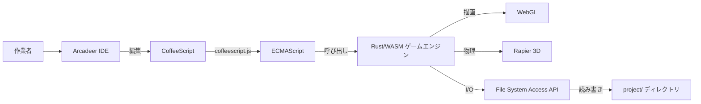

---
## 2. 動作環境

- Chrome系ブラウザ限定（File System Access API・PWAインストール機能を使用するため）
- **インターネット接続必須**（Tailwind CSS 等のCDNライブラリを利用するため）
- **PWA（Progressive Web App）として配布・インストールする**
  - 初回のみホストされた配布URL（例: GitHub Pages 等）にアクセスしてインストール
  - スタンドアロンウィンドウで起動（OSのアプリケーションとして登録される）
  - Service Workerは自前アセットのキャッシュ（起動高速化）に利用する
- File System Access API でローカルファイルシステム上の `project/` ディレクトリを直接読み書きする
- 追加のランタイム（Node.js, Python等）不要
- **CSSフレームワーク**: Tailwind CSS（Play CDN）。既存レイアウト(`style.css`)との競合を避けるため preflight は無効化する

### 2.1 PWAインストール〜利用フロー

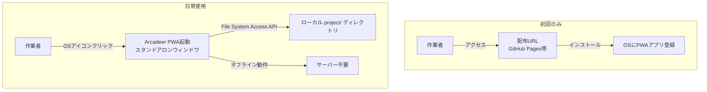

---

## 3. ファイル構成

### 3.1 PWA配布構成（ホスト側）

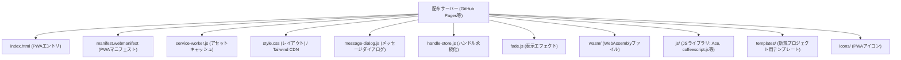

### 3.2 ローカル側（ユーザーの選択ディレクトリ）

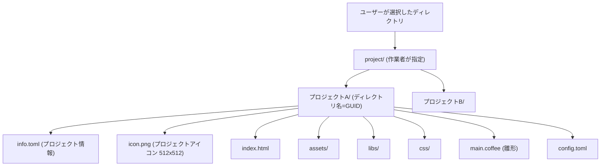

- GUIDプロジェクトディレクトリの親（図中の `project/`）を **Arcadeerホームディレクトリ** と呼ぶ
  - 新規プロジェクト作成・プロジェクトを開く操作では、まずこのホームディレクトリをピッカーで選択する

### 3.3 プロジェクトディレクトリ名と `info.toml`

- **ディレクトリ名にはユニークなGUIDを使用する**（`crypto.randomUUID()` で生成）
  - 入力したプロジェクト名はディレクトリ名には使わず、`info.toml` に保存する
  - これにより、プロジェクト名の重複・マルチバイト文字・OS依存の禁止文字を気にせず作成できる
- 新規プロジェクト作成時、プロジェクトディレクトリ直下に `info.toml` を生成する
- プロジェクトのメタ情報を記録する（ゲーム動作設定の `config.toml` とは役割が異なる）
- 現時点のフィールド:

  | キー | 説明 |
  | --- | --- |
  | `project_name` | 新規プロジェクト作成ダイアログで入力したプロジェクト名（表示名） |
  | `project_id` | ディレクトリ名として使用する生成済みGUID |
  | `icon` | プロジェクトアイコン画像（512x512 PNG）のファイル名。プロジェクトディレクトリ直下からの相対名 |

  ```toml
  project_name = "my-game"
  project_id = "1b9d6bcd-bbfd-4b2d-9b5d-ab8dfbbd4bed"
  icon = "icon.png"
  ```

- 今後、作成日時・エンジンバージョン・ゲーム名（マルチバイト表示名）等を追記予定

#### プロジェクトアイコン

- 各プロジェクトは 512x512 ピクセルの PNG アイコンを持つ
- 新規プロジェクト作成時、デフォルトアイコン（`web/templates/assets/default-icon.png`・デフォルト猫と同系配色の猫フェイス）が `icon.png` としてプロジェクトディレクトリへコピーされ、`info.toml` の `icon` に記録される
- デフォルトアイコンの生成: `tools/gen_default_icon.py`（Python標準ライブラリのみ）
- 作業者は `icon.png` を差し替える（または `info.toml` の `icon` を書き替える）ことでアイコンを変更できる

- 初回起動時にFile System Access APIでユーザーに `project` ディレクトリへのアクセス許可を求める
- 以降、ゲームプロジェクトの読み書きは選択された `project/` ディレクトリ配下に対して行う
- ファイル直接編集（外部エディタやGit連携）も可能

### 3.4 ホームディレクトリの永続化（IndexedDB）

- ピッカーで選択したホームディレクトリの `FileSystemDirectoryHandle` は **IndexedDB** に永続化する（`web/handle-store.js`）
  - ハンドルはJSON化できないため localStorage は使用できず、structured clone で保存できる IndexedDB を使用する
  - DB名 `arcadeer` / ストア `handles` / キー `home`
- 2回目以降の「新規プロジェクト作成」「プロジェクトを開く」では保存済みハンドルを優先し、**ディレクトリピッカーを省略**する
  - 権限が失効している場合は `requestPermission({mode:"readwrite"})` による小さな確認バブルのみ表示される（インストール済みPWAでは権限が永続化されるため、通常は無確認）
  - 未保存・許可拒否・ディレクトリ消失などで保存済みハンドルが使えない場合は、従来どおりピッカーへフォールバックし、選び直した結果で保存を上書きする
- ホームディレクトリは UI 上 **ワークスペース** と呼ぶ。プロジェクト選択画面の `[別のワークスペースを選択する]` ボタンで、保存済みハンドルを使わずに明示的に選び直せる（結果は保存を上書き）

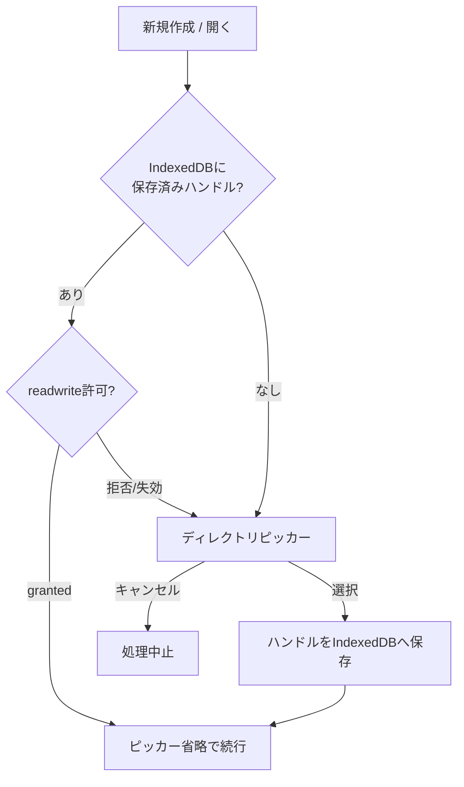

---

## 4. IDE画面構成

### 4.1 全体レイアウト

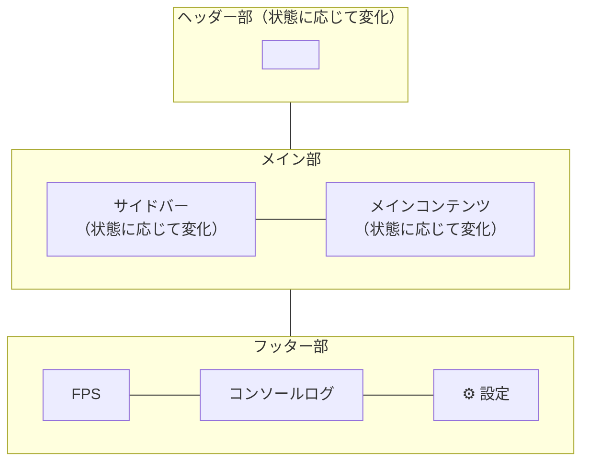

### 4.2 ヘッダー部

- 状態に応じて表示内容が変化する
- **ゲーム編集時の表示**: `[新規オブジェクト作成]` `[ゲーム実行]` `[ゲーム停止]`

### 4.3 サイドバー

- 状態に応じて表示内容が変化する
- **起動直後の表示**: 縦にボタンを並べる
  - `[新規プロジェクト作成]`
  - `[プロジェクトを開く]`

### 4.4 メイン部

- 起動直後: サイドバーの選択に応じた画面
  - `[新規プロジェクト作成]` クリック時:
    - プロジェクト名を入力するモーダルダイアログを表示する
    - `[OK]` 押下で `project/<プロジェクト名>/` ディレクトリを作成し、テンプレートファイルをコピーする
    - **アクセス許可の扱い**:
      - ディレクトリ選択は `showDirectoryPicker({ mode: "readwrite" })` で行い、選択時点で読み書き許可をまとめて要求する
      - ディレクトリ作成前に `requestPermission({ mode: "readwrite" })` の結果が `"granted"` であることを確認する
      - 許可がひとつでも却下・キャンセルされた場合（`AbortError` / `NotAllowedError` / 非granted）は、ディレクトリを作成せず処理を中止する
      - 作成成功・中止・失敗の結果は、フッターのコンソールログに加えて**メッセージダイアログ**（4.5節）でも通知する
  - `[プロジェクトを開く]` クリック時（**プロジェクト選択画面**をメイン部全体に表示する）:
    - IndexedDBに保存済みのホームディレクトリ（ワークスペース）があれば、ピッカーを省略して直接スキャンする（3.4節）
    - 保存済みハンドルが使えない場合は、ディレクトリピッカーで **Arcadeerホームディレクトリ**（GUIDプロジェクトディレクトリの親）を選択する（`readwrite`・許可却下時は中止。新規作成と同じ扱い）
    - ホームディレクトリ直下を走査し、`info.toml` を持つサブディレクトリをプロジェクトとして検出する（`info.toml` が無い・読めないディレクトリはスキップ）
    - **プロジェクト選択画面のレイアウト**（サイドバー右側のメイン部全体を使用）:
      - 最上段の左端に見出し「プロジェクト選択」、その右側に `[別のワークスペースを選択する]` ボタンを配置
        - ボタンをクリックすると、保存済みハンドルを使わずディレクトリピッカーで選び直す（結果は保存を上書きし、一覧を再表示）
      - その下に、**アイコン画像（`info.toml` の `icon`）＋ `project_name`** のカードグリッドを表示する（プロジェクト名順。アイコンが読めない場合は絵文字プレースホルダー📦）
      - プロジェクトが1件も見つからない場合は、ヘッダー行の下に案内メッセージを表示する
    - カードをクリックすると、そのプロジェクトを開く（フッター右端にプロジェクト名を表示。ディレクトリハンドルを保持し、以降の編集機能で使用する）
- **プロジェクト編集時**: エディタ（左）＋ゲームプレビュー（右）の横並び
  - コードエディタは **Ace Editor** を使用
  - スプリットモード・UNDO履歴同期などAce Editorの機能を活用する

### 4.5 メッセージダイアログ（共通モジュール）

- 作業者への通知（完了・中止・エラー・お知らせ）をモーダルで表示する共通モジュール（`web/message-dialog.js`）
- Tailwind CSS でスタイリングし、種別ごとに色・アイコン・見出しを切り替える
  - `info`（お知らせ・青） / `success`（完了・緑） / `warning`（中止・橙） / `error`（エラー・赤）
- WASM(Rust)からは `window.arcadeerShowMessage(message, kind, title)` 経由で呼び出す
- `[OK]` 押下で閉じる

### 4.6 フッター部

- FPS表示（左端）
- コンソールログ（エラー・デバッグ出力）
  - **最新の1件のみ表示**する（履歴はブラウザの開発者コンソールで確認する）
- 現在のプロジェクト名（右端、`info.toml` の `project_name`）
- 設定画面を開く歯車アイコン（⚙）

### 4.7 表示エフェクト（共通）

- UI要素の**表示／非表示はすべて0.3秒のフェードイン／フェードアウト**で行う（共通モジュール `web/fade.js` + `style.css` の `.fade-dialog` / `.fade-element` クラス）
- 対象: メッセージダイアログ、新規プロジェクト作成ダイアログ（Escキーによるキャンセルも含む）、メイン部の画面切り替え（プロジェクト選択画面の表示・差し替え・クリア）、フッターのプロジェクト名・コンソールメッセージ表示
- WASM(Rust)からは `window.arcadeerFadeInDialog` / `arcadeerFadeOutDialog` / `arcadeerFadeInElement` / `arcadeerFadeOutElement` / `arcadeerFadeOutAndClear` 経由で呼び出す（fade.js 未ロード時は即時表示にフォールバック）

### 4.8 画面遷移

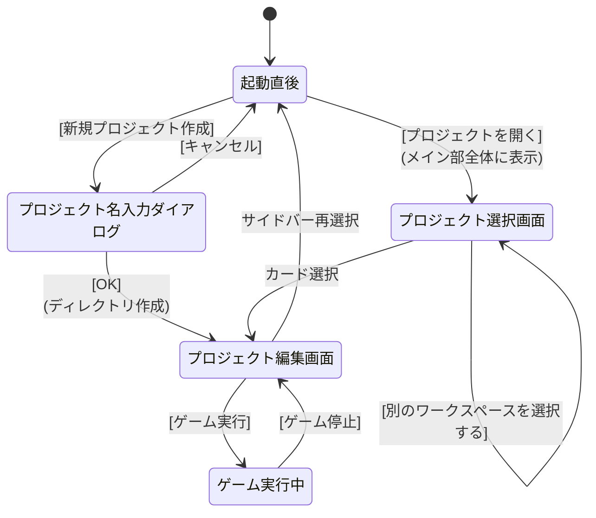

---

## 5. ゲームエンジン

### 5.1 CoffeeScriptトランスパイル

- ゲームの初回実行時にCoffeeScriptからECMAScriptにトランスパイルされる
- トランスパイルには公式の `coffeescript.js`（ブラウザ向けトランスパイラライブラリ）を使用する
- ブラウザ内で `CoffeeScript.compile()` を呼び出して変換する（**ソースマップ付き**。エラー表示の行番号逆変換に使用する — 5.8節）

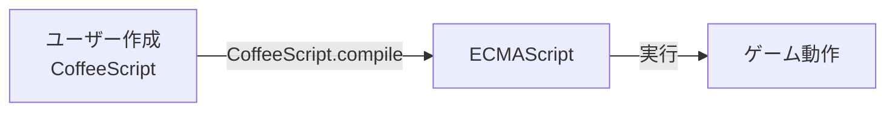

### 5.2 WebGL描画

- WebGLを使い画面描画を行うライブラリをECMAScriptで記述し、WebAssemblyから呼び出す
- **外部JSライブラリ（Three.js等）は使用せず、WebGLを直接制御する**
- Rustからは `web-sys` クレート経由でWebGL APIを呼び出す

#### 描画構成

- 2Dと3Dのプレーンの両方をWebGLで生成する
- 2Dは、WebGLの2Dプレーンを使用する
- 重ね合わせは2Dの方を上にする
- 2Dプレーンは複数作成可能
- 2Dオブジェクトは描画するプレーンを指定可能
- 2Dプレーンは作成された順に上に積み上がっていく（重ね合わせで上になる）
- 同じプレーンに描画される2Dスプライトは描画順に上に重なっていく

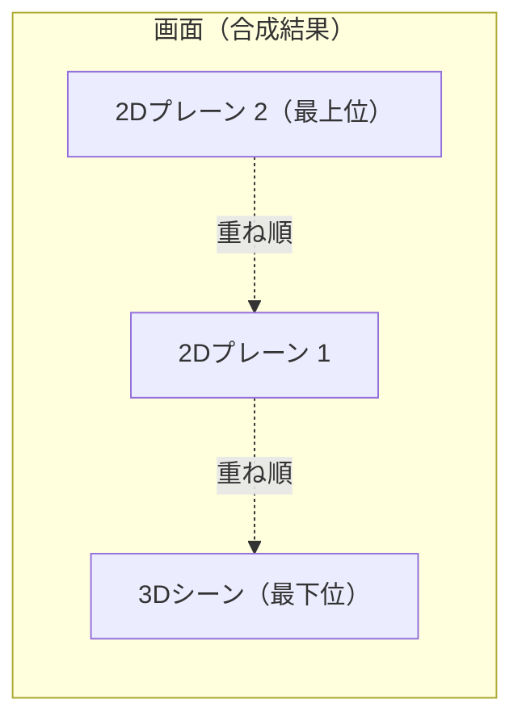

### 5.3 2Dカメラ（2Dプレーンの表示範囲制御）

- Three.jsの `OrthographicCamera` と同じ思想で2Dプレーンの表示範囲を制御する
- 各2Dプレーンはワールド座標系を持ち、カメラがその一部を切り取って表示する
- カメラオブジェクトは以下のパラメータを持つ
  - `x, y`: ワールド座標系におけるカメラ左上位置
  - `width, height`: カメラで映す範囲の幅・高さ
- 上記パラメータをもとに正射影行列（Orthographic Projection Matrix）を生成し、WebGLに渡して描画する
- 2Dスプライトは矩形メッシュ（2つの三角形）にテクスチャを貼って描画する

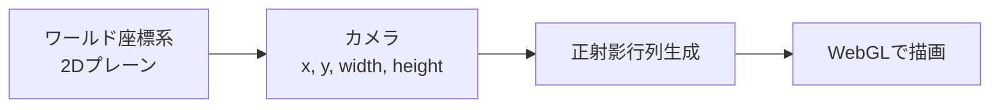

### 5.4 テキスト描画

- 2Dプレーンにテキストを表示する機能を実装する
- テキストデータを渡すと2Dプレーンに描画するライブラリを作成する

### 5.5 3D当たり判定

- 3Dの当たり判定には **Rapier** を使用する
- Rustクレート版（`rapier3d`）を使用し、ゲームエンジンのWASMビルドに統合する
- 当たり判定があった時に指定したメソッドがコールバックされるようにする

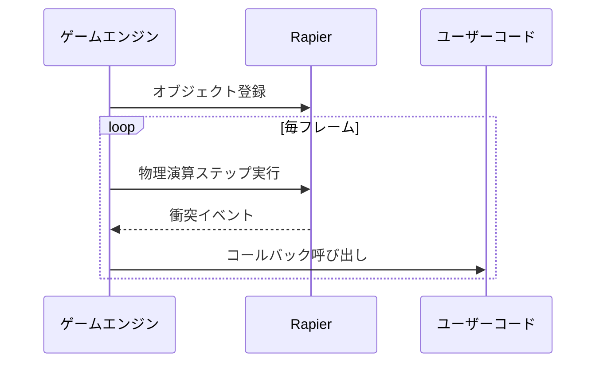

### 5.6 3Dモデルフォーマット

- **採用フォーマット: glTF 2.0（バイナリ版 `.glb` を標準とする）**
- 選定理由:
  - **アニメーション内包**: スケルタル（ボーン）アニメーションとモーフターゲット（ブレンドシェイプ）を、複数の名前付きクリップとして単一ファイルに格納できる
  - **標準性**: Khronos Group（OpenGL / Vulkan / WebGL と同じ団体）が策定し、**ISO/IEC 12113:2022** として国際標準化されている
  - **Web/WebGL適性**: Web上のリアルタイム3Dの標準交換フォーマットであり、WebGLで直接扱える。本IDEは外部JSライブラリを使わず `web-sys` 経由でWebGLを直接制御する方針（5.2節）と整合する
  - **配布効率**: `.glb` はジオメトリ・マテリアル・テクスチャ・アニメーションを1つのバイナリファイルに圧縮梱包でき、ファイルサイズが小さく読み込みが速い
  - **PBR対応**: 物理ベースレンダリング（PBR）マテリアルを標準サポートする
- 比較検討した他フォーマット:

  | フォーマット | 判断 |
  | --- | --- |
  | **FBX**（Autodesk） | アニメ内包可・流通も広いが、プロプライエタリ仕様で制作パイプライン（Unity/Unreal）向け。Web/WebGLでの直接利用には不向き（実質glTF等への変換が前提）。不採用 |
  | **USD / USDZ**（Pixar） | 大規模シーン記述やApple系AR向けに強いが、WebGLランタイムでの直接読み込みは一般的でなくブラウザゲーム用途には過剰。不採用 |
  | **OBJ / STL** | アニメーション非対応のため要件外。不採用 |

- 取り扱い方針:
  - 配布・保存は単一ファイルの **`.glb`（バイナリ）** を基本とする
  - `.gltf`（JSON + 外部リソース）は開発・デバッグ時の確認用途として許容する
  - 圧縮が必要な場合は **Draco**（ジオメトリ圧縮）／ **KTX2 / Basis**（テクスチャ圧縮）拡張の採用を将来検討する
- 3Dモデルファイルはゲームプロジェクトの `assets/` 配下に配置する
- モデルの読み込み・解放は **アセットパック**（5.7節）を通じて行う

#### デフォルトキャラクター（同梱モデル）

- 新規プロジェクト用のデフォルト3Dキャラクターとして、デフォルメ猫モデルを同梱する
- 配置: `web/templates/assets/default-cat.glb`
- 生成: `tools/gen_cat_glb.py`（Python標準ライブラリのみで `.glb` を直接生成。Blender等の外部ツール不要）
  - 再生成する場合は `python3 tools/gen_cat_glb.py` を実行する
- 構成:
  - 12ボーン（hips / spine / head / ear_L,R / leg_FL,FR,BL,BR / tail1-3）のスケルトン＋リジッドスキニング
  - 複数パーツの頂点カラー(`COLOR_0`)による色分け（体=オレンジ、耳/しっぽ先=濃色、口/脚=クリーム、鼻=ピンク、目=黒）
  - 単一マテリアル（PBR・`baseColorFactor` 白／`COLOR_0` で着色）
- 内包アニメーションクリップ:

  | クリップ名 | 長さ | ループ | 内容 |
  | --- | --- | --- | --- |
  | `Walk` | 1.0秒 | する | 対角の脚を交互に振る歩行、胴の上下、しっぽの揺れ |
  | `Run` | 0.55秒 | する | 大振幅・高速の走行、胴の上下とピッチ、しっぽを後方へ |
  | `Jump` | 1.3秒 | しない | しゃがみ→跳躍→空中で脚を畳む→着地→静止 |

### 5.7 アセット管理（アセットパック）

ゲームに使うアセット（画像・音声・3Dモデル）を**アセットパック**という単位でまとめて定義し、シーン単位でプリロード／解放する仕組みを提供する。

#### 定義（連想配列）

- アセットパックはCoffeeScriptの連想配列で定義する
- パック名をキーに、種別（`images` / `sounds` / `models`）ごとに「アセット名 → ファイルパス」を列挙する

```coffee
AssetPacks.define "stage1",
  images:
    player: "assets/player.png"
    tiles:  "assets/tiles.png"
  sounds:
    bgm:    "assets/stage1_bgm.ogg"
    jump:   "assets/jump.wav"
  models:
    cat:    "assets/default-cat.glb"
```

#### プリロード

- シーン開始前に `AssetPacks.load(パック名, 進捗コールバック)` で一括読み込みする
- 読み込みは fetch にとどまらず**デコードとGPU転送まで**行い、使用時の遅延を無くす

```coffee
await AssetPacks.load "stage1", (loaded, total) ->
  drawLoadingBar loaded / total
```

| 種別 | プリロード時の処理 | メモリの実体 |
| --- | --- | --- |
| 画像 | fetch → デコード → WebGLテクスチャ化 | GPU（VRAM） |
| 音声 | fetch → AudioBufferにデコード（Web Audio API） | RAM |
| 3Dモデル(.glb) | fetch → パース → 頂点/インデックスバッファをGPU転送。スケルトン・アニメーションクリップはRAM保持 | GPU + RAM |

#### 使用

- `AssetPacks.get(パック名, アセット名)` でキー指定により即時取得する（デコード済みのため遅延なし）
- 解放済み・未ロードのパックに `get` した場合は明確なエラーをコンソールへ出力する

#### 解放

- 不要になった時点で `AssetPacks.release(パック名)` を呼び、メモリから解放する
  - WebGLリソース（テクスチャ・バッファ）は `deleteTexture` / `deleteBuffer` で**明示的にGPUメモリから解放**する
  - AudioBufferやパース済みデータは参照を切ってJSのGCに回収させる

#### 管理方式

- **参照カウント**: 同じファイルが複数パックに含まれる場合、アセット実体は参照カウントで共有管理する
  - `release` しても他のパックが使用中なら実体は保持する
  - 同一ファイルの二重ロードを防止する
- **ロード状態**: パックは `unloaded` / `loading` / `ready` の状態を持つ
  - `load` の二重呼び出しは同一のPromiseを返す（多重読み込みしない）

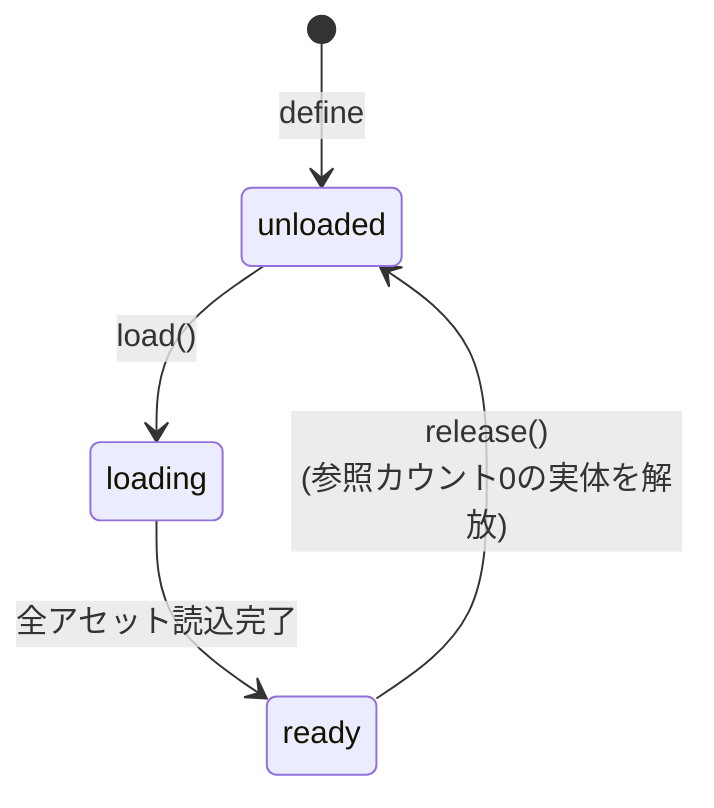

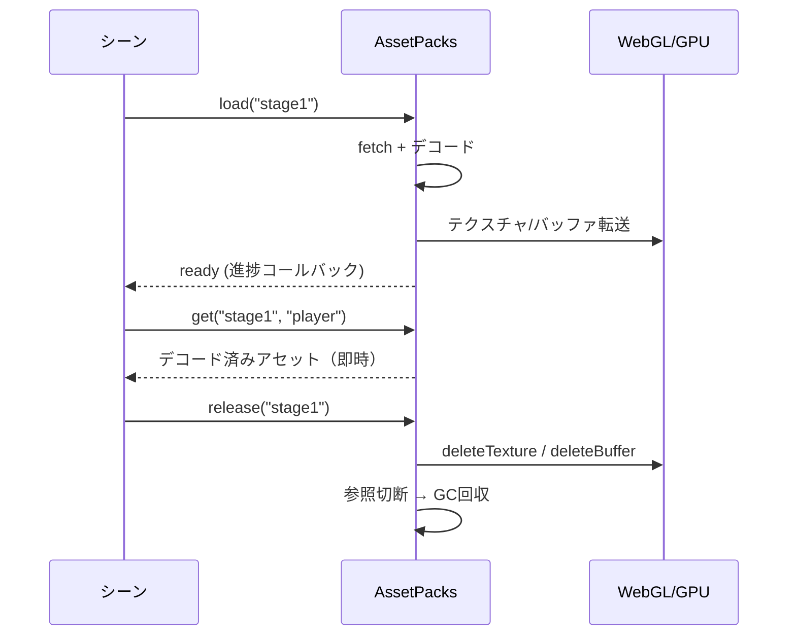

### 5.8 エラー捕捉と通知

ゲームコード（CoffeeScript → トランスパイル後のJavaScript）のエラーは、ブラウザの開発者ツールを開かなくても**IDE内で捕捉・表示**し、コーダーに通知する。捕捉は以下の4層で行う。

#### ① コンパイルエラー（実行前）

- `CoffeeScript.compile(source, { sourceMap: true })` は構文エラー時に**行・列番号付きの例外**を投げる（`e.location.first_line` / `first_column`）
- 実行前にIDEで捕捉し、`.coffee` 上のエラー位置とメッセージを表示する

#### ② 実行時エラー（フレームループ内・最重要）

- エンジンがユーザーコードの `behavior()` を呼び出す箇所を **try/catch で包む**
- 「**どのオブジェクト（クラス）のどのメソッドで発生したか**」という文脈付きで通知する

```js
try {
  obj.behavior();
} catch (e) {
  reportError(e, obj);  // 発生元オブジェクトの情報を添えて通知
}
```

#### ③ グローバル捕捉（取りこぼし防止の保険）

- `window.addEventListener("error", ...)`: 同期エラー全般
- `window.addEventListener("unhandledrejection", ...)`: async/Promise系エラー

#### ④ ソースマップによる行番号逆変換

- コンパイル時に生成したソースマップで、エラースタックの**JS行番号を `.coffee` の行番号に変換**して表示する
- コーダーは自分が書いたCoffeeScriptの行として直接エラー位置を把握できる

#### IDEでの通知方法

| 表示先 | 内容 |
| --- | --- |
| Aceエディタの行アノテーション | エラー行に赤マーカー＋ホバーでメッセージ（コンパイル/実行時とも） |
| フッターコンソール | 最新エラーの1行表示（4.6節） |
| エラーパネル／メッセージダイアログ | エラー種別・発生元オブジェクト名・`.coffee` 行番号・スタック |

#### エラー発生時の挙動

- **実行時エラー発生時はゲームループを一時停止する**
  - 毎フレーム同じエラーが連続発生してログが流れるのを防ぐ
  - 修正 → 再実行のフローへ自然につなげる
- ユーザーコードの `console.log` もIDE内（フッターコンソール／エラーパネル）へ表示し、printデバッグを開発者ツールなしで完結させる

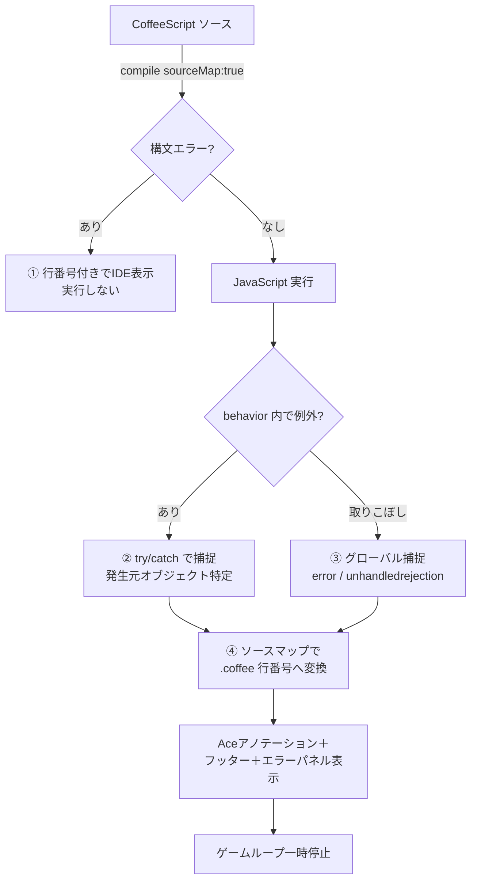

---

## 6. ゲーム作成仕様

### 6.1 画面描画タイミング

- デフォルトは **60fps**
- 設定ファイル（**TOML形式**）で10fps単位で変更可能

### 6.2 オブジェクト管理

- ゲーム実行中のオブジェクトは**一次元配列**で管理する
- 全オブジェクトを単一のフラットなリストに格納する
- 毎フレーム、配列を順に走査して各オブジェクトの `behavior()` を呼び出す
- `addObject()` / `removeObject()` で動的に追加・削除する

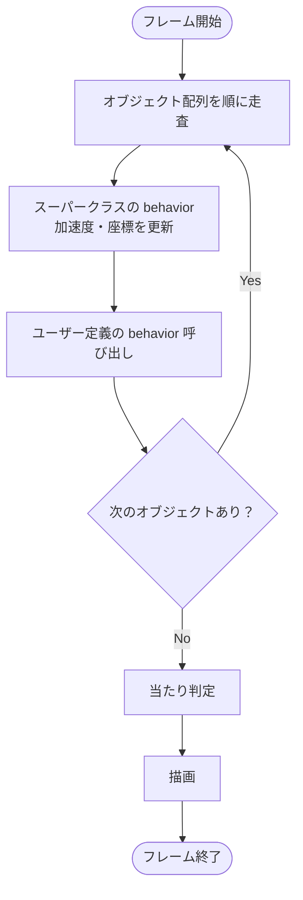

### 6.3 ユーザー作成クラス

- ユーザーが作成するクラスの種類は**一種類**
- ひとつの雛形クラスを編集・拡張していく
- **雛形は CoffeeScript のクラスファイルで、共通メソッドが定義されているスーパークラスを `extends` した形になる**
- 新規プロジェクト作成時、このCoffeeScript雛形ファイルがテンプレートとして `project/<プロジェクト名>/` 配下にコピーされる
- 2Dプレーンはワールド座標系を持っており、現在の2D画面がワールド座標系のどの部分を表示するのかを指定する
- クラスはデフォルトで後述のパラメータを持つ（スーパークラスに定義され継承される）

#### クラス階層

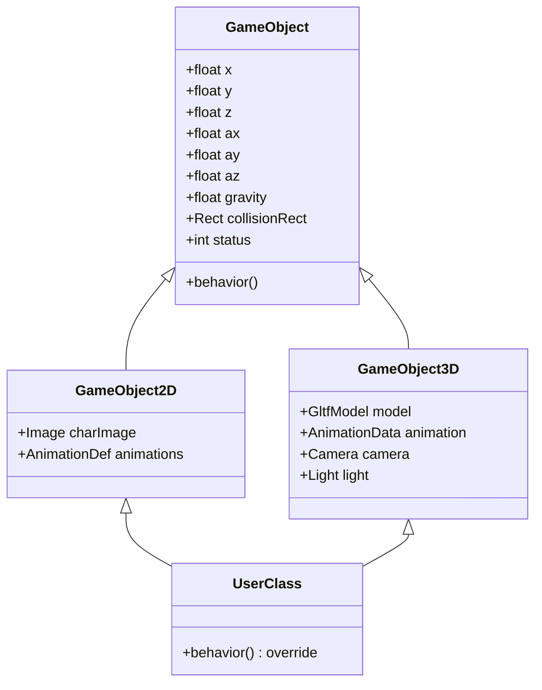

#### 共通パラメータ

| パラメータ | 内容 |
| --- | --- |
| X, Y, Z座標 | 2DオブジェクトでもZ座標を持つ。2Dの場合はワールド座標系においての座標 |
| X加速度, Y加速度, Z加速度 | 加速度は毎フレームそれぞれの座標に加算される |
| 重力 | 毎フレームY加速度に加算される |
| 当たり判定矩形データ | `width`, `height` と、キャラクタのX,Y,Z座標と当たり判定矩形データ左上座標の差分 |
| カメラデータ | 3Dシーンで使用する |
| ライトデータ | 3Dシーンで使用する |
| ステータス番号 | 初期値は「0」 |

#### 2Dオブジェクト固有パラメータ

- **使用するキャラクタ定義画像**
- **アニメーション定義**
  - キャラクタ定義画像から、X, Y, width, height でキャラクタを切り出し、それぞれにシリアル番号を振り、シリアル番号を並べてアニメーションパターンを定義する
- アニメーションパターンの絵は当たり判定には使われず、キャラクタ同士の当たり判定には**当たり判定矩形データ**を使う

#### 3Dオブジェクト固有パラメータ

- **モデルデータ**（glTF 2.0 / `.glb`。詳細は5.6節）
- **アニメーションデータ**（glTFに内包されたアニメーションクリップ）

#### behaviorメソッド

- 指定したFPS毎に呼ばれる
- スーパークラスのbehaviorメソッドでX, Y, Z加速度とX, Y, Z座標の計算が行われる
- 60FPSであれば1秒間に60回呼ばれる
- このメソッド内でキャラクタ（オブジェクト）の動作を定義していく

---

## 7. ゲームの配布

### 7.1 配布形式

- 作成したゲームは**フォルダごとZIP圧縮**して配布する
- プレイヤーはZIPを展開し、フォルダ内の `index.html` をブラウザで開いてゲームを起動する
- サーバー不要・OS非依存

### 7.2 配布フォルダ構成

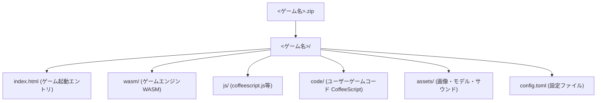

### 7.3 ビルド手順

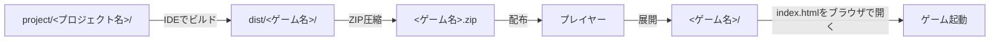

- IDEのビルド機能で `project/<プロジェクト名>/` から配布用フォルダ `dist/<ゲーム名>/` を生成する
- 生成された配布用フォルダをZIPで圧縮して配布する

---

## 8. 未決定事項

以下は今後決定する必要がある項目：

1. **テンプレートCoffeeScriptファイルの具体的な内容**
   - スーパークラス名、コンストラクタ、`behavior()` 雛形の記述形式
2. **プロジェクト編集時のサイドバー表示内容**
   - オブジェクト一覧 / ファイルツリー / アセット一覧など